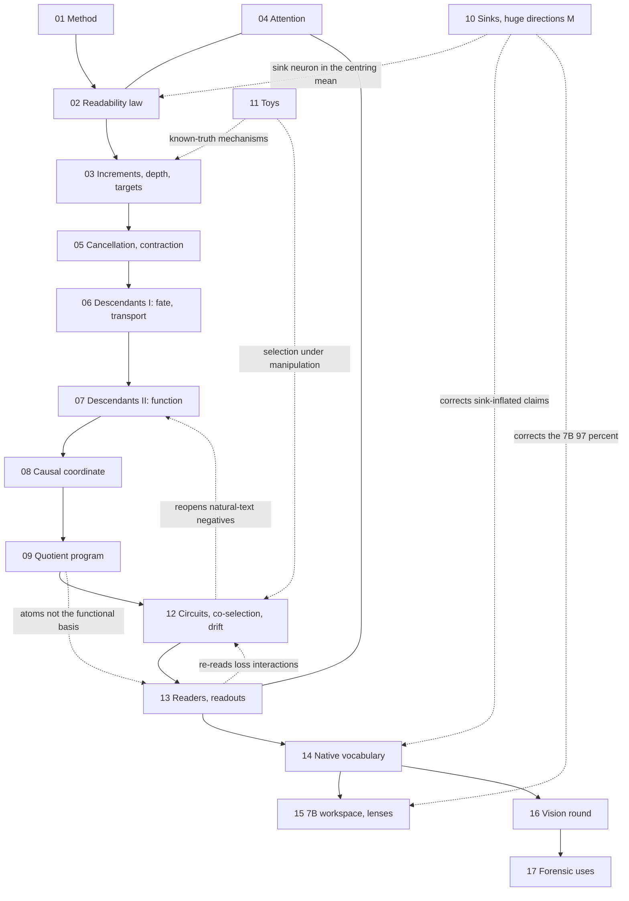

# What a write becomes: the descendant and quotient program on Weight-Dictionary Decomposition

Ronish Bhatt ([ORCID 0009-0000-8835-5380](https://orcid.org/0009-0000-8835-5380)), September 2026. Companion to [Weight-Dictionary Decomposition](https://github.com/sunmoonron/weight-dictionary-decomposition) (WDD), which reads a transformer's residual state as a sparse combination of the model's own write vectors. This repository holds the follow-on program: 427 experiments (e00 to e465 with variants) and about 2,000 recorded runs on five small models, run between 2026-09-19 and 2026-09-24, one to five minutes each on one GPU. Phase 1 (e00 to e356) follows one WDD write through the network and asks what it becomes, with the theory the results support and the literature they sit in; it uses forward passes, ablations, injections and closed-form fits only. Phase 2 (e357 to e373) tests the program's tools against known circuits, the co-selection proposal of the LessWrong post "What if not Circuits?", and per-neuron drift across Pythia and OLMo training. Phase 3 (e374 to e465) turns to readers and readouts and then to self-description: how well a model's own write rows describe its own states. It adds Qwen2.5-7B, and it trains toy transformers, grokking networks and a small sequence model from scratch, some with writer or reader rows frozen. **Start with [`docs/ATLAS.md`](docs/ATLAS.md)**, which organises all 427 experiments into seventeen technical areas and shows how their results connect; the table below summarises it.

The short version of the result: a neuron's write is the model's own perturbation of its residual stream. Downstream computation expands that perturbation physically (hundreds of dimensions) while its causally relevant content becomes compressible (tens of dimensions), and that compressibility is a property of the residual stream's response to any perturbation, not of the write. The compressed content is not carried by a privileged subspace: any moderate-dimensional high-variance projection of the perturbation cloud carries it, there is no null space and no equivalence-class structure, and the WDD atoms are not a special basis of it. WDD remains a clean birth coordinate and instrument; it is not the functional dictionary. The negative results are part of the result.

The short version of phase 3: a model's own write rows are a vocabulary in which its states can be re-described sparsely. At the middle depth 32-64 of them keep 90% of the loss, far more than a rotated copy of the dictionary, while the model's largest actual writes need a thousand or more. The vocabulary is absent at initialisation, starts as a per-block second-order accent, becomes word-level between Pythia steps 4000 and 16000, and is written by training the writer rows: writer rows frozen at random are barely used as words. It holds language-independent concept words (15 of 24 nouns in Qwen2.5-0.5B, 22 in Qwen2.5-7B), it is private across seeds and sizes, and it is not the best sparse vocabulary (a learned SAE is better at small k). Several phase-3 numbers were inflated by attention-sink tokens and were corrected in session 44; `docs/ATLAS.md` lists every correction.

License: MIT for the code (`scripts/`), CC BY 4.0 for the result files and documents (`results/`, `docs/`). Cite with `CITATION.cff`.

## The whole program at a glance

Each area links to a page with one row per experiment (question, result, status, what it builds on and leads to), how the results flow and links to other areas. `docs/atlas/index.tsv` maps every experiment id to its area, session, status, script and result files.

| # | Area | Experiments | What it established |
| --- | --- | --- | --- |
| 01 | [Method: solvers, the dictionary, invariance, calibration](docs/atlas/01_method.md) | 34: e00-e169, S1-S2 | Only a trained dictionary beats its rotation, by an extreme-value edge in the first ~8 atoms. OMP reconstructs best and identifies worst. Identification is limited by competition, not budget. Function follows reconstruction. |
| 02 | [When a write is readable: the prominence law, certificates](docs/atlas/02_readability_law.md) | 33: e05-e206, S1-S3 | A write is read when its prominence beats a covariance-set competitor level (held out, zero parameters). Readability is a stable neuron trait, unrelated to importance. Two certificates. |
| 03 | [Where provenance survives: increments, depth, targets](docs/atlas/03_increments_depth_targets.md) | 33: e02-e218, S1-S4 | Provenance is lost when writes accumulate: block increments read what states lose. An identified atom names who wrote a direction, not what caused it. |
| 04 | [Attention heads](docs/atlas/04_attention.md) | 7: e13-e150, S1-S2 | Static head bases miss heads. OV value atoms rebuild head writes and recover attention patterns. |
| 05 | [Cancellation, erasure, the learned contraction](docs/atlas/05_cancellation_contraction.md) | 29: e06-e220, S1-S4 | Erasure is rare, done by a crowd of later MLP writes, never attention. Every trained block contracts any direction by a gain derived from its weights, born as warmup ends. |
| 06 | [Descendants I: fate and transport](docs/atlas/06_descendants_fate_transport.md) | 30: e221-e250, S4-S11 | A write is scattered, not damped. Its descendant still names the neuron (88-98%) and is the transported image of the write vector. A transported dictionary fails as a basis. |
| 07 | [Descendants II: function, sufficiency, dynamics](docs/atlas/07_descendants_function.md) | 39: e251-e285b, S12-S21 | The descendant carries the write's function. Injected, it reproduces the effect, and it predicts its own future. Massive-activation neurons are the exception. |
| 08 | [The causal coordinate: compression, kill-tree, the quotient picture](docs/atlas/08_causal_coordinate.md) | 32: e286-e316b, S22-S30 | Causal observables need 8-32 directions of a descendant, reconstruction 512-1024. The application (functional units, attribution) failed. |
| 09 | [The quotient program](docs/atlas/09_quotient_program.md) | 38: e317-e356, S31 | Compressible, not structured. Shuffled-target fits, PCA and the discarded complement decode as well. WDD atoms are not the functional basis. |
| 10 | [Sinks, massive activations, the huge directions M](docs/atlas/10_sinks_huge_directions.md) | 13: e20-e441, S1-S2, S44 | Sinks are one neuron's write. Phase 3's "86% / 97% of variance in 8 directions" was sink tokens; M holds 10-26% at ordinary positions. M is an early identity channel with a superquadratic knee. |
| 11 | [Synthetic constructions and toy transformers](docs/atlas/11_toys_synthetic.md) | 16: s1-e386, S1-S3, S33-S34 | Known-truth systems reproduce misattribution, increment-versus-state reading and phase 2's selection claims. Three constructions are retracted. |
| 12 | [Phase 2: circuits, co-selection, drift, curvature](docs/atlas/12_circuits_coselection_drift.md) | 27: e81-e373, S1-S2, S32 | Unit statistics find induction and IOI circuits in all five models, but not in natural-text averages. Co-selection peaks while a circuit forms. Interactions are large-move effects. Writes settle before function. |
| 13 | [Readers, readouts, stitching](docs/atlas/13_readers_readouts.md) | 15: e374-e390, S33-S35 | Loss convexity biases interaction measures, so read them on logits. WDD plus a reader's metric finds induction edges. The 64-atom code keeps 84-99% of the loss, through provenance. |
| 14 | [Self-description: the native vocabulary](docs/atlas/14_native_vocabulary.md) | 40: e391-e443, S36-S44 | 32-64 own words keep 90% of the loss. The vocabulary is learned: a per-block accent early, words from step 4000-16000. It survives covariance, lexicon and Gaussian-state controls. It is private across seeds. |
| 15 | [A 7B workspace agenda and established lenses](docs/atlas/15_workspace_lenses.md) | 12: e415-e425, S40-S42 | At 7B, native words surface a hidden two-hop bridge that the logit lens misses. It is not a better reader in general. Most results have established names; the instrument is what is new. |
| 16 | [The vision round and its causal follow-ups](docs/atlas/16_vision_round.md) | 19: e444-e455, S45-S46 | The vocabulary is written by training the writers, and the same function can be re-implemented with different words. Concept words hold across languages (7 / 15 / 22 of 24 nouns) and are causal handles: near natural size one word redirects 35-58% of translations (e455's 67-94% was a 6-8-fold injection). Word tables do not translate between models. |
| 17 | [WDD beyond description: forensics, steering, learning, grammar, self-consistency](docs/atlas/17_forensic_instrument.md) | 10: e456-e465, S47-S51 | Self-description survives compression that breaks the model, so it does not detect damage. WDD names what a fine-tune changed but does not compress it. A native word steers as efficiently per unit of displacement as a dense vector. Its checksum, its ledger (for a state's future) and its forgery detection add nothing over simple baselines. It is a forward coordinate, not a learning one; its words have no grammar; and what a description omits persists downstream. |

How the areas feed one another (dotted lines are corrections or side branches):



## What is in the repository

| Path | Contents |
| --- | --- |
| `scripts/e01_*.py` to `scripts/e356_*.py` | One script per experiment (309 files). Each is self-contained: it loads a public checkpoint, reads the token cache, runs, and writes `results/<script>_<model>.json` plus one line to `results/FINDINGS.log`. The docstring at the top states the question, the design and what each number means. |
| `scripts/wdd_common.py`, `desc_common.py`, `func_common.py`, `quot_common.py` | Shared code: model loading, the dictionary and the cache (`wdd_common`), the runner with ablation and injection hooks (`desc_common`, `func_common`), the quotient helpers (`quot_common`). |
| `scripts/build_cache.py` | Builds the token cache and the dictionary for one model (see below). |
| `scripts/runjob.sh`, `wave2.sh`, `run.sh` | The launchers used on the box: resume-safe job runner with a skip guard, parallel wave runner, single launch. |
| `results/*.json` (2,020 files) | Every recorded result, one JSON per script and model or checkpoint revision, with the numbers behind every claim in the documents. |
| `results/FINDINGS.log` | One line per run in the order recorded: timestamp, experiment, and the headline numbers. |
| `results/e349_quotient_*.pt` | The 16-dimensional quotient bases of Pythia-410m at six training checkpoints. |
| `scripts/e357_*.py` to `scripts/e373_*.py`, `scripts/pc_common.py` | Phase 2: positive controls, co-selection, drift, curvature (see the phase-2 section). `pc_common.py` holds the ablation, induction and IOI helpers. |
| `scripts/sched2.py`, `prefetch.py`, `waitrun.sh`, `pythia_revs.txt`, `olmo_revs.txt` | Phase 2's job scheduler, checkpoint prefetcher, dependency waiter and checkpoint lists. |
| `results/e357_*.json` to `results/e373_*.json`, `results/FINDINGS_phase2.log`, `results/e365/*.pt` | Phase-2 results, the phase-2 findings log, and the top-16 quotient bases with their logit-image summaries at 13 Pythia checkpoints. |
| `RUNLIST_phase2.txt` | Every phase-2 run in the order the scheduler completed it. |
| `scripts/e374_*.py` to `scripts/e390_*.py`, `scripts/p3_common.py`, `results/e374_*.json` to `results/e390_*.json`, `RUNLIST_phase3.txt` | Phase 3: reader maps, scale mechanics, interaction readouts, stitching and toy transformers. |
| `scripts/e391_*.py` to `scripts/e465_*.py`, `scripts/sd_common.py`, `ws_common.py`, `lr_common.py`, `ma_common.py`, `results/FINDINGS_box3.log` | Phase 3 continued: self-description and the native vocabulary (e391 to e414, e426 to e443), the Qwen2.5-7B workspace agenda and established lenses (e415 to e425), the huge directions and sinks (e432 to e443), the vision round with models trained from scratch (e444 to e450), causal tests of concept words and a re-implemented block (e451 to e455), WDD as a forensic instrument (e456 to e461), the learning signal in native coordinates (e462), a grammar over native words (e463 to e464), and the self-consistency of descriptions (e465). |
| `docs/ATLAS.md`, `docs/atlas/` | The atlas: all 427 experiments in seventeen technical areas, one page per area, and `index.tsv` mapping every id to its area, session, status, script and results. |
| `docs/VISION.md`, `docs/uncharted_map.md` | The backcast of a decade of WDD with its roadmap, and the survey of results never connected to WDD (session 44). |
| `RUNLIST.txt` | Every run that produced a result, as `python <script> <model-or-revision>`, in recorded order (1,430 lines). Replaying it reproduces the repository. |
| `waves/` | The job files that were launched in parallel, for the record of what ran together. |
| `docs/FINDINGS.md` | The chronological narrative, session by session, with the numbers. |
| `docs/SYNTHESIS.md` | What each round established, the closing statements, and where everything is. |
| `docs/GRAPH.md` | The hypothesis graph, H0 to H262: each hypothesis, the experiments that tested it, and its status (survives, narrowed, killed, open). |
| `docs/KILLED.md` | Every hypothesis killed, with the experiment and the number that killed it, and the artifacts retracted. |
| `docs/THEORY.md` | The first-order transport theory, its derived predictions tagged by what they rest on, the tests of the new predictions, and the corrections the later rounds forced. |
| `docs/RELATED_WORK.md` | The literature placement and the priority check against the closest 2025 and 2026 work. |

The models: GPT-2 small (`gpt2`), Pythia-410m (`pythia410`), Qwen2.5-0.5B (`qwen05`), OLMo-1B-0724 (`olmo1b`), SmolLM2-135M (`smollm2`). Two GELU models, three gated (SwiGLU) models. Pythia's public training checkpoints are used for the training-dynamics runs.

## How to run and replicate

Environment: Python 3.11 or 3.12, `torch>=2.1`, `transformers>=4.46`, `numpy`, `scipy`, `datasets` (`pip install -r requirements.txt`). Checkpoints are downloaded from the Hugging Face Hub on first use; the wikitext-2 corpus is downloaded by `datasets`. One 80 GB GPU ran everything here with two or three scripts in parallel; the sub-1B models fit a 24 GB card one script at a time. Models are loaded in float32.

Paths are set by environment variables, with the defaults the box used:

```bash
export WDD_CACHE=/path/to/cache      # token caches and dictionaries, one folder per model tag
export WDD_RESULTS=/path/to/results  # where the JSON results and FINDINGS.log are written
export HF_HOME=/path/to/hf_cache     # optional, the Hugging Face cache
```

Build the cache for a model once (about a minute for the small models; the eval tokens are 32 sequences of 512 tokens of wikitext-2 test, the centering tokens are wikitext-2 train):

```bash
cd scripts && python build_cache.py gpt2
```

Model keys are the five above. A Pythia training checkpoint is cached under its own tag with `WDD_REV=step4000 python build_cache.py pythia410 pythia410_step4000` (the checkpoint scripts pass the revision themselves and read the base tag's tokens). A random-initialisation control is `WDD_RANDOM=1 python build_cache.py gpt2 gpt2_random`.

Run one experiment:

```bash
cd scripts && python e283_state_variable.py gpt2
```

It prints its log line and writes `results/e283_statevar_gpt2.json`. Replay a set in parallel with the skip guard (a run whose JSON exists is skipped, so the list is resume-safe):

```bash
cd scripts && ./wave2.sh 2 ../waves/waveAG.txt
```

The wave runner and `runjob.sh` hard-code the box paths (`/workspace/wdd/...`); edit the two paths at the top of each for another machine, or replay `RUNLIST.txt` directly with a loop over its lines. Every script's result name is the record name in `FINDINGS.log`, so any number in the documents can be traced to its JSON and to the script that wrote it.

Reading a result: each JSON has the fields named in the script's docstring and log line, plus `_exp` and `_time`. The `note` written to `FINDINGS.log` is the one-line summary the documents quote.

## The experiment map

This is the phase-1 map by rounds; [`docs/ATLAS.md`](docs/ATLAS.md) maps all 427 experiments by technical area. The program ran as rounds, each answering the previous round's open questions. The rounds in brief (script ranges are approximate; the narrative in `docs/FINDINGS.md` has every one):

| Rounds | Scripts | Question |
| --- | --- | --- |
| 1 to 6 | e01 to e230 | What WDD reads: sparse approximation over the model's own atoms, prominence at birth, certificates, the erasure matrix, the learned per-block contraction, the exact residual identity, training dynamics. |
| 7 to 12 | e231 to e254 | The descendant: the footprint of a write at depth is neuron-specific, vector-determined, compositional, angle-preserving, robust, portable, zero-shot predictable; the transported dictionary fails as a basis; the linear transport operator; the massive-neuron boundary. |
| 13 to 17 | e255 to e272 | Function: descendant geometry predicts the write's effect better than write geometry; the descendant is a sufficient, causally active, continuously parameterising coordinate; the capacity ladder. |
| 18 to 25 | e273 to e295 | The descendant as a state variable: no functional null space, subspace nesting, the transport residual, interpolation without snapping, functional composition, the Euclidean metric, self-prediction of the future, the reaction carrier of the massive neuron, the compression test, the kill-tree. |
| 26 to 27 | e296 to e308 | The literature-derived program and the operator question: causal metric, persistent channels, layerwise dimensions, attention routing, propagation, cross-neuron geometry, second order, dose-response, family invariance; what the projection is not. |
| 28 to 30 | e309 to e316b | The quotient picture: the perturbation cloud's origin and curvature, the manifold sweep, the quotient by function, transfer across families, the WDD-to-quotient equation and its test, held-out observables, intervention without refitting, the functional atlas and the application test. |
| 31 | e317 to e356 | The quotient program: observable dependence, horizons, channels, nonlinearity, algebra, breaking, the functional dictionary, universal bases, null space and cosets, homomorphism, fibres, state-alone prediction, leakage audits, component internals, adversarial families, token topology, normalization, fine amplitude, discarded dimensions, compression baselines, cancellation, checkpoints, component transport, the light cone, kernels, one-to-many. |

## What was found, in order of confidence

Positive, replicated in five of five models unless noted:

1. WDD reads a write at birth (source identification 88 to 98% from the increment) and reading is a prominence phenomenon: it decays with a causal half-life of about two blocks and depends on the context re-writing the direction (rounds 1 to 6).
2. Every trained block is, along any direction, a learned diagonal contraction of a near-isometric mixing map: a write's energy is conserved or amplified while its direction is scattered into thousands of later writers and into attention, exactly accountably (the residual identity).
3. The descendant of a write, the footprint of ablating it at depth, is a vector-determined, compositional, magnitude-invariant, portable image of the write, identifiable to its source far past the point where sparse decomposition over transported atoms fails. Provenance survives on a coherent fraction that falls to 5 to 15% of the descendant's energy by depth; classification needs only that fraction, a decomposition would have to explain the rest.
4. The descendant is a state variable for the perturbation family: it predicts its own future two blocks later (cosine 0.43 to 0.78 through a data-free operator, against 0.03 to 0.12 for the original write) and reproduces the future logit effect; interpolated descendants follow the interpolation of the endpoint trajectories through the rest of the network; the transport law composes in state and in function.
5. The causally relevant content of the descendant is compressible: tens of directions suffice for identity, function, the future and the removal KL, about 128 for a linear reconstruction of the future descendant, the full width for the physical descendant. This holds for every perturbation family tried, sixteen of them, including perturbations built orthogonal to the model's natural residual manifold: the compressibility is a property of the residual stream's response, not of the write.
6. The compressed content is universal across observables (nine observables' quotients overlap at the split-half reliability ceiling), homogeneous and additive in its coordinate, linear along its directions to three to ten times the natural amplitude, read out nonlinearly, read by the later MLPs (which also damp the perturbation) and spread across tokens by attention alone, born by step 4000 of training together with the cross-family convergence, and it collapses rather than expands beyond the linear range.
7. The one exception is the massive-activation neuron of SmolLM2: its write transports by the ordinary law at every amplitude, but the natural response to removing it at its own tokens is anti-parallel to the response to adding it, an even (set-point) response carried by one MLP at block 10.

Negative, and decisive for how the positive results should be worded:

1. The compressed content has no privileged coordinate system. A projection fitted to shuffled targets scores the same as the real one; PCA, PLS, CCA and kernel PCA coincide; the discarded 64-dimensional complement decodes identity, function, the future and token identity as well as the 16-dimensional core; cancelling the core component restores nothing at the logits.
2. There is no null space of the response and no coset structure: the difference of two functionally equivalent perturbations is a full-strength perturbation; fibres of the quotient have the diameter and dimension of random sets.
3. The functional coordinate is not an eigenspace or singular space of the transport operator, not the read-out's high-gain subspace forward or backward, not the residual state's variance subspace, and not confined to the natural manifold.
4. WDD atoms are not a privileged basis of the functional content (no sparser, no more concentrated than random directions), their functional classes carry no vocabulary meaning, coordinate-equivalent atoms are not substitutable, and a block's functional coordinate is carried by the small-coefficient tail of its ledger, not its sparse head.
5. None of this yet explains the models' outputs better than direct logit attribution: the functional atlas built from the framework does not beat it for joint ablations.

## Theory

The documents keep two statements apart: the theorem-like object, which is mathematics conditional on assumptions, and the empirical discovery, which is what the five models showed. `docs/THEORY.md` tags every derived item by what it rests on.

### Objects

Residual stream of token t at level ℓ: x_ℓ(t) ∈ R^D, with a pre-norm block acting as x_{ℓ+1} = x_ℓ + f_ℓ(x_ℓ; X_{≤t}). The write of neuron i of block b at token t is c_i(t) ŵ_i, where ŵ_i is the unit row of the MLP down-projection and c_i(t) = a_i(t)·‖w_i‖ is the WDD coefficient. WDD writes the centred state at the birth level as a ledger over the model's own atoms,

```
x_{b+1}(t) − μ = Σ_i c_i(t) ŵ_i + r(t).
```

The descendant of a write at level ℓ is its natural footprint, d_i(ℓ, t) = x_ℓ(t)[with the write] − x_ℓ(t)[without it]; at ℓ = b + 1 the descendant is the write itself.

### The axiom (first-order transport)

Within the linear range,

```
d_i(ℓ, t) = c_i(t) · J_t · ŵ_i + O(c²),     J_t := ∂x_ℓ(t) / ∂x_{b+1}(t),     J_t = J̄_C + ΔJ_t,
```

with J_t the Jacobian of the downstream map along the token's own trajectory, split into a context-class mean and a token-specific fluctuation. Three measured properties make it concrete: (J1) a generic spectrum, singular values spread 11 to 50 times between the 90th and 10th percentiles, no exact null space, root-mean-square gain of order one; (J2) token dependence, the fluctuation term dominating by mid depth (coherent fraction 0.16 to 0.33 at mid depth, 0.05 to 0.14 late); (J3) a linear range up to about the natural amplitude, with distortion at 3 to 10 times.

The read-out is the un-averaged Jacobian lens, f_i(t) = G_{ℓ,t} · d_i(ℓ, t) with G_{ℓ,t} = W_U · ∂x_final(t)/∂x_ℓ(t), and G is nearly isotropic in gain on the descendant cloud.

### What follows, and what observed it

- Homogeneity, d(αŵ) = α d(ŵ), and additivity, d(Σ c_i ŵ_i) = Σ c_i d(ŵ_i), in the linear range (e250, e278, e241, e248, e337).
- Vector determination: d depends on ŵ, not on which neuron produced it, and every vector has a descendant (e236 to e248, e304).
- Sufficiency and causal carriage: the descendant is a sufficient statistic for the effect given the level, injecting it reproduces the effect, effects interpolate linearly along descendant segments and whole trajectories interpolate without snapping (e268, e269, e271, e280).
- The state-variable property: d(ℓ + k, t) = J_{ℓ→ℓ+k, t} · d(ℓ, t), so the present descendant predicts its future while the write does not (e283, e281).
- Angle preservation without isometry. For a pair (u, v_θ = cos θ·u + sin θ·r) with r random, cos(Ju, Jv_θ) = cos θ·ρ / sqrt(cos²θ·ρ² + sin²θ) with ρ = ‖Ju‖/‖Jr‖. Random bases have ρ ≈ 1 by concentration of measure, which is why pair cosines looked preserved; pairs on the operator's top and bottom singular directions have their cosines raised and lowered exactly as the formula says, within 0.07 in fifteen of fifteen cases (e238, e282, e285). "Isometric transport" in the record means this.
- Provenance versus decomposition as an inequality. With κ(ℓ) the coherent fraction, nearest-centroid identification among K candidates has signal-to-noise about sqrt(κ)·Δ / sqrt((1 − κ)·K/D_eff) and survives down to κ of order K/D_eff, while any reconstruction by a fixed dictionary has fraction of variance unexplained at least 1 − κ (e277, e272).

### The quotient and its equation

Reading a functional coordinate from any perturbation by a linear map on the linear range, z_ℓ(δ) = P_ℓᵀ δ, and composing with the ledger and the transport,

```
z_ℓ( Σ_i c_i(t) J_t ŵ_i ) = Σ_i c_i(t) z_i(t) ≈ Z_ℓ c(t),     Z_ℓ := P_ℓᵀ J̄ [ŵ_1 … ŵ_N].
```

Z_ℓ is the image of the WDD dictionary under transport and quotient. WDD reads c (which atom); the quotient reads Zc (what the atoms do). Tested by joint ablation of random subsets of atoms: the ledger-weighted sum of the atoms' coordinates meets the joint footprint's coordinate at cosine 0.54 to 0.68 in three models and 0.30 to 0.34 in two, against zero for random atoms, and the quotient is additive on unrelated atoms at 0.78 to 0.97 (e313).

### The correction the last rounds forced

The first-order model with a generic J and a near-isotropic G predicted the universality of the functional coordinate across observables and families and its additivity, and both held. It never said the coordinate is a privileged subspace, and the audits show it is not (e336, e338, e340, e346, e347, e348). The consistent reading is that G restricted to the descendant cloud is of moderate effective rank with a long tail (e355) and near-isotropic, so that any high-variance projection of the cloud of dimension a few tens suffices for prediction and none is structurally distinguished. P in the equations should be read as "any such projection". In one line:

```
x_ℓ(t)[with] − x_ℓ(t)[without] = c_i(t) [ J̄_C ŵ_i + ΔJ_t ŵ_i ] + O(c²),     f_i(t) = G_{ℓ,t} · d_i(ℓ, t),
```

with the causal information in d low-dimensional and its coordinates not unique. What the theory does not derive: the numerical values, which component reacts at the exception, why training shapes J as it does, and the sizes of the identity, function and behaviour subspaces beyond "function is low-rank because G is".

## Where this sits in the literature

`docs/RELATED_WORK.md` places the program against its nearest neighbours and states what is and is not new. First-order transport, Green-function propagation, composition and the local linear regime belong to Transformer Field Theory (Olivieri and Pérez Rodríguez, 2026); the learned spectral bottleneck of the residual Jacobian to Fernando and Guitchounts (2025, 2026); the causal-dimensionality wedge to Sarkar and Deka (2026); the averaged read-out to the Jacobian lens (Transformer Circuits, 2026); linear transport of learned features between layers to Activation Transport Operators (Szablewski, 2025); weight-space neuron description to ROTATE (2026) and parameter decomposition to SPD and VPD. What this program adds is the native-write anchor through that machinery, the separation of a write's identity, its transported descendant and its functional effect, the equivalence structure the read-out induces on arbitrary perturbations measured by held-out prediction and intervention, its acquisition off the natural manifold and its convergence across families, its independence from the operators' spectra, the equation z = Zc tested by joint ablation, and the negative results above, in the scope of five small models.

## Phase 2: circuits, co-selection and drift (e357 to e373)

A second round, run on 23 September 2026 on one rented A100 80 GB, anchored on the LessWrong post [What if not Circuits?](https://www.lesswrong.com/posts/mMERyrvEJ4xbiozie/what-if-not-circuits) and its comments. It asks whether the program's unit-level tools see known circuits, whether the post's co-selection signal finds them, how neurons drift across training, and whether the quotient results depend on the depth of the writer. Same five models, same constraints (no training, forward and backward passes only), about 255 runs. Details and every number: `docs/FINDINGS.md` (session 32), `docs/SYNTHESIS.md`, hypotheses H153 to H169 in `docs/GRAPH.md`, `docs/THEORY.md` section 3i, `docs/RELATED_WORK.md` section 11.

| Experiment | Question | Answer |
| --- | --- | --- |
| e357, e358 | Do pairwise ablation interaction and joint non-additivity detect the induction and IOI circuits? | Yes, in all five models (top heads 1.4 to 9 times random interaction; GPT-2's IOI top twelve contain ten published heads) |
| e357, e358, e366 | Do the same statistics see those circuits in natural-text averages? | Barely (1 to 4 times random); scoring at the positions the circuit serves recovers part of the signal. The program's earlier natural-text negatives (e264, e302) are statements about averages, not about the absence of circuits |
| e359, e363, e368, e369 | Does co-selection (the post's per-batch gradient signal) find the circuits? | Weakly at batch level (strong in SmolLM2 and Qwen), better at token level (three of five), and finite ablation co-effects do better than gradients (GPT-2: AUC 0.82 against 0.41) |
| e370, e370b | Does first-order selection measure use? | No: at a trained optimum every unit's mean selection vanishes while its use does not |
| e363, e368, e364b on Pythia checkpoints | When is a circuit co-selected? | Co-selection of the induction circuit appears when it forms (step 1000), peaks while it is refined (3000 to 16000), and fades by the end; co-selection structure as a whole is re-formed throughout training |
| e371, e372 | Do local quantities (gradient, curvature, co-selection) reproduce ablation-level circuit structure? | No: interactions are 2 to 50 times the local curvature and weakly ranked by it; the loss along an important head's scale is flat near full strength and rises only near zero |
| e360, e362 (+ b, c, d, e) | How do neurons drift across Pythia (46 checkpoints) and OLMo (19 checkpoints) training, in a basis-free logit signature? | Implementation (write vector) settles before function (reliability-corrected signature) in both models; early-layer neurons' logit effects become strongly context-dependent over training; important neurons turn over late; no speciation at this resolution |
| e361 | Are the quotient results a block-2 artefact? | No: all hold at four birth depths in all five models |
| e365, e365b | How does the quotient relate to circuit formation across training? | It is born with the induction transition (dimension 2 to 8, gain peak) and does not persist through training even in function space |
| e373 | Does the quotient's growth need the induction circuit? | Partly, and only early: removing the induction heads removes about a third of the descendant cloud's spread at steps 1000 to 2000 and none at the end |

Running phase 2. The scripts are in `scripts/` with the same conventions as phase 1 (`pc_common.py` holds the shared ablation, induction and IOI helpers). The box ran them through `scripts/sched2.py`, a GPU/CPU job scheduler that reads `queue_gpu.txt` and `queue_cpu.txt` (one command per line), skips jobs whose result file exists, launches GPU jobs while measured plus declared memory leaves room, requeues out-of-memory failures with a larger declared need, and adopts running jobs after a restart; `scripts/prefetch.py` downloads training checkpoints ahead of the drift runs and deletes them once no queued job names them; `scripts/waitrun.sh` holds a CPU analysis until its GPU series is complete. `RUNLIST_phase2.txt` lists every phase-2 run in order. A single run needs nothing but the script:

```bash
python scripts/e357_induction_control.py gpt2
python scripts/e360_drift.py step33000
python scripts/e362_drift_general.py olmo1b step550000-tokens1153B
python scripts/e360b_drift_analysis.py
```

Two measurement notes. The drift signatures were computed with TF32 matmuls, which e360e shows agree with fp32 at cosine 1.00 for the same token assignment. Their raw cross-checkpoint cosines must be read against the reliability ceilings of e360d and e362d, because a single neuron's signature is estimated from about 36 tokens and early-layer signatures are strongly context-dependent late in training.

## Phase 3: readers, readouts and toys (e374 to e390)

A third round on the same day, one to five minutes per run, aimed at mechanisms and at the program's own conclusions rather than more models or checkpoints. It includes the program's first training: 13 tiny attention-only transformers trained from scratch in about four minutes each, to manufacture phenomena instead of only observing them. Details: `docs/FINDINGS.md` (session 33), hypotheses H170 to H190, `docs/THEORY.md` sections 3j and 3k, `docs/RELATED_WORK.md` sections 12 to 14, `RUNLIST_phase3.txt`.

| Experiment | Question | Answer |
| --- | --- | --- |
| e375 | Does WDD, read from the state and weighted by a reader's input map, recover known circuit edges? | Yes: the previous-token head is WDD's top or second input for all 20 induction heads tested across five models, and an S-inhibition head is first for two of GPT-2's three name movers; shares are underestimated |
| e381 | Is it a general edge finder? | Above chance but unreliable: the right top input on 2-69% of strong edges, depending on the model |
| e374 | Where does the flat-then-steep response to removing a head live? | Mostly in the softmax readout; the loss is an ordinary quadratic near full strength, so there is no degenerate direction |
| e376, e377, e382 | Do backup-like (super-additive) pairs reveal redundancy? | Not on the loss: its convexity makes nearly all pairs super-additive when logit effects add, a quarter to a half of pair signs flip on a linear readout, and the circuit/readout split is path dependent |
| e380 | Does the induction circuit really add redundancy through training (phase 2)? | Only on the loss; on the logit its joint ablation is sub-additive at every Pythia checkpoint |
| e378 | Can late lower layers be swapped under the final upper layers? | No: the halves co-adapt to the end; an affine map at the cut repairs about half the penalty |
| e379 | Can the phenomena be manufactured in toy models? | Redundancy appears only with head dropout; gradient selection vanishes at convergence while use stays large; co-selection is high only while a circuit is being built |
| e383 | Was e264's "joint removal is additive" (measured on KL) a readout artefact? | Its KL interactions are the Fisher overlap of the two footprints; in logit space the pairs are additive, so the conclusion stands |
| e384 | Does phase 2's induction redundancy survive on a linear readout? | The loss inflates it 1.4-5.3x; on the centred logit the circuit is additive or sub-additive in four models and redundant only in Pythia (1.72) |
| e385 | Do readers draw on the writes WDD can identify? | Yes in aggregate: 1.33-1.46x more than write size predicts, in all five models; not a per-edge predictor |
| e386 | Does self-repair need training noise (toys)? | Annealed no-dropout toys repair 0-19%; head dropout 32-49%; a constant learning rate 26% |
| e387 | How sparse is reading, and is the reader preference for identifiable writes deep? | Half of a reader input comes from 8-14 components; the preference is mostly shared alignment with the state (present at initialisation), genuine only in GPT-2 and OLMo |
| e388 | Judged as a sparse autoencoder, is WDD's reconstruction functionally faithful? | 64 atoms keep 84-99% of the loss; at 8 atoms 31-88% against -10 to 35% for a rotated copy of the dictionary and 11-40% for PCA |
| e389, e390 | Which atoms carry that, and is it provenance? | The model's own MLP write rows; rows from checkpoints that differ (cosine 0.35 or less) do no better than random |

These results correct phase 2: its super-additivity readings (e357, e365) are mostly statements about the loss readout; on logits real redundancy remains only in Pythia. A literature check (docs/RELATED_WORK.md section 13) found the exact reader-input split behind e375 to be standard (Franco and Crovella 2025), selection vanishing at convergence to be classical pruning knowledge, and self-repair documented in real models trained without dropout; the loss-versus-logit sign-flip measurement, block swaps across training checkpoints of one language model, and the readout-versus-trajectory split of removal curves were not found in prior work.

## Self-description length and private languages (e391 to e398b)

Two further chains the same night:

- The first asked what WDD's sparse code is a code of.
- The second looked for a purer direction than the sparse-autoencoder comparison. It treats a network's own weights as its vocabulary and asks three things:
  - How short is the network's description of itself?
  - How does that change through training?
  - Can one network's words describe another network's states?

Details: `docs/FINDINGS.md` (sessions 36 and 37), hypotheses H191 to H201, `docs/THEORY.md` section 3l, `docs/RELATED_WORK.md` section 15, `RUNLIST_phase3.txt`.

| Experiment | Question | Answer |
| --- | --- | --- |
| e391, e393 | Is WDD's sparse code the state's few largest actual writes? | No. The 64 largest writes keep 53-79% of the loss and 1024 keep 75-92%, against 91-99% for 64 of WDD's words. Most of WDD's MLP atoms are not top writers, and refitting the true writes' coefficients closes only part of the gap |
| e392 | Can the model's own words replace every layer at once? | No. Errors compound: +0.43 to +3.77 nats at 128 atoms per layer |
| e394 | Are WDD's atoms sparse causal nodes? | No. Effects spread over 13-16 of 32 atoms; gradient-times-coefficient ranks them at Spearman 0.33-0.67 |
| e395 | How many of its own words does a network need to describe itself, and does training create that? | 32-64 own words give 90% of the function throughout Pythia's training, while the writing grows denser: the 4096 largest writes keep 84% at the end. At initialisation the own vocabulary is exactly as good as a random rotation of itself |
| e396 | Can one training stage's vocabulary describe another stage's states? | Later words read earlier states, and from step 33000 the vocabularies are interchangeable. Early words read late states worse |
| e397 | Why do the step-4000 words fail on the final model? | False friends. They capture three times the variance of random words, yet at 4-8 words they leave the function worse than the mean state. Their rotation is harmless, and the cause is neither numerical nor geometric |
| e398, e398b | Can one individual's words describe another's (PolyPythia seeds)? | Not as is, and not through the shared tokens: the two embedding matrices are not rotations of each other. A state-fitted translation carries a third to a half of the own-word advantage. Random words pushed through a fitted linear map already match the network's own words, so the shared subspace carries the function |

Scope: sessions 36 and 37 use the middle depth and three sequences of 512 tokens. Session 37 uses Pythia-410m checkpoints and three seeds only. Differences of 0.05 or less at k = 16 are within the spread of random rotations.

## An external review's controls (e399 to e406)

A review relayed by the user raised five questions:

- Is the own words' advantage just alignment with where the states vary?
- Would any operator's directions do as well?
- What is the description length when the words are chosen for function?
- How do the own words compare with a learned dictionary?
- Do the results replicate?

Details: `docs/FINDINGS.md` (session 38), hypotheses H202 to H210, `docs/THEORY.md` section 3l, figure `results/e402_map_k16.png`.

| Experiment | Question | Answer |
| --- | --- | --- |
| e399, e405 | Is the own words' advantage second-order alignment with the states? | Early in training, mostly yes: until about step 8000, vocabularies with the same second moment or span do nearly as well (an accent). From step 16000, no: they fall to the rotation level and the individual words carry the advantage |
| e399 | Would any operator's directions do? | Downstream readers' input directions carry part of it (+0.09 to +0.20 over their rotation, against +0.15 to +0.27 for the writers). The writing blocks' own input directions do not |
| e400 | What is the functional description length, with words chosen under the network's Fisher metric? | Small-k function rises (0.24 to 0.41 at 4 words) but the 90% length is unchanged. Under this pursuit the own advantage grows through training (0.04, 0.09, 0.24 at steps 1000, 16000 and the end). The final state's top-8 directions hold 86% of the variance and 1.5% of the Fisher trace |
| e401 | Does "training creates self-describability" replicate? | Yes: it is absent at initialisation in five architectures at three depths, and present at every OLMo checkpoint |
| e402, e406 | With a proper null, where are the false friends? | In Pythia, only words from steps 4000-8000 on states from step 33000; later words read earlier states as well or better. None in OLMo |
| e404 | What makes a false friend? | The target's few huge directions: with them handled exactly, the step-4000 words beat random words |
| e403 | How do the own words compare with a learned SAE (GPT-2)? | The SAE is far better at 4-8 words. The own words reach about two thirds of its advantage at 16-32, overtake it at 64, and keep more function per unit of variance explained. Random words drawn from the states' covariance also beat the own words at 16 |

## Round 2 of the review, and fresh angles (e407 to e414)

Details: `docs/FINDINGS.md` (session 39), hypotheses H211 to H222, `docs/THEORY.md` section 3l (terminology: native vocabulary, native-vocabulary description length with functional distortion primary).

| Experiment | Question | Answer |
| --- | --- | --- |
| e407 | Do the readers' directions carry word-level structure like the writers'? | No. The readers' advantage is second-order at every checkpoint, and only the writers turn from an accent into a vocabulary |
| e408, e408b | Can the weights alone say what matters, or choose the words? | They flag the huge, function-light directions (0.9-6.3% of the readers' trace on 52-86% of the variance), and a metric built from them recovers much of the Fisher gain in GPT-2. Selecting words by weight criteria picks the embedding table and does worse than random |
| e409 | Are false friends and the accent-to-vocabulary transition properties of the Pythia family? | The transition is, at 70m and 160m. False friends are not: they appear only in 410m |
| e411 | What are the false friends? | Precursors: MLP rows partly aligned with directions that become huge later (from step 4000, formed by 16000) |
| e410 | What structure do the intelligibility maps have? | Directional accretion in 80% (Pythia) and 100% (OLMo) of pairs, plus drift with training distance |
| e412 | Do the network's errors speak its own language? | Yes, and the language changes hands. During early learning the errors are best described by the writers' words; from step 16000 by the readers', while the states stay with the writers |
| e413 | Does the native vocabulary cover in-context computation? | Yes. In-context copying on unseen random sequences is kept at least as well as natural-text prediction |
| e414 | What are the word frequencies of the native language? | Zipf-like (slopes about -0.65 against -0.33 for rotated words). The most used words point into the huge directions and carry little function on their own in Pythia |

## The workspace agenda on a 7B model (e415 to e420)

This session was anchored on WorkspaceBench (LessWrong 2026), which asks for readers that surface a model's hidden intermediate variables without hallucinating. Its harness needs LLM judges and a 27B model, so here it is used as an agenda: Qwen2.5-7B, tasks with known intermediates, and exact scoring. Each reader ranks tokens at one position:

- the logit lens;
- a centred logit lens;
- a PCA lens;
- the native-word lens: the state as 16 of the model's own write directions, each read out separately;
- a rotated-vocabulary control.

Details: `docs/FINDINGS.md` (session 40), hypotheses H223 to H229.

| Experiment | Question | Answer |
| --- | --- | --- |
| e420 | At the subject's token, in middle layers, can native words surface a two-hop bridge ("France" for the Eiffel Tower) that lenses miss? | Yes. The bridge is in the top 20 for 0.11-0.21 of prompts against 0.00-0.01 for the logit lens, with the true country ranked first among countries 0.50-0.63 against 0.41-0.44. Rotated words and principal parts never surface it. More than 16 words does not help |
| e415 | And at the final position? | Only late (blocks 24-26), where the plain lens reads it at least as well. There bridge and answer sit in separate native words, and removing the bridge word costs the answer 0.15 nats against 0.01 for another word |
| e417 | Can a reader tell who did what (roles)? | Only late, for every reader. The native words show the resolution as suppression of the other name |
| e416 | Arithmetic intermediates and fabricated digits? | Inconclusive: the model solves too few chains |
| e418, e419 | Does self-description hold at 7B? | Yes, and more strongly (0.79 against 0.26 at 16 words). The top 8 directions were reported to hold 97% of the variance; that was one sink token in the fitting text (corrected by e437b: 11% at ordinary positions). Kept exact alone they recover 29% of the loss |

## A survey of the whole program, and the bridges it suggested (e432 to e443)

Five agents read all 400+ experiments in groups of ten and listed every result never connected to the native-vocabulary picture (`docs/uncharted_map.md`). About 40% of the mass pointed at one hub, the few highest-variance directions (M). The rest pointed at where the vocabulary lives, whether its privilege is statistical, development, and applications. The experiments below were each built to decide between competing explanations. Details: `docs/FINDINGS.md` (session 44), hypotheses H242 to H256.

| Experiment | Question | Answer |
| --- | --- | --- |
| e432, e437, e437b | Is M's huge variance share a sink artefact? (Phase 1 excluded positions above 10x the median norm; phase 3 did not) | Yes. In Pythia-410m one "\n\n\n" token per sequence held 0.83 of the variance; in Qwen2.5-7B one " series" token held 0.97 of the fitting text's. At ordinary positions M holds 10-26% (11% at 7B), in the same directions |
| e437 | Do the false friends survive with the sinks exact? | No. With the sinks kept exact the step-4000 words beat their rotation (+0.15 against +0.08 at k = 4): the false friends were mis-described sinks |
| e432 | What is M's function: a set point, normalisation ballast, a temperature knob, or just large variance? | None of these. Removing M costs the average per unit of variance, 2-4 times its local quadratic prediction, while a random move of the same size stays quadratic |
| e438, e441 | Where does that knee come from? | No single seat: attention carries a third to two thirds of the cost; in gated models the MLPs absorb large moves |
| e433 | Is M the token-identity channel? | Partly: the most lexical subspace, 65-91% predictable from the state after block 0, position-bearing in GPT-2. The knee is not lexical |
| e434 | Does the network keep what is said in its own words? | No: retention follows variance, not usage |
| e435 | Is self-description only alignment with the states' covariance? | No: Gaussian states with the same covariance keep 15-45% of the advantage. Zipf-like usage is geometry, reproduced by the Gaussian states |
| e439 | Is the native vocabulary the lexicon (token, position and block-0 rows)? | No, in all five and at every checkpoint; descriptions almost never name the current token |
| e440 | Is there a native vocabulary for what context adds to a token? | Yes, word-level in all five |
| e443 | Is the late vocabulary a union of per-block accents? | No at the end (per-block Gaussian words carry at most 0.33 of the gap, per-block word mixtures 0.12-0.52), but 0.82 at step 1000: the early accent is per block, and the words appear between steps 4000 and 16000 |
| e436 | Do words appear in a block's increment before the state? | Yes at step 4000 in Pythia; at the end increments are less word-level than states |
| e442 | Does the advantage live on the self path or the broadcast path? | Both |
| e392b | Does the replacement model compound through the sinks? | No: the compounding is real |

## A decade of WDD, backcast (e444 to e450)

The question: if this method had existed for ten years, what would the world look like, and what must be true for that world? Each imagined capability was reduced to one untested assumption and given the cheapest decisive test (`docs/VISION.md`; details in `docs/FINDINGS.md`, session 45; hypotheses H257 to H262).

| Capability | Test | Answer |
| --- | --- | --- |
| Models ship with a readable dictionary | e448-e448e: the same content in English, French, Spanish and German | **Yes, for concrete concepts.** One MLP write row serves as a language-independent concept word for 7 of 24 nouns in SmolLM2, 15 in Qwen2.5-0.5B and 22 in Qwen2.5-7B (rotated words: 0), found without labels. Removing one hurts more than a matched other word. |
| A theory: training writes the vocabulary | e444, e444b, e449b: models trained from scratch with frozen writer or reader rows | **Written, not spoken.** Writer rows frozen at random are barely used as words; trained ones are (in grokking, 4 trained MLP words explain 92% of the state against 7% rotated). |
| Training monitored by vocabulary formation | e444: grokking with memorisation controls | **Partly.** Generalising networks become sparse in their own words, memorising ones only to second order; the word-level part led generalisation in two of four runs. |
| Interoperable internals via word tables | e445: Pythia 160m, 410m, 1b | **No.** Word-for-word translation keeps 0.06-0.13 of function; dense linear maps keep 0.85-0.91. |
| Interpretable by design | e447, e447b: GPT-2 with a self-description term | **Not with a Euclidean objective:** states get much sparser in the model's own words, but function is not better described. |
| Activations as native codes | e450: 64-512 bits per position | **Only at moderate rates:** beats PCA at 512 bits in 5 of 5 models, loses at 128 bits and below. |

## Causal tests of concept words, and a re-implemented block (e451 to e455)

An external review, relayed by the user, listed what it considered still open. Two of its items had already been run in session 45 and e403 (it had read an older README). The rest were tested in about 30 minutes of GPU time. Details: `docs/FINDINGS.md` (session 46) and `docs/atlas/16_vision_round.md`.

| Experiment | Question | Result |
| --- | --- | --- |
| e451, e454 | Is a concept word (one MLP write row, used on a noun across languages) a causal handle, tested at one depth? | Its effects are specific: removal is 3-6 times as specific as removing a matched other word, and a swap raises the swapped-in noun 3-13 times as much as random. But answers change only in SmolLM2 (French and Spanish 29-37%), and the noun's category barely moves. |
| e455 | And when swapped at every block up to the middle, at the noun? | Yes. 67-94% of translations move to the swapped-in noun (random 0-3%), English copies included, and 39-78% of the Qwen models' category answers move (random 11-13%). Removal alone rarely breaks the Qwen models (accuracy 0.88-0.90): the word is a handle, not the only carrier. Corrected in e458: these swaps were 6-8 times the word's natural size, and near natural size one word moves 35-58% of translations. |
| e452 | Does a block's function determine its vocabulary? | No. A middle MLP retrained from scratch to its own input-output map keeps the loss within 0.02 nats with different rows (median best abs cosine 0.26-0.28; two seeds 0.22-0.25 with each other). Its rows are words about half as good as the original's. Frozen random writer rows reproduce the function but are not words at all. |
| e452b | Why only half? | Mostly the quality of the fit. More distillation reaches 71-77% of the original's advantage, and the rows drift slightly toward the originals. Training the block on the model's own next-token loss adapts it to the text (loss down 0.16-0.29 nats) but makes its rows no more word-like. |
| e453 | Do concept words correspond across Qwen2.5-0.5B and 7B? | Only at the concept level. Through a dense map, a concept word is most aligned with the same noun's 7B concept word in 11 of 14 cases, but at abs cosine 0.08, and it is the nearest 7B atom for only 1 of 14. |

## WDD as a forensic instrument (e456 to e459)

A second relayed review proposed twelve forensic uses of WDD. Eight were already answered by the atlas, or could not be done properly quickly; the list is in `docs/FINDINGS.md`, session 47. Four were run in about 10 minutes of GPU time. Details: `docs/atlas/17_forensic_instrument.md`.

| Experiment | Question | Result |
| --- | --- | --- |
| e456 | Does self-description detect compression damage? | No. At 4 bits GPT-2 loses 3.9 nats and keeps 96% of its words' advantage over rotation. Own words stay far below rotation in unexplained variance at every level of quantisation and pruning: the states are still built from the model's rows. |
| e457 | Can WDD describe what a fine-tune changed? | It names it: on chat, a few words carry much of the usage change (Qwen's block-10 rows 3276 and 1521 go from under 1% to 12-13% of tokens). It does not compress it: the chat change is low-rank and dense. |
| e458 | Native word or dense steering vector; can a WDD checksum certify an intervention? | Corrects e455, whose swaps were 6-8 times natural size. Near natural size one concept word moves 35-58% of translations; the dense difference of means moves 82-100% with 4-6 times the displacement. The checksum predicts success (AUC 0.70-0.92) no better than the displacement's size. |
| e459 | Do native words persist across generated tokens? | Modestly: 1.3-1.8 times rotated words' reuse at lags of 4-32 in Qwen, and no regeneration beyond their usage rate. |

## Authorship labels as forensics: two clean nulls (e460, e461)

A third relayed review proposed using WDD's authorship labels for forensics. Several of its ideas assumed that a state's write history, or the order of its writes, could change its future. It cannot: the forward pass depends only on the current states of all positions. The testable core was run in about a minute of GPU time (details in `docs/FINDINGS.md`, session 48).

| Experiment | Question | Result |
| --- | --- | --- |
| e460 | Do near-identical states with different WDD ledgers have different futures? | They differ (KL 0.26-0.40), but mainly through context: transplanting one state into the other's context shows the vector itself accounts for 15-24%. The ledger difference adds nothing to the cosine (partial Spearman -0.07 and -0.10). |
| e461 | Can WDD detect and locate a forged write-sized vector? | Barely: AUC 0.60-0.64 at the forged block, no better than a covariance (Mahalanobis) detector (0.62-0.75). It finds the right block in 14-35% of cases and sees nothing a few blocks later. |

## The learning signal in native coordinates (e462)

A fourth relayed review asked what learning looks like in the model's own words. Most of its proposals were already answered in the atlas (errors are described in the readers' words, e412 and e429) or follow from the chain rule. The one open question was run in under a minute of GPU time (details in `docs/FINDINGS.md`, session 49).

| Question | Result |
| --- | --- |
| Does a gradient update reinforce or rotate a native word? | Per batch, neither in a structured way. The gradient on a word's row is no more aligned with the word than a random direction (0.5-0.8 times chance), its sign is a coin flip, and it does not predict how the row changes between checkpoints. |
| How do words change over training (Pythia-410m)? | Until about step 16000 the rows rotate while growing (net change 1.7-3.1 times their norm, almost all orthogonal to them): this is when the words appear. After that they shrink in place, and late in training half of the change is along the row. |
| Do the most used words get the most learning pressure? | No: usage and gradient norm are unrelated or anti-related (Spearman -0.63 to -0.04). WDD provenance is a forward coordinate, not a learning coordinate. |

## Is there a grammar over the native words? (e463, e464)

A sixth relayed review asked whether the model's own words behave like a language: inflected by context, and policed by syntax. Both were tested in about two minutes of GPU time (details in `docs/FINDINGS.md`, session 50). Its other proposals were already answered in the atlas.

| Experiment | Question | Result |
| --- | --- | --- |
| e463 | Is a word's noun or verb role carried by inflecting the same native words (an "accent")? | No. Role is carried by which native words describe the token (decoded at 0.94-0.97). The words shared by both roles carry half the description, but their coefficients decode role at only 0.61 and never change sign. Rotated words decode role as well. |
| e464 | Is a native word written where it never fires corrected by the network? | No. It is damped, scattered and re-described exactly like the same word where it does fire (survival after 2 blocks 0.60 against 0.64 in GPT-2, 0.48 against 0.47 in Qwen). |

The native vocabulary behaves like fixed labels with context-dependent amounts, not like an internal language.

## Is a native description a self-sufficient state? (e465)

A seventh relayed review asked whether WDD can audit itself. Most of its proposals were already answered in the atlas: certificates (e180, e195, e200), the prominence law, aliasing, the rotated-dictionary control (e388, e395). The new question was run in under a minute of GPU time (details in `docs/FINDINGS.md`, session 51).

| Question | Result |
| --- | --- |
| After a state is replaced by its 16-word native description, does the network regrow what the description left out? | No. The divergence from the natural run stays at about 0.7 of the growing state four blocks later, and grows 1.3-2 times in size. A random error of exactly the same size is damped to 0.49 and costs almost no loss (0.92-0.96 kept). What a description omits is functional content that later blocks cannot re-derive, not noise. Native descriptions omit less than rotated or PCA descriptions, but do not heal better. |

## Scope and caveats

Five models under 1.1B parameters, block-2 writers for most runs, one corpus (wikitext-2, with a Pile check), tokens in typical-norm range (attention-sink positions excluded), perturbations at the natural amplitude unless a sweep says otherwise, and decoders limited to nearest-centroid, kNN, ridge and closed-form kernels so that nothing is trained. Every number is a median over held-out tokens unless the script says otherwise. Retracted artifacts and superseded designs are listed in `docs/KILLED.md`; an unsigned transport residual (e275) and a mis-designed additivity reference (e285 part 3) were corrected by e275b and e285b, and a cross-token measure in e315 was discarded for dense injection. The one large outage of the run, two hours without network mid-program, did not lose results because the launcher is resume-safe.
