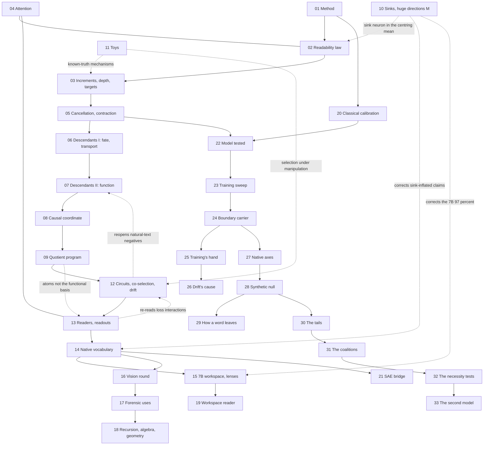

# What a write becomes: the descendant and quotient program on Weight-Dictionary Decomposition

Ronish Bhatt ([ORCID 0009-0000-8835-5380](https://orcid.org/0009-0000-8835-5380)), September 2026. Companion to [Weight-Dictionary Decomposition](https://github.com/sunmoonron/weight-dictionary-decomposition) (WDD), which reads a transformer's residual state as a sparse combination of the model's own write vectors. This repository holds the follow-on program: 630 experiments (e00 to e627 with variants) and about 2,000 recorded runs on five small models, run between 2026-09-19 and 2026-09-24, one to five minutes each on one GPU. Phase 1 (e00 to e356) follows one WDD write through the network and asks what it becomes, with the theory the results support and the literature they sit in; it uses forward passes, ablations, injections and closed-form fits only. Phase 2 (e357 to e373) tests the program's tools against known circuits, the co-selection proposal of the LessWrong post "What if not Circuits?", and per-neuron drift across Pythia and OLMo training. Phase 3 (e374 to e627) turns to readers and readouts and then to self-description: how well a model's own write rows describe its own states. It adds Qwen2.5-7B, and it trains toy transformers, grokking networks and a small sequence model from scratch, some with writer or reader rows frozen. **Start with [`docs/DIGEST.md`](docs/DIGEST.md)**, a ten-minute, theory-first summary that says which routes are closed and why; [`docs/ATLAS.md`](docs/ATLAS.md) organises all 630 experiments into fifty-three technical areas and shows how their results connect, and the table below summarises it.

The short version of the result: a neuron's write is the model's own perturbation of its residual stream. Downstream computation expands that perturbation physically (hundreds of dimensions) while its causally relevant content becomes compressible (tens of dimensions), and that compressibility is a property of the residual stream's response to any perturbation, not of the write. The compressed content is not carried by a privileged subspace: any moderate-dimensional high-variance projection of the perturbation cloud carries it, there is no null space and no equivalence-class structure, and the WDD atoms are not a special basis of it. WDD remains a clean birth coordinate and instrument; it is not the functional dictionary. The negative results are part of the result.

The short version of phase 3: a model's own write rows are a vocabulary in which its states can be re-described sparsely. At the middle depth 32-64 of them keep 90% of the loss, far more than a rotated copy of the dictionary, while the model's largest actual writes need a thousand or more. The vocabulary is absent at initialisation, starts as a per-block second-order accent, becomes word-level between Pythia steps 4000 and 16000, and is written by training the writer rows: writer rows frozen at random are barely used as words. It holds language-independent concept words (15 of 24 nouns in Qwen2.5-0.5B, 22 in Qwen2.5-7B), it is private across seeds and sizes, and it is not the best sparse vocabulary (a learned SAE is better at small k). Several phase-3 numbers were inflated by attention-sink tokens and were corrected in session 44; `docs/ATLAS.md` lists every correction.

License: MIT for the code (`scripts/`), CC BY 4.0 for the result files and documents (`results/`, `docs/`). Cite with `CITATION.cff`.

## The whole program at a glance

Each area links to a page with one row per experiment (question, result, status, what it builds on and leads to), how the results flow and links to other areas. `docs/atlas/index.tsv` maps every experiment id to its area, session, status, script and result files.

| # | Area | Experiments | What it established |
| --- | --- | --- | --- |
| 01 | [Method: solvers, the dictionary, invariance, calibration](docs/atlas/01_method.md) | 34: e00-e169, S1-S2 | Only a trained dictionary beats its rotation, by an extreme-value edge in the first ~8 atoms. OMP reconstructs best and identifies worst. Identification is limited by competition, not budget. Function follows reconstruction. |
| 02 | [When a write is readable: the prominence law, certificates](docs/atlas/02_readability_law.md) | 33: e05-e206, S1-S3 | A write is read when its prominence beats a covariance-set competitor level (held out, zero parameters). Readability is a stable neuron trait, unrelated to importance. Two certificates. |
| 03 | [Where provenance survives: increments, depth, targets](docs/atlas/03_increments_depth_targets.md) | 33: e02-e218, S1-S4 | Provenance is lost when writes accumulate: block increments read what states lose. An identified atom names who wrote a direction, not what caused it. |
| 04 | [Attention heads](docs/atlas/04_attention.md) | 7: e13-e150, S1-S2 | Static head bases miss heads. OV value atoms rebuild head writes and recover attention patterns. |
| 05 | [Cancellation, erasure, the learned contraction](docs/atlas/05_cancellation_contraction.md) | 29: e06-e220, S1-S4 | Erasure is rare, done by a crowd of later MLP writes, never attention. Every trained block contracts any direction by a gain derived from its weights, born as warmup ends. |
| 06 | [Descendants I: fate and transport](docs/atlas/06_descendants_fate_transport.md) | 30: e221-e250, S4-S11 | A write is scattered, not damped. Its descendant still names the neuron (88-98%) and is the transported image of the write vector. A transported dictionary fails as a basis. |
| 07 | [Descendants II: function, sufficiency, dynamics](docs/atlas/07_descendants_function.md) | 39: e251-e285b, S12-S21 | The descendant carries the write's function. Injected, it reproduces the effect, and it predicts its own future. Massive-activation neurons are the exception. |
| 08 | [The causal coordinate: compression, kill-tree, the quotient picture](docs/atlas/08_causal_coordinate.md) | 32: e286-e316b, S22-S30 | Causal observables need 8-32 directions of a descendant, reconstruction 512-1024. The application (functional units, attribution) failed. |
| 09 | [The quotient program](docs/atlas/09_quotient_program.md) | 38: e317-e356, S31 | Compressible, not structured. Shuffled-target fits, PCA and the discarded complement decode as well. WDD atoms are not the functional basis. |
| 10 | [Sinks, massive activations, the huge directions M](docs/atlas/10_sinks_huge_directions.md) | 13: e20-e441, S1-S2, S44 | Sinks are one neuron's write. Phase 3's "86% / 97% of variance in 8 directions" was sink tokens; M holds 10-26% at ordinary positions. M is an early identity channel with a superquadratic knee. |
| 11 | [Synthetic constructions and toy transformers](docs/atlas/11_toys_synthetic.md) | 16: s1-e386, S1-S3, S33-S34 | Known-truth systems reproduce misattribution, increment-versus-state reading and phase 2's selection claims. Three constructions are retracted. |
| 12 | [Phase 2: circuits, co-selection, drift, curvature](docs/atlas/12_circuits_coselection_drift.md) | 27: e81-e373, S1-S2, S32 | Unit statistics find induction and IOI circuits in all five models, but not in natural-text averages. Co-selection peaks while a circuit forms. Interactions are large-move effects. Writes settle before function. |
| 13 | [Readers, readouts, stitching](docs/atlas/13_readers_readouts.md) | 15: e374-e390, S33-S35 | Loss convexity biases interaction measures, so read them on logits. WDD plus a reader's metric finds induction edges. The 64-atom code keeps 84-99% of the loss, through provenance. |
| 14 | [Self-description: the native vocabulary](docs/atlas/14_native_vocabulary.md) | 40: e391-e443, S36-S44 | 32-64 own words keep 90% of the loss. The vocabulary is learned: a per-block accent early, words from step 4000-16000. It survives covariance, lexicon and Gaussian-state controls. It is private across seeds. |
| 15 | [A 7B workspace agenda and established lenses](docs/atlas/15_workspace_lenses.md) | 12: e415-e425, S40-S42 | At 7B, native words surface a hidden two-hop bridge that the logit lens misses. It is not a better reader in general. Most results have established names; the instrument is what is new. |
| 16 | [The vision round and its causal follow-ups](docs/atlas/16_vision_round.md) | 19: e444-e455, S45-S46 | The vocabulary is written by training the writers, and the same function can be re-implemented with different words. Concept words hold across languages (7 / 15 / 22 of 24 nouns) and are causal handles: near natural size one word redirects 35-58% of translations (e455's 67-94% was a 6-8-fold injection). Word tables do not translate between models. |
| 17 | [WDD beyond description: forensics, steering, learning, grammar, self-consistency, interchange, life cycle](docs/atlas/17_forensic_instrument.md) | 16: e456-e471, S47-S54 | Self-description survives compression that breaks the model, so it does not detect damage. WDD names what a fine-tune changed but does not compress it. A native word steers as efficiently per unit of displacement as a dense vector. Its checksum, its ledger (for a state's future) and its forgery detection add nothing over simple baselines. It is a forward coordinate, not a learning one; its words have no grammar; what a description omits persists downstream. Across the band of blocks where a noun is written, a few native words are good interchange coordinates for it. Over training, becoming a word and becoming important are separate processes. |
| 18 | [WDD applied to itself: fixed points, word algebra, role typing, induced geometry, and their audits](docs/atlas/18_recursion_composition.md) | 6: e472-e477, S55-S56 | Applied to its own description, WDD is a projection: one application is a fixed point, for rotated words too. Native handles for two attributes of one word act independently and compose in Qwen (gender alone 92%, both from two words 74%), where rotated words fail and the task's principal directions do as well; the gender handle is one shared MLP row that works across words and languages (98%). Identity handles are not typed by grammatical role, and for an entity copied into the answer native words are no better than rotated ones. WDD's distances between states are a coarse version of activation distance; its one native-only signal, the concentration of deep descriptions, survives its audit and is half prominence. |
| 19 | [WDD as a workspace reader: WorkspaceBench's problems](docs/atlas/19_workspace_reader.md) | 6: e478-e482 with e478b, S57 | Against the benchmark's problems at 7B: the native reader almost never claims a wrong bridge country where the lens claims nothing, and no certificate helps where fabrication occurs (arithmetic); a concept held in mind is surfaced three times as often as by the lens, always as a computed MLP row and never as an echo; one native word carries a two-token name as a unit and disambiguates it (24 of 25) where the lens shows the second token in 4%; per-word reading loses half of a finished answer and reading the words as a whole recovers it; signs do not carry order. |
| 20 | [Calibration against classical theory](docs/atlas/20_classical_calibration.md) | 13: e483-e493, e498, e500, S58-S62 | The detection threshold is a Gumbel law whose two parameters predict the detection curve within 0.1 (resolution 0.25-0.4 of the state's norm); its scale is the atoms' second moment for a rotated dictionary and 2.9-6.2 times that for the native one, a provenance factor that is write sparsity on an accent: the largest writes standing out, rising through training, over a collective alignment that forms by Pythia step 512 and decays (Pythia and OLMo). The description is a non-redundant code with correction; its first word carries 0.4-1.2 bits about the next token; the rows are the heavy-tailed directions of the states, which FastICA partly rediscovers; provenance loss has one timescale; MLP rows are the words at every checkpoint. |
| 21 | [The provenance layer under SAEs](docs/atlas/21_sae_bridge.md) | 8: e494-e497, e499, e501, e502, e504, S59-S64 | A learned SAE feature's top native word is an MLP row for 76-93% of features at every depth of GPT-2, from any block; features are sparser in native words than in rotated ones but as sparse as a whole state, not a write (ReLU family), or between covariance-matched directions and states (TopK family); a quarter of the most used rows are features; a feature's top row separates the positions where it fires at AUC 0.62 (ReLU) and 0.73 (TopK), the eight-word ledger 0.61 and 0.83.; the TopK family's stronger row-following is its features' sparsity, not its parameterisation (e501); the other rows add modestly where features are sparse; on Pythia-160m the top row follows the feature but the features are not state-like |
| 22 | [The extreme-value model tested](docs/atlas/22_model_tested.md) | 8: e503, e505-e511, S64-S68 | The floor stands (rotated calibration 0.97-1.00 in 27 cells); the numerator is neither the largest write's own coefficient (0.3-0.7 of a winning projection) nor the state cloud's second-order alignment (1.02-1.24 of the non-writers' 1.3-2.3 excess) but the position's chord of large writes, centred against the common direction they share, which predicts GPT-2's maximum within 13% and names the atom in a third to a half of states, with the crowd's contraction (OLMo) and the small writes (Pythia) as the corrections that matter; the accent is the dense sum on head atoms, the words the sparse chord; against the whole profile the chord is a partial predictor, and the crowd amplifies it early in training and contracts it late; the clean maximum is selection over a nearly exchangeable residual (GPT-2), and the crowd's contraction is the MLPs' response to the chord, born with area 05's learned contraction; the contraction itself is isotropic and blind to the atoms, and the chord's sparing is a nonlinear, chord-amplitude effect specific to the position's own writes (a fake chord of native rows is contracted like a random direction) |
| 23 | [The onset of wordhood in training](docs/atlas/23_training_sweep.md) | 7: e512-e516, e515b, e516b, S68-S72 | At 18 Pythia checkpoints wordhood turns on in a fast phase (half the writer-win rate's rise between steps 2000 and 8000) and then creeps; sparsification precedes it, the contraction and the chord's growth follow; the accent is in place before step 512; the late attention phase erodes the last block's words; before it, the state cloud collapses to a dozen dimensions at steps 16-64 (the accent's birth) and sparsification begins as it re-expands, with the gradient spread, not concentrated; the future words have no lineage before sparsification, selectivity leading usage by a doubling from step 2000, and the early vocabulary is other rows; the vocabulary is replaced in identity at the churn rate of the large rows, under a boundary that drifts toward larger, sparser rows and then holds; the boundary is the extreme-value floor, which predicts the next checkpoint's entrants out of sample at 0.76-0.97 |
| 24 | [The boundary's carrier](docs/atlas/24_selection_counterfactual.md) | 8: e517-e521, e517b, e519b, e521b, S73-S77 | Replacing, permuting or removing the position's 64 largest writes at every position leaves the prospective prediction of entry within 0.04 of the real state's, so the projection that predicts wordhood is carried by the state outside its largest writes; the entrants rise because their projections rise, not because the floor falls; the criterion picks a disjoint text set's new words at 0.86-0.97 in GPT-2, Pythia and OLMo; split into parts, no part supplies the projection alone, attention least, and the words are the atoms along which the parts agree, and given its size the composition of the projection adds nothing; and the alignment is made locally and diffusely by the mass of small writes at the position, not by descendants from elsewhere, not by the words, carried causally by a few thousand small writes inside a cancelling mass (the participation ratio of session 76 measured the cancellation) |
| 25 | [Training's hand](docs/atlas/25_training_motion.md) | 5: e522-e524, e522b, e524b, S77-S78 | The loss gradient at the origin does not select the entrants (a one-step move along it, 12k and 65k tokens, reads entry at 0.47-0.55 in every form, Spearman 0.00-0.02 with the actual change, for the reliable part of the prediction; the row's own gradient direction is unmeasurable); the rise of a future word's alignment is the row moving toward the states (0.64-0.78 of the rise), not the states moving onto the row, every row rotating by a similar angle and growing; the entrants' rows move into the cloud's principal subspace and toward the states where they already project most, the maximum often moving to another position; and given S, the number of positions at which a row clears the floor reads entry at 0.71-0.85; in time, entry is a directed drift of five thousand steps or more in which breadth rises first, then a crossing of two thousand steps in which the pull toward the best state doubles, the row's own motion keeping its profile and the states' moving the maximum |
| 26 | [The drift's cause](docs/atlas/26_drift_cause.md) | 7: e525-e530, e525b, S79-S82 | The directed drift of the rows near the floor is not their mean loss gradient at the time, raw or Adam-whitened, which at training-batch scale agrees with itself at cosine 0.08-0.18 and is followed by the thousand-step update at 0.01; not the co-active writes; and not a flat direction of the loss (the update's curvature 1.13-1.15 times a random direction's). A few percent of an entrant's motion is toward the mean state where its neuron fires and toward the state at its best position, persisting and accumulating over thousands of steps (the increments' lag correlation 0.11-0.17 out to six thousand steps); the typical row's write drifts away from its read direction; the bulk of every row's motion is growth along itself and an unexplained, mean-reverting remainder; the row set does not move as one, the best common linear flow carrying a tenth of the motion early and a fortieth late and making no entrant; separated by timescale the long displacement is 1.09-1.18 times as curved as a random direction and the oscillation axis 1.15-1.17; and the bound: everything at the origin predicts 0.049-0.072 of a row's eight-thousand-step displacement's energy, all of it growth and read repulsion, the destination's geometry no more, while the size of the motion is predictable at R2 0.71-0.76; the search for the drift's cause in local quantities closes here |
| 27 | [The native axes](docs/atlas/27_native_axes.md) | 6: e531-e535, e534b, S83-S87 | The prospective criterion is four fifths generic: fixed random and rotated dictionaries followed through training foretell their own entries at 0.81-0.86 against 0.91-0.94 for the native rows, whose frozen directions do as well as the moving ones; what the native rows have is stability, half their word set surviving four thousand steps against a sixth, and it is in their individual orientations, not their covariance (matched atoms keep 0.19-0.20); the native half-life is about four thousand steps and grows as the row set settles; a native word's angular basin is 26-29 degrees, twice a random dictionary's, by its margin above the competitors; the basin is the margin, directionally structured along the row's drift and its neighbours, and mostly the row's own (its competitors' random motion leaves 0.79-0.89 of the words); at equal margin a native word is no more robust to rotation than a random dictionary's word; none of it depends on OMP, three other definitions of wordhood giving the same criterion and advantage |
| 28 | [The synthetic null](docs/atlas/28_synthetic_null.md) | 3: e536-e538, S87-S89 | Rows diffusing on the sphere against a fixed Gaussian cloud with the real covariance, with no training, show the criterion at 0.75-0.80, breadth before the maximum, turnover and retention 0.32, the generic four fifths of e531; memory alone adds only memory; a temporally coherent motion into the cloud adds the native fifth (0.88, 0.52, a crossing through the floor), and Pythia's own increment sequences carry it to any recipient; the motion is aimed at the cloud the rows face (turned by a fixed rotation the cloud loses the fifth, 0.72 and 0.13; a Gaussian cloud with its covariance keeps most of it, 0.88 and 0.41); the pull's sign is necessary and a fading pull gives a slow approach, not Pythia's jump to a plateau |
| 29 | [How a word leaves](docs/atlas/29_exits.md) | 6: e538b-e541b, S89-S91 | The floor is a gate in one direction for the native rows: an entry is a crossing (0.37 of the entrants under the floor two intervals before), an exit a loss of usage and breadth with the projection kept (0.77-0.82 of the leavers over the floor at the first checkpoint out); the exit is not a displacement, the field at the lost positions still (0.88 to 0.88) and the leaver's own projection falling (0.92 to 0.79), the takers at the null in number, class, cosine and neighbour rank, entrants never displacing a leaver; the erosion is mostly the states' drift, the maximum relocating above the floor; hysteresis (a word stays where a matched non-word does not enter) is generic, and so is the erosion, but the gate is native: a random dictionary's words leave through the floor (0.24 over it), isotropic diffusion's likewise, the pull worlds' half; the gate is the persistence of the native maximum, which sits at S 1.25-1.44 while the breadth erodes; what holds the maximum is the cloud's covariance, a native row's alignment at a position not regressing at equal level where a random atom's does, covariance-matched atoms persisting like the rows, and a null with their kernel reproducing the native maximum, while persistence is not stability, the covariance atoms' words churning below the floor, so that a stable word needs the persistent subspace and the individual orientation that sets it high |
| 30 | [The tails](docs/atlas/30_tails.md) | 4: e542-e544, e544b, S92-S93 | The cloud persists in most of its directions and its dynamic modes are its variance modes; a native row's whole profile persists like an isotropic atom's while its extremes persist beyond its bulk; a Gaussian cloud with the real covariance at every checkpoint gives, at any temporal dynamics, the spatial and temporal persistence but words at S 1.07 with retention 0.35; the native fifth is sparse and row-wise: the top four real projections per position grafted onto that cloud restore the plateau (1.32), the turnover (91 entries per interval), the retention (0.51) and the gate (0.88), the real bulk with those projections Gaussianised has none of it, and the grafted pairs moved to random positions at every checkpoint give the same vocabulary, so the vocabulary is the slow evolution of the set of rows the states make extreme somewhere |
| 31 | [The coalitions](docs/atlas/31_coalitions.md) | 5: e545-e547, e546b, e547b, S94-S96 | Each word's extremes are written by its own persistent ensemble of thousands of writers in a cancelling mass, more than half of the projection transported by attention, the same population wherever they occur, specific to the row and not shared across words; the coalition precedes the word, cohering across a future entrant's extreme positions four intervals before entry (0.42 against 0.20 for a near miss matched on S) while the contexts are as stable for both; what rises across the entry is the coherence, the own neuron's contribution and the alignment, a quarter of the rise the row's rotation, a quarter the arrival of transported writes; the coalitions are private (0.575 against 0.013) and persist beyond their contexts (0.873 against a selection-matched 0.599); a channel selected by alignment with the row is generic by construction and says nothing about which came first; the neuron's selectivity for its future contexts precedes entry (z 1.61 eight intervals before, 2.85 at entry) and a near miss is a row whose neuron loses it while its row approaches as an entrant's does; the coalitions' families are few and are near-duplicate rows at the same contexts |
| 32 | [The necessity tests](docs/atlas/32_necessity.md) | 2: e548, e549, S97-S98 | WDD is not a proxy for neuron selectivity: six ordinary statistics of a neuron and its row predict entry at 0.74 out of sample, S and breadth at 0.88, and the activation side adds nothing to WDD, because a word's extreme contexts are the coalition's, where the neuron fires selectively but not most; a learned feature dictionary of the states sees the association by half, no feature matching a word's context set as a set (Jaccard 0.19), the feature nearest to the row at cosine 0.48 and at half of its contexts, and the nearest row to a feature a word for 0.20 of features against a base rate of 0.01 |
| 33 | [The second model](docs/atlas/33_second_model.md) | 6: e550-e555, S99-S100 | On OLMo-1B at steps 1000-16000 (block 8) the chain of sessions 89-97 replicates, most of it more strongly: the criterion 0.94 against 0.80 for random atoms, retention 0.64 against 0.19, the gate one-way for the rows (0.96 over the floor at exit) and two-way for random atoms, the rows' extremes persisting beyond their bulk, the private persistent coalition (0.731 within a row, 0.969 across eight thousand steps) preceding the word (0.52 against 0.31 for near misses), and the necessity test (S and breadth 0.92 against 0.78); session 100 re-measured the two apparent differences: by absolute activation the OLMo entrant's neuron is selective before entry (z 2.63 eight intervals before) and is the largest contributor to its extreme, attention's small share (0.27) is OLMo's share of any state, thousands of non-words sit over the floor on both models so the floor bounds entry from below rather than defining it, and the tails carry the plateau, the gate and the turnover on OLMo while the covariance keeps most of its retention |
| 34 | [The map: nine directions run](docs/atlas/34_map.md) | 13: e556-e564 with e557b, e558b, e561b, e564b, S101 | A twenty-one-direction map triaged against the record and its nine open directions run in one session: the vocabulary is a property of writing through rows to a residual stream, present in a state-space model with neither attention nor MLPs (Mamba, advantage 0.258 against Pythia-160m's 0.188, words at S 1.78), in two vision transformers without tokens (advantage 0.105 / 0.161, broader words) and in the grokking toy under three optimizers alike; conserved across scale by its context sets (0.40 of 410m's words twinned in 160m against a null of 0.03, mostly not token identities, the same rate across a data twin, three quarters of the within-run rate) while the rows forget their initialization (0.071) and the context sets outlive their rows (0.55 against 0.21 by index); entry is the row's turn into a direction the cloud already speaks (1.29 in the old cloud) and exit the cloud's erosion, a transplanted neuron brings its word (0.68-0.80), a trajectory merge has no barrier; the ledger reads neither upstream corruption nor factual error (no state does; invented names are more spoken); 1024 candidates by projection reproduce OMP at 1.9-4.6 times the speed; continued training moves the states, not the rows, and the word set is a marginal statistic (Jaccard 0.86 under noise costing +0.03 nats) where the usage correlation is the robust one |
| 35 | [Theory extraction: the mechanism map](docs/atlas/35_mechanism_map.md) | 12: e565-e572 with e566b, e566c, e566d, e569b, S102 | The question above the program, why a trained network organises its computation into persistent associations between native write directions and classes of its state distribution, answered arrow by arrow in MECHANISM_MAP.md after the open arrows were tested: the partition of the state space is the data's (independent seeds twin at 0.34-0.38 against a null of 0.03; Pythia-410m to Mamba-130m 0.46, to OLMo-1B 0.41 by character spans); the loop runs from the data to the neuron (the row turns toward the cloud's variance, 1.035 against a random turn's 0.970, and the cloud does not grow along the row); the write direction is what a later neuron carries into an earlier model (0.54 against 0.18 for the read row); the coalition is in Mamba, stronger (0.857 within a row against 0.000); in the toy the association tracks generalisation under every knob; stability has levels (row identity > usage > function > membership); norm-matched rows describe the states equally at K=8 but are used 0 times against 19, sit under the floor and twin at 0.02 against 0.40, so the span is the norm's and the association the data's; the invented-name row is a generic construction word with no causal role for its own write |
| 36 | [The object: class, direction or row, and what has to travel](docs/atlas/36_object.md) | 9: e573-e579 with e573b, e575b, S103-S104 | The one question left above the map, whether a context class or its row is the object, generalised into five hypotheses and run: the class is the partition and the partition is the corpus's surface structure (the token, the previous token and the position predict a word's context set at AUC 0.853; not an output partition; two vision models with different objectives share only its spatial layout); the direction carries the function (a class that changes rows changes its direction, cosine 0.133, and its downstream effect, 0.156 against 0.449 for kept rows; within one model two words sharing a class have effects as alike as their directions, correlation 0.86); the row is the implementation (frozen trained rows draw a fresh network's usage without their classes; a transplanted direction becomes a word without carrying computation, KL 0.0021; the words are read no more than other rows): the data fixes the classes, training fixes the directions, the rows are where the directions live; what has to travel (session 104): the direction alone makes 0.60 of entrants words, the coalition of 128 producers 0.47, both 0.93, and nothing short of the readout moves the recipient's predictions at the class toward the donor (-0.066 for 512 producers with the direction, -0.873 for the readout alone): the effect is the direction's, its producers' and its readers' together; and the native excess is a label-free detector of generalisation in the toy, never false, never early |
| 37 | [The instrument placed](docs/atlas/37_instrument_placed.md) | 3: e580, e580b, e581, S105 | Two tests designed to let WDD lose: an autoencoder's features on the same states have producer coalitions as coherent as the words' (0.692 against 0.672, random directions 0.154) and as necessary (drop 0.92 against 0.77), with different producers (Jaccard 0.07), so the producer-consumer decomposition belongs to any spoken direction attribution can reach; and over 20 toy trajectories the best WDD statistic predicts generalisation a thousand steps ahead at AUC 0.824 against 0.961 for the best classic baseline. The placement: WDD's distinct element is parameter provenance of the association, which buys the developmental questions and not the descriptive or the detector ones |
| 38 | [Watching words being born](docs/atlas/38_born.md) | 3: e582-e584, S106 | The developmental claim given its control: over sixteen checkpoints and 241 eventual words every class coheres in the cloud from the first checkpoint, the rows are recruited at step 7.0 thousand at the median and the coalition coheres before recruitment (0.84); an autoencoder trained at every checkpoint has a persistent feature for 0.31 of the classes, sees those before the row, and does not date the parameter (its decoder at cosine 0.11 with the row at recruitment, pointing at it 7.0 checkpoints later for 33 words): the order of birth is any dictionary's, which parameter takes responsibility and when is the native one's |
| 39 | [Responsibility migration read directly, and the forecast](docs/atlas/39_migration.md) | 4: e585-e588, S107-S108 | Three experiments outside the control loop: a class has one speaker at the median after a gap, its own direction is at cosine 0.85 with its step-16000 direction at step 4000 when the row is the speaker for 0.06 of classes and at 0.86 at the final model when the row is the speaker for 0.38 (the class with its direction is the invariant, the row its replaceable implementation); the row that will be recruited is the first of 53,248 by its ratio over the class two checkpoints ahead for 0.52 of words and in the top ten for 0.84 (recruitment is the geometry's); with its 32 eventual words frozen the toy reaches test accuracy 1.00 with a vocabulary on other neurons, a third of the classes re-appearing on substitutes (block the row and the network recruits others); and the forecast with no future in the class: row-free clusters at t pick the row that will be recruited two checkpoints later at AUC 0.927 on Pythia-410m and 0.932 on OLMo-1B (eight ahead 0.869 / 0.848), the class side adding +0.006 / +0.003 to the row's own S (session 108) |
| 40 | [The mechanism of the turn, the removed speaker, the paper](docs/atlas/40_turn_and_paper.md) | 2: e589, e590, S109 | The last mechanistic hole and the scale test, then the paper: two checkpoints before recruitment the eventual row's gradient step points toward its class at mean cosine +0.020 (3.8 standard errors; controls at zero), the class's positions supplying 0.215 of the row's gradient at 0.006 of positions, a drift the class's own loss drives; thirty speakers removed and frozen at step 8000 and trained 2.5M tokens leave 0.17 of their classes with a substitute (unfrozen 0.30), the loss at the classes 3.583 -> 3.588 -> 3.636; PAPER.md states the record as one falsifiable sequence with the network as its subject and WDD as the instrument that follows the parameter |
| 41 | [Six directions beyond the descendants](docs/atlas/41_six_directions.md) | 12: e591-e596 with e591b, e591c, e592b, e593b, e593c, e593d, S110 | The six directions left after the paper, each with its controls: recruitment is not a performance event (the class's loss drops -0.1231 across it, its token-matched controls -0.1380; the row's direction removed from the class costs 0.0047 nats two checkpoints before recruitment and 0.0109 after); bounded unlearning leaves the forget words' rows untouched (cosine 1.0000) and silences them at the forgotten classes (0.47 still write, from 1.00), the share tracking relearnability; pruning helps grokking whatever is pruned and S ranks the recruits below average until generalisation; twins are not stitching anchors; classes per word rise 0.15 to 3.53 through training at a K-dependent level; the magnitude bias is the support's |
| 42 | [The unlearning audit, tested as its users would](docs/atlas/42_audit_users.md) | 4: e597, e597b, e600, e601, S111 | The audit against five unlearning methods, two domains, two sizes, a probe and three attacks: no training method touches the rows (cosine 0.9991 to 1.0000); ascent, difference and NPO silence the writers on 160m PubMed (activation 0.53 to 0.82) and not elsewhere (0.90 to 0.99); RMU leaves them firing (1.00), overrides the state and is the shallowest (recovery 0.83 to 0.96); dampening alone reaches the rows and relearns slowest; depth is read on the parameter side (the writers' activation 0.82 with the recovery on both sizes, against still-writing 0.39 and the probe 0.67, which invert or vanish on 410m); fine-tuning recruits existing rows unchanged; removing the named writers does not unlearn on its own, and after silencing slows the relearning |
| 43 | [The audit's baseline, its causal test, and three new audits](docs/atlas/43_audit_baselines.md) | 7: e602-e606 with e602b, e603b, S112 | The naive-selection baseline with seeds (a difference-selected set overlapping the writers by Jaccard 0.06 correlates with relearnability at 0.83 against the writers' 0.89), the separable interventions with three seeds (silencing the writers' inputs adds 55 relearning steps after RMU, 40 after ascent), and three new audits: safety training recruits the harmful-request writers by feeding them 2.03 times more with rows at cosine 0.9973, and benign fine-tuning erodes refusal with those writers still firing, an override downstream of them (the two prefix jailbreaks did not move this model); merged fine-tunes keep both sets of recruits because they recruit different rows; compression damage tracks silenced writers across compressions (Spearman -0.94) through severity, not within one |
| 44 | [The refusal direction, writer rescue, the causal test at 410m, and the baseline at 1B](docs/atlas/44_refusal_direction_rescue.md) | 5: e607-e610 with e608b, S113 | The refusal direction of a chat model is real (ablation takes refusal from 0.93 to 0.04) and is not written by the writers that fire on harmful requests (rows' cosine 0.034 against 0.024 for any row), which keep firing under its ablation; restoring the silenced writers after an unlearning recovers 0.09 of the rise and restoring every MLP neuron of blocks 0-B 0.02, so the writers are the route back and not the store; at 410m silencing them after ascent adds only 10 relearning steps (random rows 0); the audit holds at 1B (writers 0.90, difference-selected 0.87) |
| 45 | [The J-Lens connection: class-conditioned descendants and transported writers](docs/atlas/45_jlens_connection.md) | 2: e611, e612, S114 | A write's class is the partition the J++ Lens learns with k-means: at block 4 of Pythia-410m the class-conditioned transport map predicts a write's actual logit change at cosine 0.283 against 0.210 for a random-subset map of the same size, 0.071 for the all-positions map and 0.065 for the raw row, the estimate mattering more than the conditioning and the class map worse outside its class; and with transport the harmful-request writers' cosine with the refusal direction is 0.101 (raw 0.034), silencing them leaving refusal at 0.89 from 0.93 (random rows 0.93) |
| 46 | [The auditor against the state of the art](docs/atlas/46_auditor_sota.md) | 4: e613, e613b, e614, e616, S115 | A threshold on the writers' activation tuned on four unlearning methods flags the fifth as shallow at 0.89 accuracy (AUC 0.93; naive sets 0.78 to 0.83, the probe 0.84), while the steps a relearning takes follow the forget rise; on TOFU the audit has nothing to read (the forget set is not a domain: 2 of 256 words pass the threshold and the 32 ranked writers fire at 0.99 to 1.00 after every method); the output KL (0.82) and drift (0.76) rank the methods' depth there and the membership test passes the shallowest method (-0.57); on the Pile a page of the forgotten domain in the prompt undoes nothing at 160m, 410m and 1B (after RMU 160m -0.02 / -0.12; 410m -0.04 / -0.22; 1B -0.13 / -0.37), deepening ascent's rise by up to +0.94 nats instead, while an off-domain page recovers 0.03 to 0.35; on TOFU two forget pairs in the prompt recover 0.26 / 0.22 / 0.39 of the rise after ascent / NPO / RMU |
| 47 | [The pre-registered held-out test](docs/atlas/47_heldout_test.md) | 3: e617, e617a, e617b, S116 | at the rules fixed before the runs, the writers' activation flags shallow unlearning on the held-out domains at 0.62 accuracy (AUC 0.85; majority 0.55; difference-selected 0.62, ratio-selected 0.71, probe 0.63), on the held-out methods at 0.51 (difference-selected 0.49, probe 0.50) and on the held-out architecture at 0.73 (difference-selected 0.67, probe 0.67); the ranking travels where the cut does not: AUC 0.85 on the held-out domains, 0.91 on the held-out methods, 0.93 on the architecture, against the difference-selected set's 0.90 / 0.96 / 0.80 and the probe's 0.76 / 0.82 / 0.47; adding the writers' activation to a model of the forget rise, the output KL and the drift moves the leave-one-domain-out accuracy from 0.55 to 0.84 (the difference-selected set 0.85, the probe 0.65, the writers alone 0.81; 255 conditions, 7 domains); silencing the writers' inputs after unlearning to +2 adds +2 steps to the relearning on the held-out domains against +2 for the difference-selected set and +0 for a random set of the same size (42 conditions; WDD beats the difference-selected set in 0.12 and random in 0.48); after the gradient methods silencing the writers' inputs adds +36 (ga), +20 (gd), +35 (npo), +54 (scrub) steps, the difference-selected set +36, +8, +48, +23, a random set +0, +0, +0, +0; after RMU, dampening and task-vector negation nothing moves |
| 48 | [The statistics, the missing controls and the per-word test](docs/atlas/48_stats_controls_perword.md) | 5: e618a, e618b, e618c, e618d, e618e, S117 | with cluster-bootstrap intervals over jobs the writers' AUC is 0.85 [0.76, 0.93] on the held-out domains, 0.91 [0.81, 0.98] on the held-out methods and 0.93 [0.54, 1.00] on the architecture; the difference-selected set's gap over the writers is +0.05 [+0.02, +0.10] on the domains, +0.05 [-0.03, +0.15] on the methods and -0.13 [-0.48, +0.04] on the architecture; the incremental gain of the writers over the forget rise, the output KL and the drift is +0.31 [+0.17, +0.47] of leave-one-domain-out accuracy (0.53 to 0.84), the difference-selected set's +0.33 [+0.23, +0.50], and the writers minus the difference-selected set -0.02 [-0.16, +0.03]; for the recovery magnitude the loss-side model explains R squared 0.04 out of domain, the writers alone 0.37, the difference-selected set alone 0.41; the steps-back criterion is a floor artefact for silenced models: zeroing any set's inputs raises the loss the model can reach (the floor rises by +0.14 (WDD writers), +0.26 (difference-selected), +0.01 (random), +0.06 (active, not selective), +0.02 (retain words' writers), +0.06 (magnitude-selected), +0.42 (union of WDD and difference-selected, twice the budget) nats on the original model), and the criterion asks for a return to within 0.1 nats of the unsilenced original; scored against each set's own floor, a 20-step relearning recovers 0.84 (WDD writers), 0.87 (difference-selected), 0.80 (random), 0.80 (active, not selective), 0.80 (retain words' writers), 0.81 (magnitude-selected), 0.90 (union of WDD and difference-selected, twice the budget) of the recoverable rise against 0.80 unsilenced (11 conditions); within a condition the writer's activation ratio correlates with the word's recovery at a median Spearman of -0.06 (positive in 0.45 of 11 conditions, a median of 56 words each), the difference-selected set's activation at the same positions 0.08, a random set's 0.07, the word's own rise 0.25; words whose writers still fire recover 0.81 of their rise, words whose writers went quiet 0.82; the writers beat the position-local naive set in 0.27 of conditions |
| 49 | [Three parameter-side directions](docs/atlas/49_parameter_side.md) | 3: e619, e620, e621, S118 | of the 256 words each model uses on the same 200 harmful and 200 harmless prompts, 98 are shared, 158 are instruct-only and 158 base-only; the instruct-only words' rows have cosine 0.9973 with the base's (shared 0.9982, all rows 0.9972), so chat tuning recruits rows without rewriting them; the shared words' classes shift toward the harmful prompts by a median of +0.001 (up by more than 0.05 in 0.24, class Jaccard 0.43) and the shared words fire 0.75 times as much on harmful prompts in the instruct model and 0.79 on harmless ones; zeroing the inputs of the instruct-only words moves refusal on harmful prompts from 0.93 to 0.92, as many shared words to 0.85, as many random rows to 0.95, the base-only words to 0.94; the gender row (block 4, row 3019, in 0.88 of the 128 items' own gender descriptions by vote) negated in the weights flips the gender of the translated word in 0.34 of the items and moves the gender score by +1.91 nats at a Pile loss change of +0.000; zeroed, 0.05 and +0.63; doubled, -0.19; the eight random rows of the same block negated flip 0.00 at most and shift the score by 0.04 at most; a 1500-step fine-tune with the ledger penalty (lambda 2) lowers the effective number of writes at block 6 from 1331 (the control fine-tune) to 54, a reduction of 0.96, at a validation-loss cost of +0.203 nats; the native loss recovered at eight own words goes from 0.39 to 0.43 (rotated -0.09 to -0.13), at sixteen 0.57 to 0.59, at thirty-two 0.77 to 0.77; the fine-tune overfits its 2400 training windows (1500 steps of batch 8, five passes): the control's training loss ends at 1.66 against a validation loss of 3.73, up from 2.71, so every comparison is between damaged models and the rotated dictionary collapses under the control too (0.19 to -0.09 at k = 8) |
| 50 | [The attribute catalogue](docs/atlas/50_attribute_catalogue.md) | 1: e622, S119 | on Qwen2.5-0.5B the dominant rows are gender, generation, number; gender: row 3019 of block 4 (vote 0.87, rank 0 by activation difference) negated flips 0.34 of discovery and 0.28 of held-out items, shifts the score +1.81 on held-out items (naive neuron 0.07, +0.58; random 0.00), other attributes at most 0.14, Pile loss +0.0003; generation: row 599 of block 4 (vote 0.57, rank 0 by activation difference) negated flips 0.19 of discovery and 0.13 of held-out items, shifts the score +0.73 on held-out items (naive neuron 0.00, +0.13; random 0.01), other attributes at most 0.03, Pile loss -0.0002; number: row 4310 of block 1 (vote 0.63, rank 0 by activation difference) negated flips 0.03 of discovery and 0.12 of held-out items, shifts the score +0.40 on held-out items (naive neuron 0.00, -0.00; random 0.00), other attributes at most 0.06, Pile loss +0.0005; polarity: row 1876 of block 7 (vote 0.49, rank 0 by activation difference) negated flips 0.00 of discovery and 0.00 of held-out items, shifts the score -0.02 on held-out items (naive neuron 0.00, -0.07; random 0.00), other attributes at most 0.01, Pile loss +0.0003; on Qwen2.5-1.5B-Instruct the dominant rows are gender, generation, number; gender: row 8031 of block 7 (vote 0.75, rank 0 by activation difference) negated flips 0.00 of discovery and 0.00 of held-out items, shifts the score +0.58 on held-out items (naive neuron 0.00, +0.35; random 0.00), other attributes at most 0.02, Pile loss -0.0002; generation: row 8892 of block 7 (vote 0.60, rank 0 by activation difference) negated flips 0.10 of discovery and 0.14 of held-out items, shifts the score +2.16 on held-out items (naive neuron 0.00, -0.10; random 0.00), other attributes at most 0.03, Pile loss -0.0001; number: row 3756 of block 12 (vote 0.87, rank 1 by activation difference) negated flips 0.02 of discovery and 0.00 of held-out items, shifts the score +0.07 on held-out items (naive neuron 0.01, +0.59; random 0.00), other attributes at most 0.00, Pile loss -0.0001; polarity: row 54 of block 3 (vote 0.33, rank 0 by activation difference) negated flips 0.03 of discovery and 0.01 of held-out items, shifts the score +0.37 on held-out items (naive neuron 0.00, +0.30; random 0.00), other attributes at most 0.01, Pile loss +0.0004; the damage on Pile text lands where the neuron fires: ranking positions by the neuron's activation predicts the loss change at AUC 0.98 (gender), 0.99 (generation), 0.49 (number), 0.73 (polarity), while the rows have 0, 1, 60, 2 class positions on the 16 windows, so the floor-based prediction is n/a, 0.99, 0.56, 0.90; the collateral is tiny in any case (Pile loss +0.0003, -0.0002, +0.0005, +0.0003) |
| 51 | [Blind edit detection and the dial in free text](docs/atlas/51_edit_detection_free_text.md) | 2: e623, e624, S120 | blind, with no reference model, a negated row is not found by consistency: over 1280 block-4 rows with a floor-based class (89 vocabulary words) the row-chord cosine has median -0.004 on the unedited model, so a sign flip has nothing to disagree with; the word-chord detector ranks a negated word row at top-1 in 0.00 and top-10 in 0.00 of 10 negations (4 of 10 negated words drop out of the vocabulary), the naive top-activation detector at top-10 in 0.00, and negated non-word rows at top-10 in 0.00 / 0.00; a doubled row is found by the norm z-score at top-10 in 1.00 (words) and 1.00 (non-words) and by neither consistency detector (0.00 / 0.00); in free text the gender row (block 4, row 3019, vote 0.88) negated moves the probability of the subject's pronoun from 0.96 to 0.81 (zeroed 0.95, doubled 0.96; random rows 0.96 to 0.96) and the generated agreement from 0.99 to 0.88, with degenerate generations 0.00 to 0.00 and a Pile loss change of +0.0003; in the weights the two rows compose only partly: the gender row negated flips gender in 0.34 of the items and the generation row (block 4, row 599, vote 0.64) flips generation in 0.17, both negated give the doubly flipped word in 0.05, gender alone in 0.26 and generation alone in 0.14 |
| 52 | [The cross-lingual dial and programmable feature placement](docs/atlas/52_crosslingual_pinning.md) | 2: e625, e626, S121 | on Qwen2.5-0.5B the gender row negated moves agreement from 0.93 to 0.58 (French), 0.93 to 0.58 (Spanish), 0.84 to 0.53 (German); zeroed 0.89, 0.93, 0.70, doubled 0.94, 0.91, 0.84; the largest change from a random row is 0.00, 0.00, 0.00; Pile loss +0.0003; on Qwen2.5-1.5B-Instruct the gender row negated moves agreement from 0.94 to 0.94 (French), 0.98 to 0.97 (Spanish), 0.95 to 0.95 (German); zeroed 0.94, 0.98, 0.95, doubled 0.94, 0.98, 0.95; the largest change from a random row is 0.00, 0.00, 0.00; Pile loss -0.0002; Pythia-160m carries gender on row 2857 of block 4 (vote 1.00 over the contrast set), and negating that row drops held-out pronoun agreement by +0.343 from 0.86, a third family with the dial; the pinning loss on a designated quiet row (lambda 1) brings its vote share for the gender difference from 0 to 1.00 on the training subjects and 0.97 on held-out ones, at a validation cost of -0.008 nats over the control fine-tune (3.890), with the designated row's dial going from -0.000 to +0.203 and the handle's from +0.343 to +0.197; at lambda 5 the designated row's share is 1.00 / 1.00, its dial +0.179 and the handle's +0.159 at -0.020 nats over the control; the pinning term ends at 0.001 of the difference's energy unexplained; every fine-tune, the control included, raises the validation loss from 3.653 to about 3.890, so the costs are read against the control |
| 53 | [The pinning checks](docs/atlas/53_pinning_checks.md) | 1: e627, S122 | three designated rows (seeds 0, 1, 2) take the concept at vote shares 1.00, 1.00, 1.00 with dials -0.029, +0.027, -0.006, each at a Pile cost on negation of +0.0009, -0.0019, +0.0017 nats and a norm that goes from 0.81, 0.48, 0.57 to 0.88, 0.55, 0.64; the handle's dial goes from +0.343 to +0.170, +0.165, +0.246 (control fine-tune +0.403); eight random rows move the pronoun by at most 0.004, 0.004, 0.002; the placebo pin (labels shuffled per pair) leaves its row at vote share 0.00 and dial +0.000; after 1,200 further steps of the next-token loss alone the pinned row's share goes from 1.00 to 1.00 and its dial from -0.048 to -0.018 (the handle's +0.175 to +0.220; validation loss 3.414 to 3.465); from the step-8000 checkpoint, where no handle exists (pronoun agreement 0.77 after the pin), the pin installs the row at share 1.00 and dial +0.128, and after release 1.00 and +0.092; two rows pinned at once: the gender row 1542 takes share 1.00 and dial -0.004, the age row 291 share 1.00 and dial +0.035 (old over young on held-out nouns, 0.58 unedited); the cross-dials are -0.008 (gender row on age) and -0.009 (age row on pronouns); both negated give +0.008 and +0.017 |

How the areas feed one another (dotted lines are corrections or side branches):


```mermaid
flowchart TD
  A01["01 Method"] --> A02["02 Readability law"]
  A02 --> A03["03 Increments, depth, targets"]
  A03 --> A05["05 Cancellation, contraction"]
  A05 --> A06["06 Descendants I: fate, transport"]
  A06 --> A07["07 Descendants II: function"]
  A07 --> A08["08 Causal coordinate"]
  A08 --> A09["09 Quotient program"]
  A09 --> A12["12 Circuits, co-selection, drift"]
  A12 --> A13["13 Readers, readouts"]
  A13 --> A14["14 Native vocabulary"]
  A14 --> A15["15 7B workspace, lenses"]
  A14 --> A16["16 Vision round"]
  A16 --> A17["17 Forensic uses"]
  A17 --> A18["18 Recursion, algebra, geometry"]
  A15 --> A19["19 Workspace reader"]
  A01 --> A20["20 Classical calibration"]
  A14 --> A21["21 SAE bridge"]
  A20 --> A22["22 Model tested"]
  A22 --> A23["23 Training sweep"]
  A23 --> A24["24 Boundary carrier"]
  A24 --> A25["25 Training's hand"]
  A25 --> A26["26 Drift's cause"]
  A24 --> A27["27 Native axes"]
  A27 --> A28["28 Synthetic null"]
  A28 --> A29["29 How a word leaves"]
  A28 --> A30["30 The tails"]
  A30 --> A31["31 The coalitions"]
  A31 --> A32["32 The necessity tests"]
  A32 --> A33["33 The second model"]
  A05 --> A22
  A04["04 Attention"] --- A02
  A04 --- A13
  A10["10 Sinks, huge directions M"] -.->|sink neuron in the centring mean| A02
  A10 -.->|corrects sink-inflated claims| A14
  A10 -.->|corrects the 7B 97 percent| A15
  A11["11 Toys"] -.->|known-truth mechanisms| A03
  A11 -.->|selection under manipulation| A12
  A12 -.->|reopens natural-text negatives| A07
  A13 -.->|re-reads loss interactions| A12
  A09 -.->|atoms not the functional basis| A13
```

## What is in the repository

| Path | Contents |
| --- | --- |
| `scripts/e01_*.py` to `scripts/e356_*.py` | One script per experiment (309 files). Each is self-contained: it loads a public checkpoint, reads the token cache, runs, and writes `results/<script>_<model>.json` plus one line to `results/FINDINGS.log`. The docstring at the top states the question, the design and what each number means. |
| `scripts/wdd_common.py`, `desc_common.py`, `func_common.py`, `quot_common.py` | Shared code: model loading, the dictionary and the cache (`wdd_common`), the runner with ablation and injection hooks (`desc_common`, `func_common`), the quotient helpers (`quot_common`). |
| `scripts/build_cache.py` | Builds the token cache and the dictionary for one model (see below). |
| `scripts/runjob.sh`, `wave2.sh`, `run.sh` | The launchers used on the box: resume-safe job runner with a skip guard, parallel wave runner, single launch. |
| `results/*.json` (2,020 files) | Every recorded result, one JSON per script and model or checkpoint revision, with the numbers behind every claim in the documents. |
| `results/FINDINGS.log` | One line per run in the order recorded: timestamp, experiment, and the headline numbers. |
| `results/e349_quotient_*.pt` | The 16-dimensional quotient bases of Pythia-410m at six training checkpoints. |
| `scripts/e357_*.py` to `scripts/e373_*.py`, `scripts/pc_common.py` | Phase 2: positive controls, co-selection, drift, curvature (see the phase-2 section). `pc_common.py` holds the ablation, induction and IOI helpers. |
| `scripts/sched2.py`, `prefetch.py`, `waitrun.sh`, `pythia_revs.txt`, `olmo_revs.txt` | Phase 2's job scheduler, checkpoint prefetcher, dependency waiter and checkpoint lists. |
| `results/e357_*.json` to `results/e373_*.json`, `results/FINDINGS_phase2.log`, `results/e365/*.pt` | Phase-2 results, the phase-2 findings log, and the top-16 quotient bases with their logit-image summaries at 13 Pythia checkpoints. |
| `RUNLIST_phase2.txt` | Every phase-2 run in the order the scheduler completed it. |
| `scripts/e374_*.py` to `scripts/e390_*.py`, `scripts/p3_common.py`, `results/e374_*.json` to `results/e390_*.json`, `RUNLIST_phase3.txt` | Phase 3: reader maps, scale mechanics, interaction readouts, stitching and toy transformers. |
| `scripts/e391_*.py` to `scripts/e627_*.py`, `scripts/sd_common.py`, `ws_common.py`, `lr_common.py`, `ma_common.py`, `results/FINDINGS_box3.log` | Phase 3 continued: self-description and the native vocabulary (e391 to e414, e426 to e443), the Qwen2.5-7B workspace agenda and established lenses (e415 to e425), the huge directions and sinks (e432 to e443), the vision round with models trained from scratch (e444 to e450), causal tests of concept words and a re-implemented block (e451 to e455), WDD as a forensic instrument (e456 to e461), the learning signal in native coordinates (e462), a grammar over native words (e463 to e464), the self-consistency of descriptions (e465), systems-theory and causal-abstraction tests (e466 to e470), the life cycle of native words (e471), WDD applied to its own objects: fixed points, word algebra, role typing and induced geometry (e472 to e475), the audits of its two open results (e476 to e477), WDD put to WorkspaceBench's problems as a workspace reader (e478 to e482), the instrument calibrated against classical theory (e483 to e492), the provenance factor decomposed with a bridge to SAE features (e493 to e494), that bridge across depth and in activation with the vocabulary's two clocks (e495 to e496), the control that shows a feature is state-like, not write-like, in native words (e497), and the follow-ups: the two clocks' anatomy in Pythia and OLMo, a second SAE family, the kind of atom that becomes a word (e498 to e500), what predicts whether a feature follows its writers (e501), the extreme-value model tested state by state and corrected (e502 to e511), the onset of wordhood at eighteen checkpoints and its prehistory at thirteen (e512, e513), the lineage of the future words (e514), the vocabulary's turnover (e515, e515b), what governs entry into it (e516, e516b), what carries the entering projection and where it comes from (e517 to e521b), and what training moves, in time, against the gradient, against the network's own geometry and as a whole, the bound on what any of it predicts (e522 to e530), the temporal null that shows the criterion largely generic (e531), what the native rows' stability consists of (e532 to e534b), what survives without OMP or training (e535, e536), which ingredient makes which statistic (e537), what the coupling to the cloud is (e538), how a word leaves (e538b), that it leaves by erosion, not displacement (e539, e539b, e540), what holds its maximum (e541, e541b), what a Gaussian cloud cannot give (e542, e543), the four projections per position that carry the native fifth (e544, e544b), the ensembles that write them (e545), that the coalition precedes the word (e546, e546b), that the neuron's selectivity precedes it too (e547, e547b), that WDD is not a proxy for that selectivity (e548), what a feature dictionary recovers of it (e549), the chain replicated on OLMo-1B (e550-e553), its critique run (e554, e555), the map's nine open directions run with their follow-ups (e556-e564), the mechanism's open arrows tested before the map was written (e565-e572), the object separated into class, direction and row (e573-e577), what has to travel with a word (e578, e579), the instrument placed against an autoencoder and the classic training signals (e580, e581), the developmental claim given its control (e582-e584), responsibility migration read directly (e585-e587), recruitment forecast from row-free classes (e588), the gradient behind the turn and the removed speaker at scale (e589, e590), the six directions beyond the descendants (e591-e596), and the unlearning audit tested as its users would, with the learning audit and guided unlearning (e597-e601), the audit's baseline, causal test and three new subjects (e602-e606), the refusal direction, writer rescue, the causal test at 410m and the baseline at 1B (e607-e610), the J-Lens connection (e611, e612), the auditor against the state of the art (e613, e613b, e614, e616), the pre-registered held-out test (e617, e617a, e617b), the statistics, the missing controls and the per-word test (e618a, e618b, e618c, e618d, e618e), three parameter-side directions (e619, e620, e621), the attribute catalogue (e622), blind edit detection with the dial in free text (e623, e624), the cross-lingual dial with programmable feature placement (e625, e626), and the pinning checks (e627). |
| `docs/DIGEST.md`, `docs/ATLAS.md`, `docs/atlas/` | The digest (theory first, ten minutes, with the routes the mathematics closes) and the atlas: all 630 experiments in fifty-three technical areas, one page per area, and `index.tsv` mapping every id to its area, session, status, script and results. |
| `docs/VISION.md`, `docs/uncharted_map.md` | The backcast of a decade of WDD with its roadmap, and the survey of results never connected to WDD (session 44). |
| `RUNLIST.txt` | Every run that produced a result, as `python <script> <model-or-revision>`, in recorded order (1,430 lines). Replaying it reproduces the repository. |
| `waves/` | The job files that were launched in parallel, for the record of what ran together. |
| `docs/FINDINGS.md` | The chronological narrative, session by session, with the numbers. |
| `docs/SYNTHESIS.md` | What each round established, the closing statements, and where everything is. |
| `docs/GRAPH.md` | The hypothesis graph, H0 to H262: each hypothesis, the experiments that tested it, and its status (survives, narrowed, killed, open). |
| `docs/KILLED.md` | Every hypothesis killed, with the experiment and the number that killed it, and the artifacts retracted. |
| `docs/THEORY.md` | The first-order transport theory, its derived predictions tagged by what they rest on, the tests of the new predictions, and the corrections the later rounds forced. |
| `docs/RELATED_WORK.md` | The literature placement and the priority check against the closest 2025 and 2026 work. |
| `docs/LOOPED.md`, `scripts/looped/`, `results/looped/` | WDD on a looped model (Ouro-1.4B against SmolLM2-1.7B): the note, its scripts and its results. |

The models: GPT-2 small (`gpt2`), Pythia-410m (`pythia410`), Qwen2.5-0.5B (`qwen05`), OLMo-1B-0724 (`olmo1b`), SmolLM2-135M (`smollm2`). Two GELU models, three gated (SwiGLU) models. Pythia's public training checkpoints are used for the training-dynamics runs.

## How to run and replicate

Environment: Python 3.11 or 3.12, `torch>=2.1`, `transformers>=4.46`, `numpy`, `scipy`, `datasets` (`pip install -r requirements.txt`). Checkpoints are downloaded from the Hugging Face Hub on first use; the wikitext-2 corpus is downloaded by `datasets`. One 80 GB GPU ran everything here with two or three scripts in parallel; the sub-1B models fit a 24 GB card one script at a time. Models are loaded in float32.

Paths are set by environment variables, with the defaults the box used:

```bash
export WDD_CACHE=/path/to/cache      # token caches and dictionaries, one folder per model tag
export WDD_RESULTS=/path/to/results  # where the JSON results and FINDINGS.log are written
export HF_HOME=/path/to/hf_cache     # optional, the Hugging Face cache
```

Build the cache for a model once (about a minute for the small models; the eval tokens are 32 sequences of 512 tokens of wikitext-2 test, the centering tokens are wikitext-2 train):

```bash
cd scripts && python build_cache.py gpt2
```

Model keys are the five above. A Pythia training checkpoint is cached under its own tag with `WDD_REV=step4000 python build_cache.py pythia410 pythia410_step4000` (the checkpoint scripts pass the revision themselves and read the base tag's tokens). A random-initialisation control is `WDD_RANDOM=1 python build_cache.py gpt2 gpt2_random`.

Run one experiment:

```bash
cd scripts && python e283_state_variable.py gpt2
```

It prints its log line and writes `results/e283_statevar_gpt2.json`. Replay a set in parallel with the skip guard (a run whose JSON exists is skipped, so the list is resume-safe):

```bash
cd scripts && ./wave2.sh 2 ../waves/waveAG.txt
```

The wave runner and `runjob.sh` hard-code the box paths (`/workspace/wdd/...`); edit the two paths at the top of each for another machine, or replay `RUNLIST.txt` directly with a loop over its lines. Every script's result name is the record name in `FINDINGS.log`, so any number in the documents can be traced to its JSON and to the script that wrote it.

Reading a result: each JSON has the fields named in the script's docstring and log line, plus `_exp` and `_time`. The `note` written to `FINDINGS.log` is the one-line summary the documents quote.

## The experiment map

This is the phase-1 map by rounds; [`docs/ATLAS.md`](docs/ATLAS.md) maps all 630 experiments by technical area. The program ran as rounds, each answering the previous round's open questions. The rounds in brief (script ranges are approximate; the narrative in `docs/FINDINGS.md` has every one):

| Rounds | Scripts | Question |
| --- | --- | --- |
| 1 to 6 | e01 to e230 | What WDD reads: sparse approximation over the model's own atoms, prominence at birth, certificates, the erasure matrix, the learned per-block contraction, the exact residual identity, training dynamics. |
| 7 to 12 | e231 to e254 | The descendant: the footprint of a write at depth is neuron-specific, vector-determined, compositional, angle-preserving, robust, portable, zero-shot predictable; the transported dictionary fails as a basis; the linear transport operator; the massive-neuron boundary. |
| 13 to 17 | e255 to e272 | Function: descendant geometry predicts the write's effect better than write geometry; the descendant is a sufficient, causally active, continuously parameterising coordinate; the capacity ladder. |
| 18 to 25 | e273 to e295 | The descendant as a state variable: no functional null space, subspace nesting, the transport residual, interpolation without snapping, functional composition, the Euclidean metric, self-prediction of the future, the reaction carrier of the massive neuron, the compression test, the kill-tree. |
| 26 to 27 | e296 to e308 | The literature-derived program and the operator question: causal metric, persistent channels, layerwise dimensions, attention routing, propagation, cross-neuron geometry, second order, dose-response, family invariance; what the projection is not. |
| 28 to 30 | e309 to e316b | The quotient picture: the perturbation cloud's origin and curvature, the manifold sweep, the quotient by function, transfer across families, the WDD-to-quotient equation and its test, held-out observables, intervention without refitting, the functional atlas and the application test. |
| 31 | e317 to e356 | The quotient program: observable dependence, horizons, channels, nonlinearity, algebra, breaking, the functional dictionary, universal bases, null space and cosets, homomorphism, fibres, state-alone prediction, leakage audits, component internals, adversarial families, token topology, normalization, fine amplitude, discarded dimensions, compression baselines, cancellation, checkpoints, component transport, the light cone, kernels, one-to-many. |

## What was found, in order of confidence

Positive, replicated in five of five models unless noted:

1. WDD reads a write at birth (source identification 88 to 98% from the increment) and reading is a prominence phenomenon: it decays with a causal half-life of about two blocks and depends on the context re-writing the direction (rounds 1 to 6).
2. Every trained block is, along any direction, a learned diagonal contraction of a near-isometric mixing map: a write's energy is conserved or amplified while its direction is scattered into thousands of later writers and into attention, exactly accountably (the residual identity).
3. The descendant of a write, the footprint of ablating it at depth, is a vector-determined, compositional, magnitude-invariant, portable image of the write, identifiable to its source far past the point where sparse decomposition over transported atoms fails. Provenance survives on a coherent fraction that falls to 5 to 15% of the descendant's energy by depth; classification needs only that fraction, a decomposition would have to explain the rest.
4. The descendant is a state variable for the perturbation family: it predicts its own future two blocks later (cosine 0.43 to 0.78 through a data-free operator, against 0.03 to 0.12 for the original write) and reproduces the future logit effect; interpolated descendants follow the interpolation of the endpoint trajectories through the rest of the network; the transport law composes in state and in function.
5. The causally relevant content of the descendant is compressible: tens of directions suffice for identity, function, the future and the removal KL, about 128 for a linear reconstruction of the future descendant, the full width for the physical descendant. This holds for every perturbation family tried, sixteen of them, including perturbations built orthogonal to the model's natural residual manifold: the compressibility is a property of the residual stream's response, not of the write.
6. The compressed content is universal across observables (nine observables' quotients overlap at the split-half reliability ceiling), homogeneous and additive in its coordinate, linear along its directions to three to ten times the natural amplitude, read out nonlinearly, read by the later MLPs (which also damp the perturbation) and spread across tokens by attention alone, born by step 4000 of training together with the cross-family convergence, and it collapses rather than expands beyond the linear range.
7. The one exception is the massive-activation neuron of SmolLM2: its write transports by the ordinary law at every amplitude, but the natural response to removing it at its own tokens is anti-parallel to the response to adding it, an even (set-point) response carried by one MLP at block 10.

Negative, and decisive for how the positive results should be worded:

1. The compressed content has no privileged coordinate system. A projection fitted to shuffled targets scores the same as the real one; PCA, PLS, CCA and kernel PCA coincide; the discarded 64-dimensional complement decodes identity, function, the future and token identity as well as the 16-dimensional core; cancelling the core component restores nothing at the logits.
2. There is no null space of the response and no coset structure: the difference of two functionally equivalent perturbations is a full-strength perturbation; fibres of the quotient have the diameter and dimension of random sets.
3. The functional coordinate is not an eigenspace or singular space of the transport operator, not the read-out's high-gain subspace forward or backward, not the residual state's variance subspace, and not confined to the natural manifold.
4. WDD atoms are not a privileged basis of the functional content (no sparser, no more concentrated than random directions), their functional classes carry no vocabulary meaning, coordinate-equivalent atoms are not substitutable, and a block's functional coordinate is carried by the small-coefficient tail of its ledger, not its sparse head.
5. None of this yet explains the models' outputs better than direct logit attribution: the functional atlas built from the framework does not beat it for joint ablations.

## Theory

The documents keep two statements apart: the theorem-like object, which is mathematics conditional on assumptions, and the empirical discovery, which is what the five models showed. `docs/THEORY.md` tags every derived item by what it rests on.

### Objects

Residual stream of token t at level ℓ: x_ℓ(t) ∈ R^D, with a pre-norm block acting as x_{ℓ+1} = x_ℓ + f_ℓ(x_ℓ; X_{≤t}). The write of neuron i of block b at token t is c_i(t) ŵ_i, where ŵ_i is the unit row of the MLP down-projection and c_i(t) = a_i(t)·‖w_i‖ is the WDD coefficient. WDD writes the centred state at the birth level as a ledger over the model's own atoms,

```
x_{b+1}(t) − μ = Σ_i c_i(t) ŵ_i + r(t).
```

The descendant of a write at level ℓ is its natural footprint, d_i(ℓ, t) = x_ℓ(t)[with the write] − x_ℓ(t)[without it]; at ℓ = b + 1 the descendant is the write itself.

### The axiom (first-order transport)

Within the linear range,

```
d_i(ℓ, t) = c_i(t) · J_t · ŵ_i + O(c²),     J_t := ∂x_ℓ(t) / ∂x_{b+1}(t),     J_t = J̄_C + ΔJ_t,
```

with J_t the Jacobian of the downstream map along the token's own trajectory, split into a context-class mean and a token-specific fluctuation. Three measured properties make it concrete: (J1) a generic spectrum, singular values spread 11 to 50 times between the 90th and 10th percentiles, no exact null space, root-mean-square gain of order one; (J2) token dependence, the fluctuation term dominating by mid depth (coherent fraction 0.16 to 0.33 at mid depth, 0.05 to 0.14 late); (J3) a linear range up to about the natural amplitude, with distortion at 3 to 10 times.

The read-out is the un-averaged Jacobian lens, f_i(t) = G_{ℓ,t} · d_i(ℓ, t) with G_{ℓ,t} = W_U · ∂x_final(t)/∂x_ℓ(t), and G is nearly isotropic in gain on the descendant cloud.

### What follows, and what observed it

- Homogeneity, d(αŵ) = α d(ŵ), and additivity, d(Σ c_i ŵ_i) = Σ c_i d(ŵ_i), in the linear range (e250, e278, e241, e248, e337).
- Vector determination: d depends on ŵ, not on which neuron produced it, and every vector has a descendant (e236 to e248, e304).
- Sufficiency and causal carriage: the descendant is a sufficient statistic for the effect given the level, injecting it reproduces the effect, effects interpolate linearly along descendant segments and whole trajectories interpolate without snapping (e268, e269, e271, e280).
- The state-variable property: d(ℓ + k, t) = J_{ℓ→ℓ+k, t} · d(ℓ, t), so the present descendant predicts its future while the write does not (e283, e281).
- Angle preservation without isometry. For a pair (u, v_θ = cos θ·u + sin θ·r) with r random, cos(Ju, Jv_θ) = cos θ·ρ / sqrt(cos²θ·ρ² + sin²θ) with ρ = ‖Ju‖/‖Jr‖. Random bases have ρ ≈ 1 by concentration of measure, which is why pair cosines looked preserved; pairs on the operator's top and bottom singular directions have their cosines raised and lowered exactly as the formula says, within 0.07 in fifteen of fifteen cases (e238, e282, e285). "Isometric transport" in the record means this.
- Provenance versus decomposition as an inequality. With κ(ℓ) the coherent fraction, nearest-centroid identification among K candidates has signal-to-noise about sqrt(κ)·Δ / sqrt((1 − κ)·K/D_eff) and survives down to κ of order K/D_eff, while any reconstruction by a fixed dictionary has fraction of variance unexplained at least 1 − κ (e277, e272).

### The quotient and its equation

Reading a functional coordinate from any perturbation by a linear map on the linear range, z_ℓ(δ) = P_ℓᵀ δ, and composing with the ledger and the transport,

```
z_ℓ( Σ_i c_i(t) J_t ŵ_i ) = Σ_i c_i(t) z_i(t) ≈ Z_ℓ c(t),     Z_ℓ := P_ℓᵀ J̄ [ŵ_1 … ŵ_N].
```

Z_ℓ is the image of the WDD dictionary under transport and quotient. WDD reads c (which atom); the quotient reads Zc (what the atoms do). Tested by joint ablation of random subsets of atoms: the ledger-weighted sum of the atoms' coordinates meets the joint footprint's coordinate at cosine 0.54 to 0.68 in three models and 0.30 to 0.34 in two, against zero for random atoms, and the quotient is additive on unrelated atoms at 0.78 to 0.97 (e313).

### The correction the last rounds forced

The first-order model with a generic J and a near-isotropic G predicted the universality of the functional coordinate across observables and families and its additivity, and both held. It never said the coordinate is a privileged subspace, and the audits show it is not (e336, e338, e340, e346, e347, e348). The consistent reading is that G restricted to the descendant cloud is of moderate effective rank with a long tail (e355) and near-isotropic, so that any high-variance projection of the cloud of dimension a few tens suffices for prediction and none is structurally distinguished. P in the equations should be read as "any such projection". In one line:

```
x_ℓ(t)[with] − x_ℓ(t)[without] = c_i(t) [ J̄_C ŵ_i + ΔJ_t ŵ_i ] + O(c²),     f_i(t) = G_{ℓ,t} · d_i(ℓ, t),
```

with the causal information in d low-dimensional and its coordinates not unique. What the theory does not derive: the numerical values, which component reacts at the exception, why training shapes J as it does, and the sizes of the identity, function and behaviour subspaces beyond "function is low-rank because G is".

## Where this sits in the literature

`docs/RELATED_WORK.md` places the program against its nearest neighbours and states what is and is not new. First-order transport, Green-function propagation, composition and the local linear regime belong to Transformer Field Theory (Olivieri and Pérez Rodríguez, 2026); the learned spectral bottleneck of the residual Jacobian to Fernando and Guitchounts (2025, 2026); the causal-dimensionality wedge to Sarkar and Deka (2026); the averaged read-out to the Jacobian lens (Transformer Circuits, 2026); linear transport of learned features between layers to Activation Transport Operators (Szablewski, 2025); weight-space neuron description to ROTATE (2026) and parameter decomposition to SPD and VPD. What this program adds is the native-write anchor through that machinery, the separation of a write's identity, its transported descendant and its functional effect, the equivalence structure the read-out induces on arbitrary perturbations measured by held-out prediction and intervention, its acquisition off the natural manifold and its convergence across families, its independence from the operators' spectra, the equation z = Zc tested by joint ablation, and the negative results above, in the scope of five small models.

## Phase 2: circuits, co-selection and drift (e357 to e373)

A second round, run on 23 September 2026 on one rented A100 80 GB, anchored on the LessWrong post [What if not Circuits?](https://www.lesswrong.com/posts/mMERyrvEJ4xbiozie/what-if-not-circuits) and its comments. It asks whether the program's unit-level tools see known circuits, whether the post's co-selection signal finds them, how neurons drift across training, and whether the quotient results depend on the depth of the writer. Same five models, same constraints (no training, forward and backward passes only), about 255 runs. Details and every number: `docs/FINDINGS.md` (session 32), `docs/SYNTHESIS.md`, hypotheses H153 to H169 in `docs/GRAPH.md`, `docs/THEORY.md` section 3i, `docs/RELATED_WORK.md` section 11.

| Experiment | Question | Answer |
| --- | --- | --- |
| e357, e358 | Do pairwise ablation interaction and joint non-additivity detect the induction and IOI circuits? | Yes, in all five models (top heads 1.4 to 9 times random interaction; GPT-2's IOI top twelve contain ten published heads) |
| e357, e358, e366 | Do the same statistics see those circuits in natural-text averages? | Barely (1 to 4 times random); scoring at the positions the circuit serves recovers part of the signal. The program's earlier natural-text negatives (e264, e302) are statements about averages, not about the absence of circuits |
| e359, e363, e368, e369 | Does co-selection (the post's per-batch gradient signal) find the circuits? | Weakly at batch level (strong in SmolLM2 and Qwen), better at token level (three of five), and finite ablation co-effects do better than gradients (GPT-2: AUC 0.82 against 0.41) |
| e370, e370b | Does first-order selection measure use? | No: at a trained optimum every unit's mean selection vanishes while its use does not |
| e363, e368, e364b on Pythia checkpoints | When is a circuit co-selected? | Co-selection of the induction circuit appears when it forms (step 1000), peaks while it is refined (3000 to 16000), and fades by the end; co-selection structure as a whole is re-formed throughout training |
| e371, e372 | Do local quantities (gradient, curvature, co-selection) reproduce ablation-level circuit structure? | No: interactions are 2 to 50 times the local curvature and weakly ranked by it; the loss along an important head's scale is flat near full strength and rises only near zero |
| e360, e362 (+ b, c, d, e) | How do neurons drift across Pythia (46 checkpoints) and OLMo (19 checkpoints) training, in a basis-free logit signature? | Implementation (write vector) settles before function (reliability-corrected signature) in both models; early-layer neurons' logit effects become strongly context-dependent over training; important neurons turn over late; no speciation at this resolution |
| e361 | Are the quotient results a block-2 artefact? | No: all hold at four birth depths in all five models |
| e365, e365b | How does the quotient relate to circuit formation across training? | It is born with the induction transition (dimension 2 to 8, gain peak) and does not persist through training even in function space |
| e373 | Does the quotient's growth need the induction circuit? | Partly, and only early: removing the induction heads removes about a third of the descendant cloud's spread at steps 1000 to 2000 and none at the end |

Running phase 2. The scripts are in `scripts/` with the same conventions as phase 1 (`pc_common.py` holds the shared ablation, induction and IOI helpers). The box ran them through `scripts/sched2.py`, a GPU/CPU job scheduler that reads `queue_gpu.txt` and `queue_cpu.txt` (one command per line), skips jobs whose result file exists, launches GPU jobs while measured plus declared memory leaves room, requeues out-of-memory failures with a larger declared need, and adopts running jobs after a restart; `scripts/prefetch.py` downloads training checkpoints ahead of the drift runs and deletes them once no queued job names them; `scripts/waitrun.sh` holds a CPU analysis until its GPU series is complete. `RUNLIST_phase2.txt` lists every phase-2 run in order. A single run needs nothing but the script:

```bash
python scripts/e357_induction_control.py gpt2
python scripts/e360_drift.py step33000
python scripts/e362_drift_general.py olmo1b step550000-tokens1153B
python scripts/e360b_drift_analysis.py
```

Two measurement notes. The drift signatures were computed with TF32 matmuls, which e360e shows agree with fp32 at cosine 1.00 for the same token assignment. Their raw cross-checkpoint cosines must be read against the reliability ceilings of e360d and e362d, because a single neuron's signature is estimated from about 36 tokens and early-layer signatures are strongly context-dependent late in training.

## Phase 3: readers, readouts and toys (e374 to e390)

A third round on the same day, one to five minutes per run, aimed at mechanisms and at the program's own conclusions rather than more models or checkpoints. It includes the program's first training: 13 tiny attention-only transformers trained from scratch in about four minutes each, to manufacture phenomena instead of only observing them. Details: `docs/FINDINGS.md` (session 33), hypotheses H170 to H190, `docs/THEORY.md` sections 3j and 3k, `docs/RELATED_WORK.md` sections 12 to 14, `RUNLIST_phase3.txt`.

| Experiment | Question | Answer |
| --- | --- | --- |
| e375 | Does WDD, read from the state and weighted by a reader's input map, recover known circuit edges? | Yes: the previous-token head is WDD's top or second input for all 20 induction heads tested across five models, and an S-inhibition head is first for two of GPT-2's three name movers; shares are underestimated |
| e381 | Is it a general edge finder? | Above chance but unreliable: the right top input on 2-69% of strong edges, depending on the model |
| e374 | Where does the flat-then-steep response to removing a head live? | Mostly in the softmax readout; the loss is an ordinary quadratic near full strength, so there is no degenerate direction |
| e376, e377, e382 | Do backup-like (super-additive) pairs reveal redundancy? | Not on the loss: its convexity makes nearly all pairs super-additive when logit effects add, a quarter to a half of pair signs flip on a linear readout, and the circuit/readout split is path dependent |
| e380 | Does the induction circuit really add redundancy through training (phase 2)? | Only on the loss; on the logit its joint ablation is sub-additive at every Pythia checkpoint |
| e378 | Can late lower layers be swapped under the final upper layers? | No: the halves co-adapt to the end; an affine map at the cut repairs about half the penalty |
| e379 | Can the phenomena be manufactured in toy models? | Redundancy appears only with head dropout; gradient selection vanishes at convergence while use stays large; co-selection is high only while a circuit is being built |
| e383 | Was e264's "joint removal is additive" (measured on KL) a readout artefact? | Its KL interactions are the Fisher overlap of the two footprints; in logit space the pairs are additive, so the conclusion stands |
| e384 | Does phase 2's induction redundancy survive on a linear readout? | The loss inflates it 1.4-5.3x; on the centred logit the circuit is additive or sub-additive in four models and redundant only in Pythia (1.72) |
| e385 | Do readers draw on the writes WDD can identify? | Yes in aggregate: 1.33-1.46x more than write size predicts, in all five models; not a per-edge predictor |
| e386 | Does self-repair need training noise (toys)? | Annealed no-dropout toys repair 0-19%; head dropout 32-49%; a constant learning rate 26% |
| e387 | How sparse is reading, and is the reader preference for identifiable writes deep? | Half of a reader input comes from 8-14 components; the preference is mostly shared alignment with the state (present at initialisation), genuine only in GPT-2 and OLMo |
| e388 | Judged as a sparse autoencoder, is WDD's reconstruction functionally faithful? | 64 atoms keep 84-99% of the loss; at 8 atoms 31-88% against -10 to 35% for a rotated copy of the dictionary and 11-40% for PCA |
| e389, e390 | Which atoms carry that, and is it provenance? | The model's own MLP write rows; rows from checkpoints that differ (cosine 0.35 or less) do no better than random |

These results correct phase 2: its super-additivity readings (e357, e365) are mostly statements about the loss readout; on logits real redundancy remains only in Pythia. A literature check (docs/RELATED_WORK.md section 13) found the exact reader-input split behind e375 to be standard (Franco and Crovella 2025), selection vanishing at convergence to be classical pruning knowledge, and self-repair documented in real models trained without dropout; the loss-versus-logit sign-flip measurement, block swaps across training checkpoints of one language model, and the readout-versus-trajectory split of removal curves were not found in prior work.

## Self-description length and private languages (e391 to e398b)

Two further chains the same night:

- The first asked what WDD's sparse code is a code of.
- The second looked for a purer direction than the sparse-autoencoder comparison. It treats a network's own weights as its vocabulary and asks three things:
  - How short is the network's description of itself?
  - How does that change through training?
  - Can one network's words describe another network's states?

Details: `docs/FINDINGS.md` (sessions 36 and 37), hypotheses H191 to H201, `docs/THEORY.md` section 3l, `docs/RELATED_WORK.md` section 15, `RUNLIST_phase3.txt`.

| Experiment | Question | Answer |
| --- | --- | --- |
| e391, e393 | Is WDD's sparse code the state's few largest actual writes? | No. The 64 largest writes keep 53-79% of the loss and 1024 keep 75-92%, against 91-99% for 64 of WDD's words. Most of WDD's MLP atoms are not top writers, and refitting the true writes' coefficients closes only part of the gap |
| e392 | Can the model's own words replace every layer at once? | No. Errors compound: +0.43 to +3.77 nats at 128 atoms per layer |
| e394 | Are WDD's atoms sparse causal nodes? | No. Effects spread over 13-16 of 32 atoms; gradient-times-coefficient ranks them at Spearman 0.33-0.67 |
| e395 | How many of its own words does a network need to describe itself, and does training create that? | 32-64 own words give 90% of the function throughout Pythia's training, while the writing grows denser: the 4096 largest writes keep 84% at the end. At initialisation the own vocabulary is exactly as good as a random rotation of itself |
| e396 | Can one training stage's vocabulary describe another stage's states? | Later words read earlier states, and from step 33000 the vocabularies are interchangeable. Early words read late states worse |
| e397 | Why do the step-4000 words fail on the final model? | False friends. They capture three times the variance of random words, yet at 4-8 words they leave the function worse than the mean state. Their rotation is harmless, and the cause is neither numerical nor geometric |
| e398, e398b | Can one individual's words describe another's (PolyPythia seeds)? | Not as is, and not through the shared tokens: the two embedding matrices are not rotations of each other. A state-fitted translation carries a third to a half of the own-word advantage. Random words pushed through a fitted linear map already match the network's own words, so the shared subspace carries the function |

Scope: sessions 36 and 37 use the middle depth and three sequences of 512 tokens. Session 37 uses Pythia-410m checkpoints and three seeds only. Differences of 0.05 or less at k = 16 are within the spread of random rotations.

## An external review's controls (e399 to e406)

A review relayed by the user raised five questions:

- Is the own words' advantage just alignment with where the states vary?
- Would any operator's directions do as well?
- What is the description length when the words are chosen for function?
- How do the own words compare with a learned dictionary?
- Do the results replicate?

Details: `docs/FINDINGS.md` (session 38), hypotheses H202 to H210, `docs/THEORY.md` section 3l, figure `results/e402_map_k16.png`.

| Experiment | Question | Answer |
| --- | --- | --- |
| e399, e405 | Is the own words' advantage second-order alignment with the states? | Early in training, mostly yes: until about step 8000, vocabularies with the same second moment or span do nearly as well (an accent). From step 16000, no: they fall to the rotation level and the individual words carry the advantage |
| e399 | Would any operator's directions do? | Downstream readers' input directions carry part of it (+0.09 to +0.20 over their rotation, against +0.15 to +0.27 for the writers). The writing blocks' own input directions do not |
| e400 | What is the functional description length, with words chosen under the network's Fisher metric? | Small-k function rises (0.24 to 0.41 at 4 words) but the 90% length is unchanged. Under this pursuit the own advantage grows through training (0.04, 0.09, 0.24 at steps 1000, 16000 and the end). The final state's top-8 directions hold 86% of the variance and 1.5% of the Fisher trace |
| e401 | Does "training creates self-describability" replicate? | Yes: it is absent at initialisation in five architectures at three depths, and present at every OLMo checkpoint |
| e402, e406 | With a proper null, where are the false friends? | In Pythia, only words from steps 4000-8000 on states from step 33000; later words read earlier states as well or better. None in OLMo |
| e404 | What makes a false friend? | The target's few huge directions: with them handled exactly, the step-4000 words beat random words |
| e403 | How do the own words compare with a learned SAE (GPT-2)? | The SAE is far better at 4-8 words. The own words reach about two thirds of its advantage at 16-32, overtake it at 64, and keep more function per unit of variance explained. Random words drawn from the states' covariance also beat the own words at 16 |

## Round 2 of the review, and fresh angles (e407 to e414)

Details: `docs/FINDINGS.md` (session 39), hypotheses H211 to H222, `docs/THEORY.md` section 3l (terminology: native vocabulary, native-vocabulary description length with functional distortion primary).

| Experiment | Question | Answer |
| --- | --- | --- |
| e407 | Do the readers' directions carry word-level structure like the writers'? | No. The readers' advantage is second-order at every checkpoint, and only the writers turn from an accent into a vocabulary |
| e408, e408b | Can the weights alone say what matters, or choose the words? | They flag the huge, function-light directions (0.9-6.3% of the readers' trace on 52-86% of the variance), and a metric built from them recovers much of the Fisher gain in GPT-2. Selecting words by weight criteria picks the embedding table and does worse than random |
| e409 | Are false friends and the accent-to-vocabulary transition properties of the Pythia family? | The transition is, at 70m and 160m. False friends are not: they appear only in 410m |
| e411 | What are the false friends? | Precursors: MLP rows partly aligned with directions that become huge later (from step 4000, formed by 16000) |
| e410 | What structure do the intelligibility maps have? | Directional accretion in 80% (Pythia) and 100% (OLMo) of pairs, plus drift with training distance |
| e412 | Do the network's errors speak its own language? | Yes, and the language changes hands. During early learning the errors are best described by the writers' words; from step 16000 by the readers', while the states stay with the writers |
| e413 | Does the native vocabulary cover in-context computation? | Yes. In-context copying on unseen random sequences is kept at least as well as natural-text prediction |
| e414 | What are the word frequencies of the native language? | Zipf-like (slopes about -0.65 against -0.33 for rotated words). The most used words point into the huge directions and carry little function on their own in Pythia |

## The workspace agenda on a 7B model (e415 to e420)

This session was anchored on WorkspaceBench (LessWrong 2026), which asks for readers that surface a model's hidden intermediate variables without hallucinating. Its harness needs LLM judges and a 27B model, so here it is used as an agenda: Qwen2.5-7B, tasks with known intermediates, and exact scoring. Each reader ranks tokens at one position:

- the logit lens;
- a centred logit lens;
- a PCA lens;
- the native-word lens: the state as 16 of the model's own write directions, each read out separately;
- a rotated-vocabulary control.

Details: `docs/FINDINGS.md` (session 40), hypotheses H223 to H229.

| Experiment | Question | Answer |
| --- | --- | --- |
| e420 | At the subject's token, in middle layers, can native words surface a two-hop bridge ("France" for the Eiffel Tower) that lenses miss? | Yes. The bridge is in the top 20 for 0.11-0.21 of prompts against 0.00-0.01 for the logit lens, with the true country ranked first among countries 0.50-0.63 against 0.41-0.44. Rotated words and principal parts never surface it. More than 16 words does not help |
| e415 | And at the final position? | Only late (blocks 24-26), where the plain lens reads it at least as well. There bridge and answer sit in separate native words, and removing the bridge word costs the answer 0.15 nats against 0.01 for another word |
| e417 | Can a reader tell who did what (roles)? | Only late, for every reader. The native words show the resolution as suppression of the other name |
| e416 | Arithmetic intermediates and fabricated digits? | Inconclusive: the model solves too few chains |
| e418, e419 | Does self-description hold at 7B? | Yes, and more strongly (0.79 against 0.26 at 16 words). The top 8 directions were reported to hold 97% of the variance; that was one sink token in the fitting text (corrected by e437b: 11% at ordinary positions). Kept exact alone they recover 29% of the loss |

## A survey of the whole program, and the bridges it suggested (e432 to e443)

Five agents read all 400+ experiments in groups of ten and listed every result never connected to the native-vocabulary picture (`docs/uncharted_map.md`). About 40% of the mass pointed at one hub, the few highest-variance directions (M). The rest pointed at where the vocabulary lives, whether its privilege is statistical, development, and applications. The experiments below were each built to decide between competing explanations. Details: `docs/FINDINGS.md` (session 44), hypotheses H242 to H256.

| Experiment | Question | Answer |
| --- | --- | --- |
| e432, e437, e437b | Is M's huge variance share a sink artefact? (Phase 1 excluded positions above 10x the median norm; phase 3 did not) | Yes. In Pythia-410m one "\n\n\n" token per sequence held 0.83 of the variance; in Qwen2.5-7B one " series" token held 0.97 of the fitting text's. At ordinary positions M holds 10-26% (11% at 7B), in the same directions |
| e437 | Do the false friends survive with the sinks exact? | No. With the sinks kept exact the step-4000 words beat their rotation (+0.15 against +0.08 at k = 4): the false friends were mis-described sinks |
| e432 | What is M's function: a set point, normalisation ballast, a temperature knob, or just large variance? | None of these. Removing M costs the average per unit of variance, 2-4 times its local quadratic prediction, while a random move of the same size stays quadratic |
| e438, e441 | Where does that knee come from? | No single seat: attention carries a third to two thirds of the cost; in gated models the MLPs absorb large moves |
| e433 | Is M the token-identity channel? | Partly: the most lexical subspace, 65-91% predictable from the state after block 0, position-bearing in GPT-2. The knee is not lexical |
| e434 | Does the network keep what is said in its own words? | No: retention follows variance, not usage |
| e435 | Is self-description only alignment with the states' covariance? | No: Gaussian states with the same covariance keep 15-45% of the advantage. Zipf-like usage is geometry, reproduced by the Gaussian states |
| e439 | Is the native vocabulary the lexicon (token, position and block-0 rows)? | No, in all five and at every checkpoint; descriptions almost never name the current token |
| e440 | Is there a native vocabulary for what context adds to a token? | Yes, word-level in all five |
| e443 | Is the late vocabulary a union of per-block accents? | No at the end (per-block Gaussian words carry at most 0.33 of the gap, per-block word mixtures 0.12-0.52), but 0.82 at step 1000: the early accent is per block, and the words appear between steps 4000 and 16000 |
| e436 | Do words appear in a block's increment before the state? | Yes at step 4000 in Pythia; at the end increments are less word-level than states |
| e442 | Does the advantage live on the self path or the broadcast path? | Both |
| e392b | Does the replacement model compound through the sinks? | No: the compounding is real |

## A decade of WDD, backcast (e444 to e450)

The question: if this method had existed for ten years, what would the world look like, and what must be true for that world? Each imagined capability was reduced to one untested assumption and given the cheapest decisive test (`docs/VISION.md`; details in `docs/FINDINGS.md`, session 45; hypotheses H257 to H262).

| Capability | Test | Answer |
| --- | --- | --- |
| Models ship with a readable dictionary | e448-e448e: the same content in English, French, Spanish and German | **Yes, for concrete concepts.** One MLP write row serves as a language-independent concept word for 7 of 24 nouns in SmolLM2, 15 in Qwen2.5-0.5B and 22 in Qwen2.5-7B (rotated words: 0), found without labels. Removing one hurts more than a matched other word. |
| A theory: training writes the vocabulary | e444, e444b, e449b: models trained from scratch with frozen writer or reader rows | **Written, not spoken.** Writer rows frozen at random are barely used as words; trained ones are (in grokking, 4 trained MLP words explain 92% of the state against 7% rotated). |
| Training monitored by vocabulary formation | e444: grokking with memorisation controls | **Partly.** Generalising networks become sparse in their own words, memorising ones only to second order; the word-level part led generalisation in two of four runs. |
| Interoperable internals via word tables | e445: Pythia 160m, 410m, 1b | **No.** Word-for-word translation keeps 0.06-0.13 of function; dense linear maps keep 0.85-0.91. |
| Interpretable by design | e447, e447b: GPT-2 with a self-description term | **Not with a Euclidean objective:** states get much sparser in the model's own words, but function is not better described. |
| Activations as native codes | e450: 64-512 bits per position | **Only at moderate rates:** beats PCA at 512 bits in 5 of 5 models, loses at 128 bits and below. |

## Causal tests of concept words, and a re-implemented block (e451 to e455)

An external review, relayed by the user, listed what it considered still open. Two of its items had already been run in session 45 and e403 (it had read an older README). The rest were tested in about 30 minutes of GPU time. Details: `docs/FINDINGS.md` (session 46) and `docs/atlas/16_vision_round.md`.

| Experiment | Question | Result |
| --- | --- | --- |
| e451, e454 | Is a concept word (one MLP write row, used on a noun across languages) a causal handle, tested at one depth? | Its effects are specific: removal is 3-6 times as specific as removing a matched other word, and a swap raises the swapped-in noun 3-13 times as much as random. But answers change only in SmolLM2 (French and Spanish 29-37%), and the noun's category barely moves. |
| e455 | And when swapped at every block up to the middle, at the noun? | Yes. 67-94% of translations move to the swapped-in noun (random 0-3%), English copies included, and 39-78% of the Qwen models' category answers move (random 11-13%). Removal alone rarely breaks the Qwen models (accuracy 0.88-0.90): the word is a handle, not the only carrier. Corrected in e458: these swaps were 6-8 times the word's natural size, and near natural size one word moves 35-58% of translations. |
| e452 | Does a block's function determine its vocabulary? | No. A middle MLP retrained from scratch to its own input-output map keeps the loss within 0.02 nats with different rows (median best abs cosine 0.26-0.28; two seeds 0.22-0.25 with each other). Its rows are words about half as good as the original's. Frozen random writer rows reproduce the function but are not words at all. |
| e452b | Why only half? | Mostly the quality of the fit. More distillation reaches 71-77% of the original's advantage, and the rows drift slightly toward the originals. Training the block on the model's own next-token loss adapts it to the text (loss down 0.16-0.29 nats) but makes its rows no more word-like. |
| e453 | Do concept words correspond across Qwen2.5-0.5B and 7B? | Only at the concept level. Through a dense map, a concept word is most aligned with the same noun's 7B concept word in 11 of 14 cases, but at abs cosine 0.08, and it is the nearest 7B atom for only 1 of 14. |

## WDD as a forensic instrument (e456 to e459)

A second relayed review proposed twelve forensic uses of WDD. Eight were already answered by the atlas, or could not be done properly quickly; the list is in `docs/FINDINGS.md`, session 47. Four were run in about 10 minutes of GPU time. Details: `docs/atlas/17_forensic_instrument.md`.

| Experiment | Question | Result |
| --- | --- | --- |
| e456 | Does self-description detect compression damage? | No. At 4 bits GPT-2 loses 3.9 nats and keeps 96% of its words' advantage over rotation. Own words stay far below rotation in unexplained variance at every level of quantisation and pruning: the states are still built from the model's rows. |
| e457 | Can WDD describe what a fine-tune changed? | It names it: on chat, a few words carry much of the usage change (Qwen's block-10 rows 3276 and 1521 go from under 1% to 12-13% of tokens). It does not compress it: the chat change is low-rank and dense. |
| e458 | Native word or dense steering vector; can a WDD checksum certify an intervention? | Corrects e455, whose swaps were 6-8 times natural size. Near natural size one concept word moves 35-58% of translations; the dense difference of means moves 82-100% with 4-6 times the displacement. The checksum predicts success (AUC 0.70-0.92) no better than the displacement's size. |
| e459 | Do native words persist across generated tokens? | Modestly: 1.3-1.8 times rotated words' reuse at lags of 4-32 in Qwen, and no regeneration beyond their usage rate. |

## Authorship labels as forensics: two clean nulls (e460, e461)

A third relayed review proposed using WDD's authorship labels for forensics. Several of its ideas assumed that a state's write history, or the order of its writes, could change its future. It cannot: the forward pass depends only on the current states of all positions. The testable core was run in about a minute of GPU time (details in `docs/FINDINGS.md`, session 48).

| Experiment | Question | Result |
| --- | --- | --- |
| e460 | Do near-identical states with different WDD ledgers have different futures? | They differ (KL 0.26-0.40), but mainly through context: transplanting one state into the other's context shows the vector itself accounts for 15-24%. The ledger difference adds nothing to the cosine (partial Spearman -0.07 and -0.10). |
| e461 | Can WDD detect and locate a forged write-sized vector? | Barely: AUC 0.60-0.64 at the forged block, no better than a covariance (Mahalanobis) detector (0.62-0.75). It finds the right block in 14-35% of cases and sees nothing a few blocks later. |

## The learning signal in native coordinates (e462)

A fourth relayed review asked what learning looks like in the model's own words. Most of its proposals were already answered in the atlas (errors are described in the readers' words, e412 and e429) or follow from the chain rule. The one open question was run in under a minute of GPU time (details in `docs/FINDINGS.md`, session 49).

| Question | Result |
| --- | --- |
| Does a gradient update reinforce or rotate a native word? | Per batch, neither in a structured way. The gradient on a word's row is no more aligned with the word than a random direction (0.5-0.8 times chance), its sign is a coin flip, and it does not predict how the row changes between checkpoints. |
| How do words change over training (Pythia-410m)? | Until about step 16000 the rows rotate while growing (net change 1.7-3.1 times their norm, almost all orthogonal to them): this is when the words appear. After that they shrink in place, and late in training half of the change is along the row. |
| Do the most used words get the most learning pressure? | No: usage and gradient norm are unrelated or anti-related (Spearman -0.63 to -0.04). WDD provenance is a forward coordinate, not a learning coordinate. |

## Is there a grammar over the native words? (e463, e464)

A sixth relayed review asked whether the model's own words behave like a language: inflected by context, and policed by syntax. Both were tested in about two minutes of GPU time (details in `docs/FINDINGS.md`, session 50). Its other proposals were already answered in the atlas.

| Experiment | Question | Result |
| --- | --- | --- |
| e463 | Is a word's noun or verb role carried by inflecting the same native words (an "accent")? | No. Role is carried by which native words describe the token (decoded at 0.94-0.97). The words shared by both roles carry half the description, but their coefficients decode role at only 0.61 and never change sign. Rotated words decode role as well. |
| e464 | Is a native word written where it never fires corrected by the network? | No. It is damped, scattered and re-described exactly like the same word where it does fire (survival after 2 blocks 0.60 against 0.64 in GPT-2, 0.48 against 0.47 in Qwen). |

The native vocabulary behaves like fixed labels with context-dependent amounts, not like an internal language.

## Is a native description a self-sufficient state? (e465)

A seventh relayed review asked whether WDD can audit itself. Most of its proposals were already answered in the atlas: certificates (e180, e195, e200), the prominence law, aliasing, the rotated-dictionary control (e388, e395). The new question was run in under a minute of GPU time (details in `docs/FINDINGS.md`, session 51).

| Question | Result |
| --- | --- |
| After a state is replaced by its 16-word native description, does the network regrow what the description left out? | No. The divergence from the natural run stays at about 0.7 of the growing state four blocks later, and grows 1.3-2 times in size. A random error of exactly the same size is damped to 0.49 and costs almost no loss (0.92-0.96 kept). What a description omits is functional content that later blocks cannot re-derive, not noise. Native descriptions omit less than rotated or PCA descriptions, but do not heal better. |

## Native words as interchange coordinates, and a large Kalman gap (e466 to e469)

An eighth relayed review framed WDD in terms of systems theory (minimal realisation), predictive information and causal abstraction. Four tests ran in about four minutes of GPU time (details in `docs/FINDINGS.md`, session 52).

| Experiment | Question | Result |
| --- | --- | --- |
| e469 | Are native words interchange coordinates for a high-level variable (causal abstraction)? | Across blocks, yes. Setting a few native words of the base prompt's state to the source prompt's values at the noun, at every block up to the middle, carries the translated noun: one word per block switches 67% of Qwen's answers and four switch 96%. Rotated words manage 0-36% and the task's own principal directions 8-66% at the same size (SmolLM2: 22-65% against 1-28% and 4-38%). At a single block the principal directions win. Patching the whole state at that position and block switches 78-99%, which corrects session 46's explanation of weak single-depth effects. |
| e466 | How many extra dimensions make a 16-word description dynamically sufficient (the "Kalman gap")? | Many. With 64 extra directions of what the words leave out, 7-11% of the loss is still missing. The omitted content is spread over many dimensions. |
| e467 | What does the description leave out? | The same kinds of information it keeps: the current, previous and next token and the position are readable from both halves. |
| e468 | Does a description keep what later tokens read from a position? | Later tokens barely depend on one middle-depth state. The native description is best for the position itself; for later tokens it is best in Qwen and ties the principal components in GPT-2. |

## Where native words carry a variable (e470)

A ninth relayed review asked where and how e469's native-word handles work. One mapping experiment ran in about five minutes of GPU time (details in `docs/FINDINGS.md`, session 53).

| Question | Result |
| --- | --- |
| At which blocks does a native-word interchange work? | Only across the band of blocks in which the noun is written. In Qwen, four native words per block over blocks 0-4 switch 85% of answers and over 0-6 switch 94%. Starting from block 8 switches only 15%, although patching the whole state there still switches 100%. SmolLM2's band is about blocks 6-12. At a single block native words almost never work, while the whole state works from early blocks on. |
| Are the carrier words the same identities throughout? | Partly. Consecutive blocks share 41-47% of their top four carrier words, and a third to a half are written by the last two blocks: the variable is re-written by new writers as it goes. |
| Is the native advantage over task PCA about PCA being local to a block? | Partly. One PCA basis shared across blocks is as good as, or better than, per-block bases at 16 dimensions, so the variable's direction is largely shared across depth. Native words lead at small sizes in both models. |

## The life cycle of a native word (e471)

A tenth relayed review proposed that native words have a life cycle: a direction becomes a causal handle, then a word, then something readable, and words that die take their function with them. Its other proposals were already answered in the atlas (details in `docs/FINDINGS.md`, session 54).

| Question | Result |
| --- | --- |
| Over Pythia-410m's training (eight checkpoints), does a neuron become important before it becomes a native word, and does its function die when it falls out of use? | Neither. A neuron's usage in the model's own descriptions and its importance (the loss change when it is zeroed) evolve independently. Neither predicts the other's later change (Spearman -0.01 and +0.06), they do not move together (+0.04), and words that fall out of use keep their importance. Single-neuron importance is tiny and noisy, so a small effect could be hidden. The number of distinct words in use peaks at step 2000 (14,115) and falls to 9,435 by the end. |

## WDD applied to itself, word algebra, role typing and induced geometry (e472 to e475)

An eleventh relayed review proposed applying WDD recursively to its own objects, and a twelfth proposed treating it as a measurement language. Most of their proposals were already answered in the atlas or follow from OMP's properties; `docs/FINDINGS.md` (session 55) says which, and why. Four tests ran in about seven minutes of GPU time, including the two experiments deferred in sessions 53-54.

| Experiment | Question | Result |
| --- | --- | --- |
| e472 | Is the 16-word description a fixed point when WDD is applied to it again? | Yes, trivially. After one application 96-100% of descriptions choose the same words again, and loss and energy stop changing, for native and rotated words alike: the operator is a projection, with no drift, collapse or attractor. Native descriptions are only more stable to 5% noise (about 13 of 16 words kept, against 10 for rotated words). |
| e473 | Do native handles for two attributes of one word act independently and compose ("word algebra")? | In Qwen, yes. For kinship words carrying gender and generation (king, queen, prince, princess and similar, translated from French, Spanish and German), four native words per block for the gender difference change only the gender in 92% of items, and those for generation only the generation in 75%. Gender from one word and generation from another give the doubly changed word in 74% (83% with sixteen words), and the effects add within 24%. Rotated words fail at four words (6%, 25%, 16%); the task's own principal directions do as well as native words. SmolLM2 had too few correct items to test. |
| e474 | Are identity handles typed by grammatical role (subject against object)? | No. In "The dog chased the cat. Who chased?"-style questions, a handle found with the entity in the other role switches as many answers as the item's own, although the words shared between roles fall to about two thirds at the middle block. On this task native words are no better than rotated ones, so e469's native advantage depends on the variable. |
| e475 | Does WDD give its own distance between states, one that predicts behaviour beyond activation distance? | Barely. Activation distance predicts next-token similarity best. WDD coefficients or word sets add only +0.04 to +0.09 beyond it, nearly as much as rotated words do. One native-only signal remains: at the deepest depth, the shape of a description's coefficient profile, with no word identities, adds +0.13-0.14 beyond activation distance and the entropy gap in all three models. What it encodes is open. |

## Audits from the digest (e476, e477)

Writing `docs/DIGEST.md` left two results to check before they could be built on. Both ran on a new box in about eight minutes of GPU time (details in `docs/FINDINGS.md`, session 56).

| Experiment | Question | Result |
| --- | --- | --- |
| e476 | Is e475's native-only signal, the concentration of a deep description's coefficient profile, an artefact of the normalisation or of k, or a proxy for something plain? | Neither. It is the same under L1 normalisation and at 8 or 32 words, rotated profiles carry none of it, and the norm, position, entropy, top probability, token frequency, copying and token identity each remove at most 0.03 of it. A third to a half of it is how well sixteen own words fit and how much one own write dominates the state, which is prominence, a quantity a rotated dictionary cannot compute; +0.07 to +0.11 remains open. The dominating word is an MLP row in 86-98% of positions. In Qwen the PCA profile carries as much. |
| e477 | Are e473's attribute handles the item's or the vocabulary's? | Gender is the vocabulary's. Four native words found on the other kinship words, in the other two languages, change only the gender in 98% of Qwen's items, better than the item's own four (92%), and at sixteen words without leaking into generation (98% against 73%). One MLP row of block 4 sits in 91% of the items' own gender supports. Rotated words fitted to the same direction give 7% at four words. The generation handle is only half shared at four words (48% against 75%). |

## WDD against WorkspaceBench's problems (e478 to e482)

WorkspaceBench (LessWrong, 2026-09-23) scores activation-to-text readers on intermediates a model computes but never writes, and names the problems: single-token readers are a bag of words, expressive readers confabulate, and a reader can cheat by echoing the prompt. Sessions 40-42 had found the native-word reader is not a better reader in general. Session 57 asked whether what it has that no text generator has, provenance, a number per claim and separately readable parts, answers those problems (Qwen2.5-7B and its instruct variant; details in `docs/FINDINGS.md`, session 57).

| Problem | Experiment | Result |
| --- | --- | --- |
| Trust | e478, e478b | On two-hop bridges the native reader's country claims are right 73 of 73 at the subject token, where the lens claims nothing, and 110 of 111 at the end. On chained arithmetic no reader is reliable (precision 0.48-0.63 against a chance rate of 0.50) and no certificate, coefficient or causal receipt, separates fabricated digits from right ones. |
| Prompt echo | e479 | A concept the instruct model is told to hold in mind while copying a sentence is surfaced at the writing positions by native words in 30% of items (lens 10%), at 0.91 precision, always on MLP rows and never on the concept's token embedding; under "do not think" nothing surfaces. Provenance tells computed content from an echo. |
| Losing nothing the lens has | e480 | Read word by word, the 16-word description loses half of a finished answer (basic, multilingual and poetry families); read as a whole it keeps 0.85-1.00 of what the lens sees, and the union of the two readings keeps 0.80-0.90 within ten tokens. No reader sees a planned rhyme at the end of a couplet's first line at 7B. |
| Multi-token concepts | e481 | One native word, an MLP row, carries both tokens of a two-token country name in 31% of items and names the right second token in 24 of 25 cases; the plain lens shows the second token in 4%. |
| Order | e482 | Without a question, the signs of native words do not carry who did what to whom; order is readable only from position and recency, by any reader. |

## WDD calibrated against classical theory (e483 to e492)

Session 58 returned to the program's original mandate and read WDD as an instrument, calibrating it against theory older than OMP on the five original models: ten experiments, 58 short runs (details in `docs/FINDINGS.md`, session 58).

| Theory | Experiment | Result |
| --- | --- | --- |
| Extreme values (Fisher and Tippett 1928, Gumbel 1935) | e483, e492 | The largest competitor correlation is a Gumbel variable in all five models, its mean grows as sqrt(2 ln m), and its two fitted parameters predict the detection curve of an injected write within 0.1; the resolution is 0.25-0.4 of the state's norm. For a rotated dictionary the law's scale is exactly the atoms' second moment; for the native dictionary it is 2.9-6.2 times that. This provenance factor is 6-14 at the first block, falls with depth to 3.5-5 in four models, and rises through Pythia's training from 2.2-3.0 at step 1000. |
| The erasure channel (Shannon 1948) and mutual coherence (Tropp 2004) | e484, e490 | A native description is a non-redundant code: one or two erased words cost a tenth of its value, and a random half refitted reaches 0.59-0.80 of OMP's own eight. It has correction: refitting native words after erasure recovers 0.02-0.09 of loss recovered where refitting rotated words costs. The supports are equally near-orthogonal for both dictionaries, so the correction is in what the words fit, not their geometry. |
| Bits per word (Shannon 1948, Fano 1961) and the entropy of a stream (Shannon 1951) | e485, e487 | The first native word carries 0.4-1.2 bits about the next token (rotated 0.2-0.3, the current token 0.9-1.4) and 1.6-4.4 bits about the current token. The word stream has 0.2-0.9 bits of sequential structure per position, half of the text's; the rotated stream has almost no entropy. |
| Heaps' law (Herdan 1960) | e486 | The growth exponent of the vocabulary in use is the same with and without provenance (0.60-0.76 against 0.55-0.78); provenance concentrates usage on 2-5% of the words used. |
| Projection pursuit (Friedman and Tukey 1974) and independent components (Comon 1994) | e488, e489 | The rows are the heavy-tailed directions of the state cloud (kurtosis 2-10 times rotated at the 90th percentile; OMP's usage follows it), and FastICA on the states alone lands on them at two to three times the rotated rows' match, in part: its components are built from several rows. |
| Prony's method (1795) | e491 | Provenance loss has one timescale: a single exponential with a per-block retention of 0.71-0.88, the contraction's, fits the fading of a block's top write; a second mode carries nothing. |

## The provenance factor decomposed, and SAE features in native words (e493, e494)

Session 59 answered the one open question a relayed conversation landed on, and ran the one bridge it proposed that was not in the atlas (details in `docs/FINDINGS.md`, session 59).

| Question | Experiment | Result |
| --- | --- | --- |
| Where does the provenance factor come from? | e493 | Mostly write sparsity. At early and middle depth the largest competitor correlation is one of the position's 64 largest actual writes (or its token embedding) in 73-100% of positions, and the writers alone reproduce the factor; rows that did not write there sit 1.3-1.9 above the rotated level. Across Pythia's training the writers' part rises from 1.0-1.5 at step 1000 to 1.6-2.6, while the non-writers' part is already there at step 1000 and hardly grows at the middle depth: the vocabulary forms as the largest writes become prominent, on top of the per-block accent of e443. |
| Which weight rows write a learned SAE feature? | e494 | In GPT-2 (Bloom's residual SAE at the input of block 7), an MLP row is the top native word for 93% of features, from every block up to the sixth. Features are sparser in native words than in rotated ones (unexplained 0.71 against 0.91 at four words, 0.48 against 0.72 at sixteen) but not one row. A quarter of the most used native rows are features at cosine above 0.5; rotated rows never are. |

## The SAE bridge across depth and in activation, and the vocabulary's two clocks (e495, e496; e492, e493 on early checkpoints)

Session 60 ran the follow-ups of session 59 (details in `docs/FINDINGS.md`, session 60).

| Question | Experiment | Result |
| --- | --- | --- |
| Is the provenance layer under SAEs the same at every depth? | e495 | Yes, at five depths of GPT-2: sixteen native words leave 0.47-0.49 of a feature (rotated 0.71-0.73), the top word is an MLP row for 0.76-0.93 of features and comes from any block (the block just before the SAE holds 0.12-0.30), and a fifth to a quarter of the most used rows are features. The frequent features are the nearest to single rows. |
| Does a feature fire when its writer fires? | e496 | Partly. The top row's write size separates the positions where the feature fires from the rest at AUC 0.62 (a random row 0.51); the eight-word ledger, with no fitting, at 0.70; a quarter and a third of features follow them above 0.8. |
| When do the two components of the vocabulary form? | e492, e493 at Pythia steps 256-3000 | The accent (non-writing rows collectively aligned with the states) forms between steps 256 and 512 and plateaus; the words (the largest writes standing out) are below the rotated level at step 256, cross it near step 1000 and grow to the end. |

## The control the bridge needed (e497)

Under the native dictionary a random direction is 0.72 unexplained by sixteen words, which is also what the rotated dictionary leaves of anything; a direction drawn from the states' covariance is 0.63; an SAE feature is 0.48; a state is 0.47 (GPT-2, block 7 input). A feature is therefore exactly as sparse in native words as a whole state and far from a single write, with its top word an MLP row at the states' rate (0.93; random directions 0.54). The bridge of e494-e496 stands, reworded: a learned feature has a state's provenance profile, not a write's (details in `docs/FINDINGS.md`, session 61).

## The two clocks' anatomy, a second SAE family, and which atom becomes a word (e498 to e500)

Session 62 ran the follow-ups of the previous three (details in `docs/FINDINGS.md`, session 62).

| Question | Experiment | Result |
| --- | --- | --- |
| What carries each clock? | e498 (Pythia, 9 checkpoints; OLMo, 7) | Across 45 checkpoint-block cells of Pythia the writers' part of the provenance factor is write sparsity (Spearman +0.86 with the largest write's prominence, -0.81 with the effective number of writes, which falls from 6,800 to about 2,000 at block 12) and the non-writers' part is the second-order alignment of the state cloud with the atoms (+0.61); neither predicts the other at the next checkpoint. OLMo shows the same two clocks: write sparsity rising through 256,000 steps, the accent largest at the first checkpoint and decaying. |
| Does the SAE bridge hold on an independently trained family? | e499 (OpenAI TopK, 32k latents) | Provenance, yes: the top native word is an MLP row for 86-89% of features, and features are far sparser in native words than random or covariance-matched directions. State-likeness, partly: TopK features sit between covariance-matched directions and states. In activation, much stronger than on the ReLU family: a feature's top row separates the positions where it fires at AUC 0.73 and its eight-word ledger at 0.83, half of features above 0.8. |
| Which kind of atom becomes a word, and when? | e500 (Pythia, 9 checkpoints) | MLP rows, at every checkpoint: the MLP-only dictionary recovers within 0.04 of the full one from step 256 to the end. The head bases' share of the words peaks at steps 512-1000 and falls, while attention comes to carry 0.75 of the state's energy; the provenance advantage over rotation grows from 0.05-0.08 to 0.24-0.25. |
| Does the composition predict a ReLU feature's firing better than its top row? | e496 v3 | No, on the full sample: 0.59-0.63 against 0.62; the earlier 0.70 was a smaller sample. |

## What predicts whether a feature follows its writers, and the model written down (e501, THEORY.md 3m)

Feature by feature on the same states, the TopK family's stronger row-following (e499) is its features' sparsity: within both families the row-following AUC falls with the feature's frequency (Spearman -0.40 ReLU, -0.20 TopK) and rises with its activation strength and its cosine with its top native row; by shared frequency decile the families are alike at both ends (0.79 against 0.77 for the sparsest tenth, 0.53 against 0.51 for the densest); and the family label's effect on the AUC is +0.18 raw, -0.09 given frequency, -0.19 given all controls. Whether a feature follows its writers is a property of the feature, not of the SAE (e501).

`docs/THEORY.md` section 3m states the model the last sessions constrain: an atom is a word for a state when its projection stands above the extreme-value level of the competing atoms; a writer clears it through its coefficient (write sparsity), a non-writer through the second-order alignment of the state cloud with the atoms; the two have different histories in training; and because energy is a sum while wordhood is a maximum, the MLP rows are the vocabulary while attention comes to carry most of the state's energy.

## The model tested and corrected: the ledger under controls, another model, the chord and the crowd (e502 to e506)

Session 64 took the relayed queue as a researcher would. The ledger's advantage over the top row was put through the same controls as the top row (e502): the other native rows add modestly and where the feature is sparse (+0.10 in the sparsest ReLU decile, zero in the densest; +0.02 in TopK), random rows add nothing, the family gap is mostly frequency but TopK's ledger keeps a 0.1-0.25 lead at matched frequency in the middle deciles, and a feature's firing turns out to be a whole-state event in which the MLP writes are the smaller part (all MLP writes 0.77-0.84, the non-MLP part of the state 0.95-0.96). On the only public residual-stream SAE in the Pythia line (Pythia-160m, EleutherAI's TopK; e504) the top word is an MLP row and the top row follows the feature at the GPT-2 level, but the features are not state-like and the MLP writes as a whole carry nothing of the firing.

Then the extreme-value model of `docs/THEORY.md` section 3m was tested with nothing fitted (e503): the floor is right in every model, block and checkpoint (the rotated dictionary's maximum is 0.97-1.00 of the exact Gaussian extreme-value mean; 27 cells), and both terms of the numerator are wrong by 1.5-2. The non-writers' excess is a tail, not the state cloud's second-order alignment (a factor 1.02-1.24 of 1.3-2.3), and a writer's projection is 1.5-2.2 times its own coefficient. The anatomy (e505): a word's projection is its own coefficient (0.3-0.7) plus the position's other large writes through their cosines (0.3-0.7), less the crowd of small MLP writes (-0.05 to -0.5), the same crowd that erases writes in area 05; the top non-writer is the chord's shadow (GPT-2, OLMo) or attention's (Pythia); at Pythia step 512 the maxima are head atoms carried by the dense sum of small writes, and the sparse chord takes over by the end. The prediction from the ledger alone (e506) fails for the largest writes summed as written (twice the level where they are as large as the state, the wrong atom in 84-98% of states) because of the common direction they share, and succeeds once the chord is centred as the states are: within 1-13% of GPT-2's level at every block, the atom named in a third to a half of states; in OLMo the crowd's contraction and in Pythia the small writes are the corrections that matter. Section 3n of `docs/THEORY.md` records what stands (the floor, the two clocks, energy as a sum and wordhood as a maximum) and what replaces the numerator. Area 22 of the atlas holds these runs.

Against the whole projection profile rather than the maximum (e507), the centred chord is a partial predictor: in GPT-2 it is calibrated within 13-25% on the atoms it ranks highest and explains 54-66% of their variance, recovers the largest atom in 32-46% of states and a third of the top ten, and orders the true top hundred at 0.30-0.41; the crowd of small writes takes 0.16-0.31 of it and attention gives back 0.13-0.16. The centred sum of all writes does better in GPT-2 and worse in OLMo, where the crowd removes 0.42-0.46 of the chord. Over Pythia's training the crowd's gain along the chord runs from +1.37 at step 512 to -0.64 at the end, amplifying the large writes' directions early and cancelling them late, while attention's gain rises from 0.08 to 0.30-0.50; at step 512 the state is its MLP write-sum (R^2 0.98-0.99 for the whole profile).

Two follow-ups close the loop (e508, e509). The chord predicts the maximum better than the profile because the maximum is selected: in GPT-2 a null that keeps the chord and permutes the residual across atoms reproduces the maximum's level within 2%, the winner's chord rank within a hundred exactly and the winner's residual excess, and the chord's own top atom is calibrated (observed over predicted 0.94-1.01); in OLMo the residual contracts the chord's largest projections specifically (its top atom wins 0.13-0.19 of states against 0.60-0.79 under the null), and in Pythia's middle training it reinforces them. And the crowd's contraction of the chord is the network's response to the chord: removing the chord from what each MLP sees removes 1.2-1.9 times the crowd's gain along it; the response is born between Pythia steps 512 and 4000 and grows to the end, as area 05's learned contraction does; a random direction of the chord's size is contracted two to three times more than the chord, so the contraction spares the vocabulary; the early amplification is not a response but the anisotropy of the early state; and the rows that write a word come to read it (their response to the chord +0.3 to +0.45 at the end).

The contraction does not know the atoms (e510). As a linear response it is isotropic within 25% across native rows, rows used as words, rows never used, token embeddings, head bases, random, covariance-matched and principal directions, in all three models and at every Pythia checkpoint, with native rows contracted slightly more than random directions (1.01-1.17), and it is born isotropic between Pythia steps 512 and 4000, the MLP at step 512 amplifying on-manifold directions only. The chord's sparing is a nonlinear effect at chord amplitude: at a perturbation of the state's size the most-used rows are contracted a fifth to a third less than random directions in GPT-2 and at Pythia's block 18, and more in OLMo, the same model-by-model pattern as the residual's structure in e508. The sentence "the network learns to preserve its vocabulary" is not supported; the vocabulary is what a blind contraction leaves of a large, in-distribution pattern.

The sparing is the position's own writes (e511): a fake chord of native rows with the position's coefficients and the real chord's norm, whether random rows or the block's most-used, is contracted like a random direction in GPT-2 and at Pythia step 16000 and most of the way to it in OLMo and Pythia's end; only the rows that wrote at the position are spared. And at eighteen Pythia checkpoints (e512, atlas area 23) wordhood turns on as a fast crossover, not a discontinuity: half of the writer-win rate's rise falls between steps 2000 and 8000, the most concentrated change of nine observables; the effective number of writes falls first (midpoint near step 1500-1700), the crowd's gain along the chord and the linear contraction follow the wins (2400-15400), the chord's amplitude grows last (14000-19000), the accent is in place before step 512, and the state's late attention phase erodes the last block's words.

Below step 512 (e513, thirteen checkpoints from initialisation): the gradient concentrates transiently on a few MLP rows in the first 16 steps; the state cloud collapses to 9-16 effective dimensions between steps 16 and 64, attention's share of the state collapses with it and the accent is born (the non-writer tail factor 1.00 through step 32, 1.14-1.48 at step 64); a collapsed plateau holds to step 256; then sparsification begins as the cloud re-expands and attention takes the state back, every row turning selective (active at a fifth of positions instead of half, none dying) while the ledger's tails heavy and the contraction is born at warmup's end. The gradient is spread over two to three times more rows than at initialisation by then: sparsification is not a few rows being reinforced.

The rows that end as native words have no lineage before that (e514, fourteen checkpoints, 256 words per block against non-word rows of the same block matched on eventual magnitude): through step 1000 nothing measured tells them apart (activity, write kurtosis, gradient share, direction and magnitude all at AUC 0.42-0.58), while against random rows they are already the larger and more reinforced rows by step 1000 (AUC 0.64 and 0.59); from step 2000 their selectivity and kurtosis separate one doubling before their usage as words does, and the three grow together to the end, where a word is active at a tenth of positions against a quarter for a non-word of the same size; the gradient reinforces them no more than rows of their size and their directions settle no earlier. Before step 2000 the future words are used less than their controls: the early vocabulary is other rows, and turns over between steps 1000 and 8000. The same run closes a measurement trap in the two sweeps before it: the early writer wins were the token embedding, the maxima of steps 512-2000 are head atoms, and the rise from step 2000 is MLP writers.

The turnover itself, followed row by row (e515, e515b): the vocabulary is replaced in identity, a twentieth of the step-1000 words surviving to the end and seven-tenths of the end's words being new after step 4000, with even the last pair of checkpoints exchanging a quarter of the set; the rate of the turnover is the rate at which the 256 largest rows churn (retention within 0.15 at every pair), so it is not an event of the vocabulary's own; but the boundary moves, the rows entering the word set through steps 256-16000 being more selective and larger than the rows leaving it (AUC 0.66-0.76 and 0.76-0.95), and it is never a magnitude threshold (the words overlap the largest rows by 0.27 at most). A churning population under a wordhood boundary that drifts toward larger, sparser rows and then holds.

What that boundary is a threshold on (e516, e516b): the extreme-value floor. Ranked at a checkpoint by its largest projection over the calibrated Gumbel floor, a non-word row's chance of being a word at the next checkpoint is read at AUC 0.76 from step 1000 rising to 0.97 from step 16000, matching or beating its own current usage and far ahead of its magnitude, selectivity and kurtosis (0.5-0.7), with nothing fitted and nothing from the later checkpoint used. The projection that crosses carries the position's chord, since a row's own write clears the floor for only 0-1% of rows; the own write governs staying instead (stayers over leavers 0.90-0.99). The extreme-value criterion is the selection mechanism, not a description after the fact.

What carries the entering projection (e517, e517b, atlas area 24): not the position's chord. With the 64 largest writes at every position replaced by random rows of the same blocks, permuted among themselves, or removed, and the floor recomputed, the prospective prediction of entry at the next checkpoint is within 0.04 of the real state's (Pythia block 12, origins 2000-32000: real 0.86-0.97, fake 0.85-0.95, permuted 0.86-0.97, none 0.86-0.96), and removing the row's own write costs 0.01-0.05; the projection that predicts a row's future wordhood is carried by what the state holds outside its largest writes, the embeddings, attention's output and the crowd of small writes, with which the future word's direction is already aligned. The entrants rise because their projections rise, from 0.135 to 0.215 of the state norm over training, while the floor drifts from 0.159 to 0.145. And the criterion holds across texts in three models (e518): on one set of eight sequences the largest projection over the floor picks a disjoint set's new words at 0.86-0.91 in GPT-2, 0.95-0.97 in Pythia and 0.90-0.93 in OLMo.

Which part of the state supplies that projection (e519, e519b): none alone. Split exactly into centred parts, the token embedding, attention's output, the row's own write, the other largest writes and the crowd, attention's part ranks the next checkpoint's entrants at 0.56-0.68 (Pythia block 12), the crowd's at 0.69-0.79, the chord's at 0.69-0.89, all the MLP writes' at 0.78-0.86, and the whole state's at 0.86-0.97; each part alone clears the floor for most rows while the whole does for a tenth, so the parts cancel along most atoms and the words are the atoms along which attention, the chord and the crowd add. That is why removing any one part changed nothing: the others carry the same ranking. At the entrants' maxima the carrier moves over training from the crowd to attention and the chord, and the entrants do not write at their own maximum until late. And the composition adds nothing to the size (e520): the agreement index, the constructive fraction and the sign consensus of the parts at a row's best position read the next checkpoint's entrants at 0.35-0.63 against 0.75-0.97 for the projection's size, sit at chance within deciles of the size, and rows near the floor enter at the same rate whether their parts agree or cancel. The extreme-value criterion is a criterion on the resultant alone.

Where the resultant comes from (e521): by first-order transport, validated by ablation of the largest sources (1.02-1.05 of the attribution), a future word's projection at its best position is supplied 0.62-0.75 by the MLP writes at that same position (0.55-0.73 the write vectors themselves, the rest their downstream responses), 0.14-0.24 by attention's outputs, 0.00-0.06 by writes at other positions reaching it through attention, and 0.01 by the embedding; the rows that are words at the origin supply 0.02-0.09, the five largest sources are non-words from blocks below, and the participation ratio of the sources is 30,000-120,000 writes. The state comes to occupy a native row's direction because the mass of small writes at a position comes to point there; nothing is transported from elsewhere, the vocabulary does not build the vocabulary, and no descendant of a particular write does. Size-matched non-entrants have the same source structure, and the unembedding's directions do not separate them.

Counted causally (e521b): the absolute attribution mass is thirty to sixty times the projection, so the participation ratio above measured cancellation; ablating the top ten, hundred, thousand and ten thousand attributed writes removes 0.09-0.18, 0.25-0.30, 0.51-0.57 and 0.89-0.92 of an entrant's projection (the first-order prediction exact to the hundred, under-predicting beyond), while ten thousand random writes at the position remove 0.16-0.31. A few thousand small writes, none above 8%, carry a future word's projection.

## Training's hand: the gradient, the rows' motion, the breadth of a word (e522 to e523, atlas area 25)

Does the loss gradient at the origin select the entrants (e522, e522b)? Not for the part of it that can be measured. One small step along the negative gradient of the loss (12k and 65k held-out tokens; the sign of the gradient as the Adam-like direction; linear, ratio 2.00 when doubled) changes every non-word row's largest projection over the floor in a way that reads the next checkpoint's entrants at 0.47-0.54 over all non-words, 0.48-0.55 within deciles of S and 0.46-0.64 against size-matched non-entrants, with Spearman 0.00-0.02 against the actual change; the local pulls of the loss on the state and on the row do no better. The prediction is reliable enough for the null to count (split-half Spearman 0.19-0.44 across rows); the row's own gradient direction is not (split-half 0.02-0.05, cosine 0.002 with the row's actual change), so that half of the question is open, not closed.

Who moves (e522): the rise of an entrant's alignment from one checkpoint to the next is the row moving, not the states. With the next checkpoint's rows against the origin's states the rise is 0.64-0.78 of the actual rise at block 12 (0.56-0.68 at block 6); with the next states against the origin's rows 0.02-0.24. Every row rotates by a similar angle (cosine 0.82-0.88) and grows (norm ratio 1.19-1.57), whether it enters or not; one gradient step moves the rows by a hundredth of a percent of their norm against a quarter of a percent for the states, so the rows' motion is the accumulated update.

Where the entrants' rows move (e523): into the state cloud's principal subspace (the change's fraction in the top-32 components 0.048-0.063 against 0.030-0.040 for non-words and 0.031 for an isotropic change) and toward the state at their best position (cosine 0.085-0.121 against 0.022-0.073 for matched rows and 0.00 at random positions), about half of that outside the top components. The maximum is not defended at one position: the best position persists for 38-60% of entrants and the rise there is a fraction of the rise of the maximum. And the criterion gains a second term: given how far a row's largest projection clears the floor, the number of positions at which it clears it reads entry at 0.71-0.85, the mean squared projection over positions at 0.68-0.77.

In time, a thousand steps at a time (e524, e524b; sixteen Pythia checkpoints, 321 clean entries at block 12 aligned at their entry): for five thousand steps or more before entry the entrants' rows drift in a consistent direction (consecutive increments at cosine 0.28-0.31, against 0.24-0.25 for size-matched rows and 0.15 falling to negative values for the typical row), their fraction in the cloud's top-32 subspace rising at every checkpoint and their breadth rising steadily (13 to 18 positions over three quarters of the floor, against 9-10) while the maximum barely moves (1.02 to 1.07) and no second position clears the floor. Then, in two thousand steps, the maximum crosses (1.07 to 1.25), the positions over the floor go from 1 to 7, the breadth jumps to 33, and the increment's pull toward the state at the best position doubles relative to matched rows (0.090 against 0.043). Then a plateau, the increments decorrelating. The row's own motion keeps its whole profile over positions (Spearman 0.96-0.99) and its old best position first; the states' motion is what moves the maximum (rank 2-4 with both moved). A future word does not lock onto an occurrence; it lifts its profile, breadth first, and the states decide where the maximum sits.

Is the drift the row's own loss gradient (e525, e525b)? Not at any scale that can be measured. A row's mean gradient at a checkpoint, estimated twice on 1.5M tokens of the training distribution, agrees with itself at cosine 0.14, 0.11 and 0.08 (steps 4000, 8000, 12000), less for neurons that fire more; the row's actual thousand-step update follows it at cosine 0.012-0.013 (positive for 63-65% of rows; at most 0.04 corrected for the estimate's reliability), and Adam's whitened direction, the mean over the per-coordinate noise, has the same consistency and the same following because a row's gradient noise is the same size in every coordinate. The update's size is unrelated to the gradient's size. The entrants' gradients are no more consistent than matched rows' (AUC 0.47-0.59), do not point toward the state at their best position (cosine 0.00) and are not followed more. The gradient at a time neither selects the entrants (e522, e522b) nor steers them; the directed drift is a slow variable of the trajectory, the residue of many short-lived corrections, and what gives it its direction is open.

What the drift follows, and what it does not (e526, e527, atlas area 26): of the directions computable at the origin from the network's own geometry, an entrant's thousand-step increment follows the mean centred state at the positions where its neuron fires (the own write removed) at cosine 0.05-0.10, the block-12 state there and the state at its best position likewise, against about zero for the typical row; not the writes it co-occurs with; and the neuron's read direction with the wrong sign for the typical row, whose write drifts away from what reads it (cosine -0.05 to -0.10 per thousand steps), while the entrants' writes do not. The five targets together explain 2-4% of an entrant's increment (0.4% for random directions), rising to 5-9% over four thousand steps: a small persistent component that accumulates while the rest averages out. The bulk of every row's motion is growth along itself (cosine 0.14-0.32) and a remainder the origin's geometry does not give, and the increments' direction has long memory (cosine 0.11-0.17 between increments two to six thousand steps apart for entrants, 0.03-0.09 for typical rows) with a mean-reverting dip at lag one. The drift is not in flat directions of the loss: the curvature in the row's coordinates along the thousand-step update is 1.13-1.15 times that along a random direction, the gradient's direction 3.80-4.68 times, and the entrants' updates are no flatter than matched rows'.

Does the row set move as one (e528)? Every row rotates by a similar angle and grows, and the states are sums of the rows, so the untested possibility was a common linear flow applied to all 53,248 rows, with vocabulary entry being which rows are positioned to gain from an anisotropic flow that amplifies the cloud's principal subspace. The best such map exists and persists (maps one to six thousand steps apart agree at cosine 0.42-0.48), is mostly symmetric growth early (0.16-0.20 per thousand steps at 1000-3000) and increasingly rotation late, but carries a tenth of the increments' energy at 1000-5000 and a fortieth by 15000 (permutation null -0.02), favours the cloud's top-32 components only in the first interval (1.45 times random, then equal or below), reproduces 0.11-0.26 of the entrants' rise of S before step 5000 and none after, and reads entry at chance from 5000 on. It carries four tenths of the increments' long memory; the rest of the motion, and the entry, are row-specific.

The geometry of drift against oscillation (e529): e527's thousand-step update was mostly the mean-reverting oscillation, so its curvature said little about the drift. Separated by timescale, the eight-thousand-step displacement (mostly drift) is 1.09-1.18 times as curved as a random direction (about as curved as a random direction), the thousand-step update 1.15-1.18, and the oscillation axis, the difference of consecutive increments, 1.15-1.17 (steeper than a random direction); entrants and matched rows do not differ.

Where the explanation stops (e530). Before another mechanism, the bound: predictors of a row's eight-thousand-step displacement fitted on half the rows from everything at the origin and scored on the other half. Growth along the row explains 0.045-0.064 of the displacement's energy; the common flow 0.039-0.056; one scale per origin-time target 0.049-0.072, of which the row's own direction and a repulsion from the neuron's read direction are the whole (the contexts, the co-active writes and the best state at 0.00-0.01); a full linear map on each target 0.023-0.046; the maps without the row 0.001-0.001; and the same maps on the destination checkpoint's contexts, the hindsight bound, 0.035-0.066 with the row and 0.001-0.002 without it. The part of the motion orthogonal to the row, 0.94-0.96 of its energy, is predicted at 0.015 or less by any of them. Entrants are no more predictable than matched rows, and rows of like alignment share no displacement. The size of the motion, by contrast, is predictable at R2 0.71-0.76 from the row's norm, the neuron's firing rate and mean activation, S, the count over the floor and the block. The direction of the drift that carries a row into the vocabulary is not in the network's geometry at either end of the interval; it is a stochastic accumulation along the training trajectory that the checkpoints do not contain. The program's claims therefore stand at the level of the criterion, the time course and the anatomy, and no further arrow is drawn.

The control the criterion needed (e531). The floor was calibrated on a rotated dictionary, but only statically; no fixed dictionary had been followed through training. Followed across the sixteen checkpoints against the moving states, with OMP usage defining each dictionary's own words, a fixed random dictionary foretells its own entries at 0.86 over a thousand steps and 0.81 over four thousand, the rotated native dictionary at 0.86 and 0.81, the native rows frozen at step 4000 at 0.93 and 0.91, and the moving native rows at 0.94 and 0.91. Four fifths of the prospective criterion is therefore the extreme-value statistic of any overcomplete dictionary against a slowly moving cloud; the native rows add a tenth, and their frozen directions carry all of it, with the same number of entries per interval and the same overlap of word sets as the moving rows. The rows' drift decides which rows enter, not how many nor how predictably. What the native directions have is stability: a vocabulary on them keeps half its words over four thousand steps, one on random directions a sixth. The claim of sessions 72-82 that the criterion reflects the native vocabulary's formation is corrected accordingly: the vocabulary's formation, as this program can state it, is an extreme-value process of a slowly moving cloud against the persistent axes that the network's own rows provide.

What the native rows' stability consists of (e532, e533, atlas area 27). Random atoms drawn with the native dictionary's covariance keep 0.19 of their words over four thousand steps and atoms drawn with the state cloud's covariance 0.20, against 0.18 for isotropic atoms and 0.50 for the native rows; the cloud-covariance atoms have the most persistent projections and the most churning words. The stability is therefore not second-order geometry but the rows' individual orientations, the non-Gaussian directions of e488. The native vocabulary's half-life is about four thousand steps against about one for random directions, a native dictionary frozen later keeps more of its words and describes a wider stretch of the trajectory, and the step-1000 vocabulary is unrelated to any later one. And a native word's angular basin is wide: half the words survive a rotation of 26-29 degrees statically and 32-33 degrees prospectively, twice a random dictionary's word, with the rotated atom's projection falling alike for both; the difference is the margin above the competitors, and the rows' own drift over four thousand steps, about 32 degrees, stays inside the basin.

The basin's anatomy (e534). The same angle in structured directions: rotating a native word toward its own direction four thousand steps later loses 0.11-0.15 fewer words than a random direction at 20 degrees and 0.17-0.25 fewer at 30, toward its nearest atom fewer still at 30 degrees, away from its nearest atom more; rotating into the cloud's top-32 principal subspace does not lose words but makes them (0.88-0.98 static, 0.75-0.99 prospective, for native and random dictionaries alike), and rotating out of it is what a random direction already is. The basin is mostly the row's own: every non-word atom rotated 20 degrees in a random direction leaves 0.79-0.89 of the native words (a random dictionary's words 0.44-0.55), while the five nearest atoms rotated toward the word remove 0.30-0.39. And its width is the margin: within quartiles of S, native and random words survive a random rotation alike, and among native words usage, breadth and S read survival at 0.71-0.78, 0.65-0.68 and 0.62-0.67 against 0.54-0.56 for the nearest-neighbour cosine. Read as a curve (e534b), survival rises steeply with the margin for native and random-dictionary words alike, and at equal margin the native words are no more robust (0.50-0.54 against 0.46-0.51 within S 0.9-1.25; native minus random -0.14--0.05 in matched bins): the basin is the margin and nothing else.

Breaking the criterion (e535, e536). Wordhood defined without OMP, by nearest-neighbour assignment, by top-16 correlation, or by the count of positions over the floor with no reconstruction at all, gives different word sets (overlapping the OMP words at 0.41-0.58) and the same phenomenon: S foretells entry at 0.92-0.96 over four thousand steps (OMP 0.91; a random dictionary 0.80-0.85) and native retention is 2.3-3.2 times random under every definition, highest under the definition that reconstructs nothing. And a synthetic null with no training, 8192 unit rows diffusing on the sphere against a fixed Gaussian cloud with the real block-12 covariance, the rows' rotation matched to Pythia's, shows a prospective criterion (0.80 at one interval, 0.75 at four), breadth rising before the maximum (12 positions over three quarters of the floor two intervals before entry against 6 for matched rows), turnover and retention (0.32): the generic four fifths of e531 exactly. It lacks words above the floor (the entrants' S 1.00 at entry against Pythia's 1.25), the crossing to a plateau, the increments' memory and the native retention; a weak persistent pull of the rows along the cloud's covariance supplies the levels (AUC 0.88, retention 0.52, S rising to 1.21 two intervals after entry) but not the memory. The program's phenomenon, stated at its boundary: generic extreme-value dynamics of a slowly changing dictionary against a slowly changing cloud, plus a persistent pull of the network's own rows into its own cloud whose origin the checkpoints do not contain.

Which ingredient makes which statistic (e537). Six synthetic worlds with the same step size: isotropic diffusion gives the generic criterion (0.73 at four intervals), breadth before the maximum, turnover and retention 0.31; temporally correlated diffusion with no relation to the cloud (memory only, lag-1 cosine 0.26) gives nothing more (0.69, 0.24); covariance-shaped noise gives less (0.18); the pull along the covariance gives the native excess (0.88, 0.52, the entrants' S rising through the floor to 1.25), and memory with the pull the same with the lag correlation (0.24). And the replay: Pythia's own thousand-step increments, given to other rows under one fixed permutation and run against the real states, carry the whole phenomenology (0.88, retention 0.47, a plateau at 1.24, against 0.91, 0.50 and 1.27 for the real rows); permuted independently at every interval they collapse (0.70, 0.10). Because the increments are larger than the rows over the run, the fixed permutation does not test whether a row's motion is coupled to its own position; it shows that the phenomenology rides on the increment sequences, which are a temporally coherent motion directed into the cloud. That is the native fifth, described as dynamics; its cause remains the boundary.

What the coupling is (e538, atlas area 28). Pythia's real rows with their increment sequences intact, against the same cloud turned by one fixed random rotation at every checkpoint (the cloud's own slow evolution kept, its alignment with the rows' motion destroyed): the criterion 0.72, retention 0.13, the words at the floor, below a frozen dictionary's generic level, because a moving dictionary whose motion bears no relation to the cloud churns more than a still one. The same sequences against a Gaussian cloud with each checkpoint's covariance: 0.88, 0.41, a crossing to 1.08. The rows move into the covariance directions of the cloud they face; the cloud's specific positions and tails add the plateau's height (1.27) and a tenth of retention. In the synthetic world, reversing the pull's sign destroys everything (0.59, 0.08), and a pull that fades toward a target margin gives a slow approach from below rather than Pythia's jump from 1.11 to 1.22 in one interval and stop at 1.25-1.27. Reversing time keeps most of the excess (0.86, 0.45), because the covariance directions the motion aligns with are stable through training, so the reversal tests nothing about causes; and the radial part of the increments carries the rows' growth and none of the statistics. The native fifth is therefore a temporally coherent motion of the rows into the covariance directions of the contemporaneous cloud, not a property of the rows' identities, not the cloud's positions, and not a fading drift; the fast crossing to a plateau is the one feature of the real dynamics no drift law tried reproduces.

How a word leaves (e538b, atlas area 29). The reversed-time replay's entrants showed no crossing, so the exits were read directly from the cached checkpoints. The floor is a gate in one direction. An entry is a crossing: 0.37 of the entrants are under the floor two intervals before entry and 0.19 one interval before, S rises +0.13 across the event, and usage jumps from 0.60 to 1.40 of the word threshold. An exit is a loss of usage with the projection kept: 0.82 of the leavers are still above the floor at the first checkpoint out and 0.76 two intervals later, S changes -0.09, and usage falls from 1.29 of the threshold to 0.67. The leavers are narrower than words of like S that stay (32 against 41 positions over three quarters of the floor), their breadth falling before the exit as an entrant's rises before entry. Words leave by losing the competition for positions, not the geometry that made them words.

Erosion, not displacement (e539, e539b, e540, atlas area 29). The exit was read at the level of positions, from the cached checkpoints with OMP over the rows alone. At the median seven positions a leaver loses, the sixteenth-largest projection at the position, the cutoff a competitor would have to beat, does not move (0.88 to 0.88); the leaver's own projection there falls (0.92 to 0.79), its rank among all atoms from 6 to 31. At the positions an entrant gains, its own projection rises (0.76 to 0.95) against a still cutoff. The atoms that take a leaver's positions are at the null in every respect: as many and as spread as at random positions (10.69 effective takers per lost position against 11.11), of the same classes (0.91 non-words), at chance cosine to the leaver (0.01) and at a median rank of 22854 among its 53,248 neighbours; entrants displace non-words (0.93) and never a leaver. There is no local replacement and no pairing of births with deaths. Hysteresis is real (at S 1.1-1.3 a native word stays at 0.47-0.64 where a matched non-word enters at 0.02-0.04) but generic: a random dictionary shows a matched difference of 0.32 and the synthetic worlds 0.30-0.72, because usage is the bulk of a row's alignment profile and the bulk persists. The one-way gate is not generic: a random dictionary's words leave through the floor (0.24 over it at exit) and enter from under it (0.76 under it one interval before), isotropic diffusion's leave through it too (0.37 over it), the pull worlds' half (0.52-0.56), Pythia's rows 0.77-0.82. The gate is the persistence of the native maximum, which sits at S 1.25-1.44 while the breadth erodes to the usage threshold. And the erosion is mostly the states' drift: at the lost positions the cosine between state and row falls -0.020, -0.015 from the states' motion and -0.006 from the row's; the cosine at a leaver's old peak falls as much while its S holds, the maximum relocating to another position above the floor. Entry is geometric acquisition, as the relayed framing proposed; exit is not competitive displacement but erosion, and what surrounds the birth boundary is not an ecology of competitors but the slow drift of the states against a row whose peak holds.

What holds the maximum (e541, e541b, atlas area 29). The maximum relocates, and generically: a native word's position of largest projection is the same one interval later in 0.44 of cases, as for random words (0.40), and the states at native peaks persist no more than elsewhere (0.926 against 0.925). Breadth alone does not hold it: independent churn drawn from the isotropic atoms' kernel, which regresses a position's projection by -0.085 to -0.122 per thousand steps, reproduces the random words' maximum exactly and under-predicts the native (1.19 against 1.28). What holds it is that a native row's alignment at a position does not regress: at equal level its projection is 1.01, 1.12, 1.26 a thousand steps later from 1.0-1.1, 1.1-1.2, 1.2-1.4, a random atom's 0.93, 1.03, 1.10, and native non-words nearly as much as words. And that persistence is the cloud's covariance: atoms drawn with it persist like the rows (1.00, 1.09), their maxima are the most persistent of all (0.85 across four thousand steps against 0.83 native and 0.39 random), and a null with their kernel reproduces the native maximum within 0.03. Yet the covariance-matched words churn (retention 0.29) below the floor (median S 0.90): persistence is not stability. A native word has both, the persistent alignments of the cloud's subspace and the individual orientation (e488, e532) that sets it at S 1.28 with 38 positions over three quarters of the floor; the gate is one-way because the first holds the maximum and the second places it high, while the breadth erodes by the states' drift. The lost positions are a word's periphery, less coherent than the kept (0.185 against 0.275 pairwise state cosine), not a chunk of contexts disappearing together.

What the cloud's persistence is, and what a Gaussian cloud cannot give (e542, e543, atlas area 30). The cloud persists in most of its directions: the top eight eigen-directions at 0.99 across a thousand steps, ranks 257-512 at 0.85, the bottom half at 0.58, 277 directions above 0.9; the eigenvectors of the lag-one cross-covariance and of the covariance span the same top-32 subspace (0.95), so there are no slow modes hidden behind the variance modes; the subspace rotates slowly and the rows do not lead it (their weight in the final subspace at steps 1000-4000 is below their contemporaneous weight, and entrants move into the contemporaneous subspace). As a whole a native row's projection profile persists no more than an isotropic atom's (0.905 against 0.899). Its extremes do: the conditional persistence of a native word's projections rises from 0.900 in the bulk to 0.961 at 1.2-1.5, while an isotropic atom's is flat at 0.900, the signature of a Gaussian profile whose extremes regress like its bulk. Then the same-covariance, different-dynamics null: the real rows against five clouds with exactly the real covariance at every checkpoint. Independent samples keep the criterion (0.88) and much of the retention (0.37) with no per-position persistence at all, the spatial part of wordhood; coupled clouds restore the per-position persistence (1.05-1.13 at 1.1-1.2 against 1.12) and the peak's provenance; and every Gaussian cloud gives the same words, median S 1.08, 125-144 entries per interval, retention 0.37-0.42, against 1.28, 96 and 0.50 for the real states. The covariance explains the persistence of the bulk and the spatial part of wordhood; the native fifth, the plateau, the low turnover and the one-way gate, lives in the non-Gaussian extremes of the real cloud, which is e488's non-Gaussianity seen dynamically.

Four projections per position (e544, e544b, atlas area 30). The native fifth was then located by surgery on the clouds, the real rows against each. The coupled Gaussian cloud with the real covariance, given the real projections at each position's top four rows (four of 53,248, solved exactly per position), restores the plateau (the words' median S 1.32 against 1.28 real and 1.07 Gaussian), the turnover (91 entries per interval against 96 and 135), the retention (0.51 against 0.50 and 0.35) and the one-way gate (0.88 against 0.79 and 0.57); the top 16 do the same, and deeper grafts bring S back down as the floor rises with the states' alignment to the dictionary. The real states with the top 16 projections per position replaced by Gaussian values fall below the Gaussian cloud (criterion 0.72, 197 entries, retention 0.16): beneath its extremes the real cloud is inert. The plateau's return is partly by construction, since OMP selects by projection and the transplanted pairs decide the winners at each position; what is not is how few pairs suffice and that the turnover, the retention and the gate ride on them. And the set is row-wise: with the grafted pairs moved to random positions at every checkpoint the vocabulary is unchanged (retention 0.51, 94 entries, gate 0.89) while a row's positions no longer persist (0.58 at 1.1-1.2 a thousand steps later against 1.02) and the maximum never stays put (0.02 against 0.41); scrambling the checkpoints keeps the set's long-range overlap (retention 0.47) and loses its consecutive coherence (125 entries, gate 0.71). The vocabulary is the slow evolution of the set of rows the states make extreme somewhere; where is interchangeable. A prospective panel on the real states closes a side question: given S, the tail's mass (the count over three quarters of the floor, 0.86) reads entry four intervals ahead and its shape (kurtosis, 0.58) does not.

Who writes the extremes (e545, atlas area 31). At steps 4000, 8000 and 16000 the state at every position was split into its writes, the 53,248 MLP neurons of blocks 0-12, the thirteen attention outputs and the embedding (the state reconstructed at cosine 1.000), and for every top-4 extreme pair the contribution of each writer to the projection was taken. An extreme is not a sparse event: 9232 effective MLP writers at step 8000, the ten largest carrying 0.01 of the absolute contribution, the thousand largest positive contributors summing to 8.4 times the net (a cancelling mass), and the attention outputs, writes transported from other positions, supplying 0.57 of the projection. The same population writes a row's extremes wherever they occur: the writer vectors of a row at two of its extreme positions have cosine 0.489 at step 8000 and 0.597 at 16000, against 0.001 for different rows and 0.024 for the same row at a typical position, the activation patterns at a row's extremes alike before any weighting (0.213 against 0.037). The ensembles are the row's own, not the big writers of any direction (random directions' cohere at 0.083); they are not shared across words (the words-by-writers matrix has effective rank 63.6 for 247 words, and the words' activation means at their extremes are no lower in rank than random position sets); and they persist (0.882 from step 8000 to 16000, 0.710 from 4000 to 16000, against 0.002 for different words). A word is a persistent, word-specific ensemble of thousands of writers whose aligned writes, in a recurring kind of context, sum to an extreme along the row. A related-work section was added to [`docs/THEORY.md`](docs/THEORY.md) placing these results beside privileged bases, superposition, massive activations, the representation geometry of training and spectral outliers in weights, with the references checked.

The coalition precedes the word (e546, e546b, atlas area 31). The temporal question was then put with a control: for every clean entrant and a near miss matched on S one interval before the event (a non-word with the same S that stays a non-word), at the row's top-4 positions at the event and at every checkpoint from four intervals before to two after, the writer vectors and their coherence. Four intervals before entry, at the positions that will be its extremes, a future entrant's writer vectors already cohere across positions at 0.42 (at entry 0.50), where the near miss's cohere at 0.20 at every checkpoint; the activation patterns alone at 0.25 against 0.16, and their stability is generic (0.72 against 0.69). Both have S 1.12 one interval before; the entrant crosses to 1.21 and 1.27, the near miss falls back to 1.08 and 1.02. What rises across the entry is the coherence of the contributions (2.45 four intervals before, 3.72 at entry, 2.72 two after; the near miss's rises to 2.47 and collapses to 0.64), the own neuron's contribution (0.06 to 0.12; the near miss's own neuron does not fire at its positions) and the alignment. Split additively, the rise of the projection from four intervals before to entry is a quarter the row's rotation (0.25), a quarter the attention outputs' own motion (0.25, transported writes arriving), 0.13 the local writers' motion, and the activations' change is slightly negative (-0.06); e522's reading, the rise is the row moving, is a quarter of the account. The coalitions are private: a word's top-500 ensemble aggregate write has cosine 0.575 with its own row, 0.013 with other words on average, and the own row is the largest entry for 0.95 of words. And their persistence is not a selection artefact: a word's writer vector at its step-8000 positions has cosine 0.873 with the same positions' vector at 16000, against 0.599 when the same positions are weighted by a random native row's alignment and 0.787 for the activations alone. A word is a row with a private coalition of thousands of writers at a recurring kind of context; the coalition exists before the word; entry is the row turning toward the coalition's aggregate write while transported writes arrive; a near miss has the projection without the coalition and falls back.

The channel that was a selection artefact, and the neuron that keeps firing (e547, e547b, atlas area 31). A step back over the arc suggested a reading: a word is an MLP neuron whose output row has rotated onto a channel, the aggregate write of its coalition at a class of contexts. Its direct test defined the coalition at the event by the writers' alignment with the row and followed the channel back through training, and its own control caught it: for random non-words defined the same way the channel is as stable (0.75 against 0.79 eight intervals before), the row approaches it as much (0.43 to 0.62 against 0.41 to 0.61) and the row's displacement points at it as well (0.458 against 0.488). An object defined by the row's own direction inherits it, and says nothing about which came first; the construction is retired, and e546's precedence stands because it was measured across positions against a near miss matched on S. What survives the control: the entrant's displacement points toward the states at its future contexts (0.171 against 0.028), its coalition is context-specific, and the families of coalitions are few (176 of 256 words alone at cosine 0.3, the largest family of 11) and are near-duplicate rows extreme at the same contexts (0.79 of family pairs sharing a token). The clean part came from the neuron itself: an entrant's own neuron is selectively active at its future extreme contexts eight intervals before entry (z-score 1.61, the contexts in the top 0.21 of its positions), rising to 2.85 at entry, where a random non-word's is not (0.02); a near miss's neuron is as selective eight intervals before (1.91) and loses it (0.57 by four intervals before), while its row approaches the class as an entrant's does (0.140 against 0.174, random rows 0.038). The developmental ordering that sessions 95-96 give: the neuron's selectivity for a class of contexts and its row just under the floor there come first, the coalition's coherence is most of the way by four intervals before, and the crossing comes last. The input side of the neuron selects the class, the output row follows, the coalition is what the class writes, and the word is the coincidence of the three holding long enough to cross.

WDD is not a proxy for neuron selectivity (e548, atlas area 32). The necessity test the previous result called for: if ordinary neuron statistics, computed without the projection, predict future entry as well as S does, the decomposition was an indirect measure of something simpler. At every checkpoint the candidates were the non-words that enter at one, two, four, six or eight intervals and 4,000 random non-words that do not, with ten features at the origin: S and the count over three quarters of the floor on the WDD side; the neuron's mean positive activation, the kurtosis and the sparsity of its activation over positions, the coherence of the states at its sixteen most active positions, the row's norm and its growth on the activation side; the row's cosine with the states at those sixteen positions as output geometry with positions chosen by the activation; and the coalition's coherence there. Out of sample (trained on even origins, tested on odd, and the reverse), the activation side predicts entry four intervals ahead at 0.74, unchanged by the output geometry and the coalition (0.74); S and breadth alone at 0.88; all ten at 0.88. WDD added to the activation side raises the AUC by +0.142; the activation side added to WDD by +0.001. Alone, the best activation-side statistics are the mean positive activation (0.64), the coherence of the neuron's most active contexts (0.67) and the coalition's coherence there (0.65); kurtosis and sparsity are at or below chance, and the row's cosine at its own most active positions reaches only 0.64. S and breadth lead at every horizon (0.83 and 0.85 eight intervals ahead against at most 0.64). The reason is in the previous sessions: a word's extreme contexts are the coalition's, where the neuron fires selectively (the top seven percent of its positions at entry) but not most, and where its own write is a tenth of the extreme; the projection sees those contexts through the row, the neuron's own firing does not. The families of session 96 fire in related contexts (activation correlation 0.26 against -0.01 for random word pairs) with different peaks (overlap 0.06). The record keeps the word "word" for the statistic; what it names is a neuron whose output row the states make extreme at a class of contexts, written there by a private, persistent coalition of thousands and preceded by the neuron's selectivity for that class.

What a feature dictionary recovers of the association (e549, atlas area 32). The fair competitor for the larger claim is a learned feature dictionary of the states. The only public residual-stream autoencoders in the Pythia line are EleutherAI's TopK autoencoders for Pythia-160m, so the test ran there, at the end of training, block 6, with 32,768 latents of which 4626 are active at eight or more of the 8170 positions. Each native word's context set was its eight positions of largest projection over the floor. No feature matches such a set as a set: the best-matching feature by Jaccard reaches 0.25 for 0.28 of words against 0.17 of random non-word rows and 0.17 of random directions, with a median Jaccard of 0.19, and it is a feature of 5 positions sharing two of the eight, its decoder unrelated to the row (cosine 0.04). The feature side does see the row, and half of its contexts: the feature nearest to a word's row by decoder cosine sits at 0.48 (random rows 0.16, random directions 0.13) and fires at 0.50 of the word's eight extreme positions (random rows 0.00, the words with shuffled positions 0.00). In reverse, the nearest row to a live feature is a word for 0.20 of features against a base rate of 0.01, a seventeenfold enrichment, though only 0.10 of features have any row within cosine 0.5. So the three lenses on a word: the neuron's own statistics see the association at 0.74 (e548); a learned feature dictionary sees the row at cosine about a half and half of its contexts; the projection sees the association whole and names the row. WDD's contribution, as far as these tests go, is the specific set of contexts where one native output direction is extreme, and the row itself; the feature side gives the class in the large and the direction in part. A first run matched by recall and was covered trivially by features active at thousands of positions; the match was changed to Jaccard. The 410m vocabulary has no public autoencoder; the GPT-2 small autoencoders of area 21 would give a replication.

The second model (e550-e553, atlas area 33). Everything from session 72 on was Pythia-410m, so before any intervention or write-up the chain of sessions 89-97 was run on OLMo-1B, a different architecture, tokenizer and corpus, at steps 1000-16000 (about two billion tokens a step, the same range as Pythia's), block 8 of 16, from one cache of states, rows, activations and attention outputs. Most of it replicates more strongly than on Pythia: the prospective criterion at four intervals 0.94 against 0.80 for random atoms, retention 0.64 against 0.19, the gate one-way for the rows (0.96 of leavers over the floor at the first checkpoint out) and two-way for random atoms (0.17), the maximum relocating, a row's positions at 1.1-1.2 persisting at 1.10 where a random atom's regress to 0.99, the rows' extremes persisting beyond their bulk (0.974 against 0.886) where random atoms' are flat; the coalition (writer vectors cohering within a row at 0.731 against -0.000 across rows, persisting from step 8000 to 16000 at 0.969 against a selection-matched 0.511) and its precedence (entrants' writer vectors cohering at 0.52 four intervals before entry against 0.31 for near misses matched on S); and the necessity test (S and breadth 0.92 against 0.78 for the activation side, WDD adding +0.133 and the reverse -0.004). Two things do not replicate, and they belong together: on OLMo the entrant's own neuron is not selective for its future contexts before entry (z-score 0.06 eight intervals before and 0.68 at entry, against Pythia's 1.6 and 2.9) and its own write is nothing of the extreme (0.03); and the attention outputs supply 0.14 of an extreme rather than Pythia's more than half. The coalition is the phenomenon; the word's own neuron's part in it, and the share carried by transport, are architectural. The thesis of session 98 loses one clause accordingly.

The critique of the second model, anticipated and run (e554, e555, atlas area 33). Two of session 99's differences did not survive re-measurement. The OLMo entrant's neuron looked unselective because the statistic was a signed z-score on SwiGLU activations, which are signed; by absolute activation it is selective for its future extreme contexts eight intervals before entry (z 2.63, 3.99 at four, 6.53 at entry, the contexts in the top 0.09 of its positions before and the top 0.01 at entry; random non-words 0.05-0.25), and its own write is the largest single contributor to its extreme at every checkpoint (rank 0 among 73,728), its small share of the net MLP part being what thousands of contributions of both signs leave to any one writer. What does differ on OLMo is the near miss: its neuron stays selective (3.66 to 5.81) where Pythia's lost it, so on OLMo only the coalition's coherence separates an entrant from a near miss. Attention's small share of an OLMo extreme is its share of any OLMo state (0.27 at the extremes, 0.27 everywhere; the MLP writes 0.73), so the Pythia-OLMo difference is the residual stream's split, not a fact about extremes. A third check corrected the record on both models: at step 8000, 3312 non-words on Pythia and 4252 on OLMo sit over the extreme-value floor, the words' tenth-percentile S is 1.09 and 1.29 and rises through training, and entrants enter at 1.15-1.17 times it. The floor is the scale the criterion is calibrated to and the level below which nothing enters; wordhood is the usage competition among the thousands of rows above it, won at 1.1-1.3 times the floor, so "birth is the crossing of the floor" becomes "birth is the rise of the maximum from the floor to the words' level while the usage crosses". Finally the tails on OLMo: a coupled Gaussian cloud with the real covariance keeps 0.58 of the real 0.64 retention (on Pythia it kept 0.35 of 0.50) while losing the plateau (1.16 against 1.70), the gate (0.71 against 0.95) and the low turnover (78 against 62 entries per interval); the top four real projections per position grafted onto it restore all of them (0.69, 1.82, 0.93), and the real states with the top sixteen Gaussianised collapse (0.33, 1.03, 0.35). The tails carry the plateau, the gate and the turnover on both models; how much of the retention they carry is the models' own affair.

The map, nine open directions run in one session (e556-e564 with e557b, e558b, e561b, e564b, atlas area 34). A twenty-one-direction map of where the program could go was triaged against the record: eight directions were already covered, four are analytic, nine were open, and all nine were run with the follow-up a critic would ask for. The vocabulary is a property of writing through rows to a residual stream: Mamba-130m and 370m, with neither attention nor MLPs, have it more strongly than Pythia-160m (native against rotated FVU 0.489 against 0.748, words at S 1.78 against 0.99 for the rotated dictionary's most used atoms), two vision transformers have it without tokens (advantage 0.105 and 0.161, broader words, a looser floor), and the grokking toy has it under AdamW, sign momentum and clipped SGD alike (0.76 / 0.73 / 0.72), a memorising run at 0.12. It is conserved across scale by its context sets: 0.40 of Pythia-410m's words have a 160m word with a matching context set (null 0.03), the same rate as across a data twin and three quarters of the rate within a run between step 16000 and the end, where the rows themselves keep only 0.21 by index; most twins are not token identities; the two 160m models share their initialization exactly and their final rows keep 0.071 of it. Entry is the row's turn into a direction the cloud already speaks (an entrant's step-16000 direction sits at 1.29 over the floor in the step-8000 cloud) and exit is the cloud's erosion; the whole neuron carries its word when transplanted (0.68 of entrants at once, 0.80 singly); a merge along the trajectory has no loss barrier and takes half its words from both parents. Two clean nulls: no single state, and so no ledger, announces an upstream corruption beyond two tokens, and the ledger does not see a factual error where the model's confidence does (AUC 0.85); invented country names are more spoken than real ones, a lead. The instrument scales: 1024 candidates by projection reproduce OMP exactly at 1.9 to 4.6 times the speed. Continued training on TinyStories moves the states and not the rows (0.0001 rotation for two nats of forgetting), and weight noise costing +0.03 nats already moves the word set to Jaccard 0.86: the word set is a marginal statistic, the usage correlation the robust one, and every word-set Jaccard in the record should be read with that.

Theory extraction: the mechanism map (e565-e572 with e566b, e566c, e566d, e569b, atlas area 35, and [`docs/MECHANISM_MAP.md`](docs/MECHANISM_MAP.md)). The question above the program, why a trained network organises its computation into persistent associations between native write directions and classes of its state distribution, was answered arrow by arrow after the open arrows were tested. The partition of the state space into context classes is the data's: Pythia-160m runs with independent initialisations and data orders twin by context sets at 0.34-0.38 against a null of 0.03, and by character spans Pythia-410m twins with Mamba-130m at 0.46 and with OLMo-1B at 0.41 across family, tokenizer and corpus (the Pythia "weight-seed" and "data-seed" variants turned out to start from the main model's initialisation, whatever their uploaded step 0 says). The loop runs from the data to the neuron: at one-checkpoint resolution an entrant's rise is the row's turn (+0.045 against the cloud's +0.032), the row turns toward directions where the cloud already has variance (1.035 of the old variance against a random turn's 0.970) and the cloud does not grow along the row; what a later neuron carries into an earlier model is its write direction (0.54 of entrants become words), not its norm (0.18) or its input weights (0.18). The coalition is in Mamba, stronger than in Pythia (within-row coherence 0.857 against 0.000 across rows), with the own row first and the near misses as selective as the words. In the toy the association tracks generalisation and nothing else: every knob that keeps the run generalising keeps the words at 1.8-2.5 times the rotated words' extremeness, and every knob that makes it memorise removes it. Stability has levels, row identity above usage above function above membership; but the description level is not the words' (random rows matched to the words' norms describe the states equally at K=8), and what is the words' is the usage (19 against 0 for norm-matched rows), the extremes (S 1.61 against 0.92) and the twins (0.40 against 0.02): a word is a large row that the cloud makes extreme at a class of contexts the data fixes. The invented-name lead closes as a generic construction row that real people's names drive too, with no causal role for its own write: the ledger separates known entity from name-like string, not right from wrong.

The object: class, direction or row (e573-e577 with e573b, e575b, atlas area 36). The one question left above the map, whether a context class or its row is the object, generalised into five hypotheses and run. The class is the partition, and the partition is the corpus's surface structure: the token, the previous token, the position and four flags predict a word's context set at AUC 0.853 at the median; it is not an output partition beyond that (the predicted next token is as pure within a set as the input token, 0.22 against 0.24); two vision models with different objectives share only its spatial layout (0.88 against 0.02 at the level of patches). The direction carries the function: when a class changes its row between step 16000 and the end, the new direction is not the old one (cosine 0.133) and the direction's downstream effect changes with it (0.156 against 0.449 for classes that kept their row); within one model, two words sharing a class have effects as alike as their directions (correlation 0.86, 0.185 when the directions differ and 0.917 when they agree); and the words are read by the other blocks no more than any other row. The row is the implementation: a fresh network trained with the grokked toy's rows frozen describes its states by them (advantage 0.55 against 0.05 for random frozen rows) without re-forming their classes (profile correlation -0.01, random pairs 0.00), and a later neuron's direction transplanted into an earlier model becomes a word without carrying computation (it changes the predictions at its class by 0.0021 nats and moves them away from the later model). The data fixes the classes, training fixes the directions, and the rows are where the directions live; WDD reads the direction through the row.

What has to travel, and what the instrument is for (e578, e579, atlas area 36). The coalition transplant factorial: for forty entrants the direction alone makes 0.60 of them words in the earlier model, the coalition of their 128 strongest producers alone 0.47, both together 0.93, and 512 producers with the direction 0.83; but none of these moves the earlier model's predictions at the class toward the later model by more than a few percent of the gap (-0.066 for 512 producers with the direction), while the readout alone (blocks 13-23, the final norm and the unembedding) closes -0.873 of it at the classes and -0.994 elsewhere. The association travels with the direction and is helped by its producers; the computation at the class is the whole model's. So the sentence of session 103 is corrected: changing a direction changes the class's downstream effect and direction similarity tracks effect similarity within a model, but the effect is a function of the direction, the coalition that produces it and the readout that consumes it together. And the instrument's use, stated: across the fourteen toy runs the native excess (the words' extremeness over the rotated words') separates every run that generalises from every run that memorises (2.17 at least against 1.45 at most), from the weights and the training inputs alone, at the step test accuracy crosses one half and not before: a label-free detector of generalisation, not a predictor.

The instrument placed (e580, e580b, e581, atlas area 37). Two tests designed to let WDD lose. EleutherAI's sparse autoencoder for Pythia-160m, on the same states as the words at block 6, has features whose producer coalitions are as coherent as the words' (0.692 against 0.672; random directions 0.154) and as necessary (zeroing the top 128 producers drops a feature's activation at its class by 0.92, a word's projection by 0.77; random neurons 0.00), with different producers (a feature and its nearest word share them at Jaccard 0.07): the producer-consumer decomposition belongs to any spoken direction of the cloud that attribution can reach, from either dictionary. And over 20 toy trajectories with the classic label-free signals logged beside the WDD statistics, the best WDD statistic predicts generalisation a thousand steps ahead at AUC 0.824 against 0.961 for the best baseline (emb_fourier_top5_d). The placement that follows: WDD is not a better feature-discovery method; its distinct element is parameter provenance of the association, the row behind a direction, which sessions 102-104 could transplant (the association travels, the computation does not), freeze (usage travels, the class does not) and follow through training (the class precedes the row, the row turns into a direction the cloud already speaks). That provenance buys the developmental questions and not the descriptive or the detector ones.

Watching words being born, against a learned dictionary (e582-e584, atlas area 38). The one claim left standing after area 37 was temporal, and it was given its control: Pythia-410m's block-12 states at sixteen checkpoints on 24 sequences, a sparse autoencoder trained at every checkpoint, and the histories of 241 eventual words with five dated events. Every class is present in the cloud, measured without the row, from the first checkpoint (the corpus's partition of area 36 seen from the states); the rows are recruited at step 7.0 thousand at the median, spread over the whole window, and the coalition coheres 5.0 checkpoints before recruitment (0.84). The per-checkpoint autoencoder, 4096 latents on 12k states, has a persistent feature for 0.31 of the classes; where it has one, the feature precedes the row for 0.61. It does not date the parameter: at recruitment its feature's decoder has cosine 0.11 with the row, and it comes to point at the row 7.0 checkpoints later, for 33 of 241 words. The order of birth, class then coalition then row, is a fact either dictionary can see; which parameter takes responsibility, and when, is what the native dictionary carries for free. That is the instrument's claim, as sharp as the record allows: a native, parameter-indexed coordinate system for how representations form and how responsibility for them migrates through training.

Responsibility migration read directly (e585-e587, atlas area 39). Instead of one more dictionary control, three experiments that end threads. The relay: over sixteen checkpoints a class has one speaker row at the median, after a gap of 8 checkpoints in which no row is over the floor at half of it; the rare handoffs pass through overlaps. Meanwhile the class's own direction, the unit mean of its states, is at cosine 0.85 with its step-16000 direction at step 4000, when the eventual row is the speaker for 0.06 of classes, and at 0.86 at the final model, when that row is still the speaker for 0.38: the latent object is the class with its direction, and it outlives its row. Recruitment as geometry: two checkpoints before a row is recruited it is already the first of 53,248 rows by its projection ratio over the class for 0.52 of words and in the top ten for 0.84, eight checkpoints before for 0.62: which row a class will get is predictable from the class alone, thousands of steps ahead. The blocked recruit: in the toy, with the 32 eventual words frozen from step 1500, the network still reaches test accuracy 1.00 with a full vocabulary on other neurons, the frozen rows being words at the end for 0.03; a third of the base classes re-appear on substitute rows at profile correlation over 0.5 (median 0.38, random pairs 0.01), against half for the natural sharing of a class between two words in the unfrozen run. The data gives the class and its direction, training recruits the nearest row to it, and the row is replaceable. None of the three needs a dictionary control, and none is a statistic about WDD; they are facts about how a network assigns its parameters to the structure its data gives it, read in parameter coordinates.

The forecast, with no future in the class (e588, atlas area 39). The centrepiece a critic proposed, run as a real forecast: at every checkpoint the states are clustered without any row (spherical k-means, 512 clusters on Pythia-410m's 12219 positions, 128 on OLMo-1B's 2040), every row's pull toward the class it would own is its largest mean projection ratio over the clusters in which it is the best row, and the target is which rows that are not words at t are words at t + k. Two checkpoints ahead the pull picks the recruits at AUC 0.927 on Pythia-410m and 0.932 on OLMo-1B (base rates 0.001 / 0.001; the top hundred candidates per checkpoint recruited at 0.05 / 0.10), eight checkpoints ahead at 0.869 / 0.848; the norm forecasts at 0.423 / 0.475. The row's own maximum over the floor, the signal of area 32, forecasts at 0.926 / 0.965, and the class side adds +0.006 / +0.003 to it: the pull of the class and the row's maximum are one quantity seen from two ends. The clock, an entrant's arrival extrapolated from its pull's slope, correlates with the actual recruitment checkpoint at 0.04 / 0.04. Recruitment is forecastable from the states and the rows at time t; what the native dictionary supplies is the row the forecast names.

The mechanism of the turn, the removed speaker at scale, and the paper (e589, e590, atlas area 40, [`docs/PAPER.md`](docs/PAPER.md)). The learning signal behind the row's turn: two checkpoints before recruitment the eventual row's gradient step, on 24 sequences, points toward its class's row-free direction at mean cosine +0.020, 3.8 standard errors above zero and above non-recruits matched on their current cosine to the class (+0.008), random rows (+0.002) and a class-shuffled null (-0.002); the class's positions, 0.006 of all positions, supply 0.215 of the row's gradient (matched non-recruits 0.086), and that part of the step points at the class. The turn is a drift the class's own loss drives, small in any one batch and accumulated over the two billion tokens of a real interval. The removed speaker at scale: thirty words' write columns zeroed and frozen at step 8000, then 2.5M tokens of continued training on Pile text: 0.17 of their classes have a substitute speaker (removal alone 0.23, the unfrozen continuation 0.30, random rows removed 0.30), and the loss at the classes goes 3.583 to 3.588 on removal and 3.636 after training; the proxy's 2.5M tokens against a real interval's two billion is the limit. The paper states the record as one falsifiable sequence with the network as its subject: a persistent structure appears in the states, a particular parameter becomes aligned with it, the parameter is recruited, distributed writes implement it, and the parameter can be replaced; WDD is the instrument that follows the parameter, and the paper lists what it is not.

Six directions beyond the descendants (e591-e596, atlas area 41). Does recruitment matter for performance? For 205 Pythia-410m words' classes the per-position loss aligned on recruitment drops -0.1231 nats from one checkpoint before to one after, and token-matched positions outside every class drop -0.1380 (difference -0.0102 [-0.0292, +0.0116]; OLMo-1B -0.0111 [-0.1104, +0.0512]); the class's positions are the hard positions of their tokens and learn at their tokens' pace, and the null holds against controls matched on difficulty as well (-0.0101 [-0.0364, +0.0055]; e591c). The row's direction removed from the block-12 state at the class costs 0.0047 nats two checkpoints before recruitment and 0.0109 two after (a random direction 0.0002): the direction is load-bearing before the row arrives, and what recruitment dates is the assignment of a parameter, not a gain in performance. The unlearning audit: with the forget term capped and a KL-to-original term, forgetting PubMed abstracts by 2 nats in Pythia-160m leaves the forget words' rows untouched (cosine 1.0000 with their originals, changed 0.89 times as much as MLP rows of the same norm) and silences them at the forgotten classes: 0.47 still write over the floor there, from 1.00, while the retain words write for 0.96 and the change lives upstream in blocks 0-6 (0.83 of the KL split); across eight conditions the share still writing tracks relearnability at Spearman 0.71 (e592b; the first run at lr 1e-5 ran away to 137 nats and is kept as a killed protocol, e592). Recruitment-guided pruning in the toy helps grokking whatever is pruned (the lowest-S half 3000, a random half 3000, the highest 3500, against 4000) because S ranks the eventual words below average until generalisation (0.62 of them in the lowest half at 1500, 0.69 at 3500) (e593, e593c). Twin-based stitching from Pythia-160m into Pythia-410m is no better on twinned positions than on random ones (4.069 against 3.995; all positions 3.924) (e594). Classes per word rise from 0.15 at step 1000 to 3.53 at 16000 at K = 512, the level depending on K (0.57 at 128, 25.46 at 2048) (e595). The paper's magnitude bias reproduces on identified MLP writes (2.59 / 2.88 times the truth at the smallest decile, sign right in 0.9919 / 0.9936), no refit removes it, and the oracle support does: the bias is the support's (e596).

The unlearning audit tested as its users would (e597, e600, e601, atlas area 42). Five unlearning methods (capped gradient ascent, gradient difference, NPO, RMU, selective dampening) on two forget domains and two model sizes, each stopped at a target forget rise, with the audit, a logistic domain probe as the baseline a reviewer would propose, and the attacks people run. No training method touches the rows (cosine 0.9991 to 1.0000 across ascent, difference, NPO and RMU). Ascent, difference and NPO silence the writers on Pythia-160m's PubMed, their neurons firing at 0.53 to 0.82 of their original activation at the forgotten contexts, but not on Github or on Pythia-410m (0.90 to 0.99), where the loss rises through the readers instead. RMU, the safety teams' method, leaves the writers firing everywhere (1.00) and pushes the state away from them downstream, damaging the retain words' writing too (0.22 to 0.74) while the retain loss barely moves; it is the shallowest, twenty relearning steps recovering 0.83 to 0.96 of its rise, against 0.56 to 0.83 where the gradient methods silence, 0.78 to 0.97 where they do not, and 0.38 to 0.49 for dampening, the one method that reaches the rows (2.27 to 12.68 times the change of rows of the same norm, at a retain cost of +0.684 to +2.646). So depth is read on the parameter side: over 39 conditions the writers' activation ratio correlates with the recovery at 0.82, and on each model size alone (0.85 / 0.72); the state-side still-writing share of session 110 reads 0.39 overall and -0.68 on Pythia-410m, the probe 0.67 and -0.03, and both call RMU the deepest. Benign relearning on the retain set recovers 0.36 to 0.40 of ascent's rise on PubMed; 4-bit quantisation recovers nothing at this scale, costing the original more than the unlearning did. The learning audit (e600): fine-tuning Pythia-160m on Github or PubMed brings 25 / 29 new rows into the domain's words, every one with its row unchanged, and attention-only fine-tuning, which cannot touch a row, gains 0.130 / 0.106 of the 0.233 / 0.178 that all parameters gain: learning recruits existing writers by feeding them differently. Guided unlearning (e601): zeroing the writers the audit names costs +0.08 nats on PubMed and +0.11 on Github (random rows +0.00), and zeroing them after ascent slows the relearning (back within 0.1 nats after 95 steps against 60 on PubMed, over 100 against 35 on Github): the coalition carries the classes, so the audit cannot be the first step of an unlearning, and it can direct the second.

The audit's baseline, its causal test, and three new audits (e602-e606, atlas area 43). The threat to the activation-ratio result was that any domain-selective neuron set would predict relearnability as well: rerun with seeds and six neuron sets tracked side by side, a set chosen by plain activation difference (overlapping the WDD writers by Jaccard 0.06) correlates with the 20-step recovery at 0.83 against the writers' 0.89 over 54 conditions, a magnitude-selected set at 0.56, a random set at -0.01, and the two seeds agree at 0.98: the substance of the audit is that domain-selective neurons still fire, and the dictionary is one way to name them. The causal test with three seeds on both domains: silencing the writers' inputs after RMU, which leaves them firing, adds 55 relearning steps (slower in 1.00 of runs), after ascent 40; random rows add 5 / 0 and the difference-selected neurons 50 / 25. The refusal audit on Qwen2.5-0.5B: safety training left the rows of the writers that fire on harmful requests at cosine 0.9973 with the base model's and made them fire 2.03 times more, the recruitment pattern of the learning audit; two prefix jailbreaks take the refusal rate from 0.93 to 0.96 / 0.93 and one epoch of benign fine-tuning to 0.37, all with those writers still firing (0.97 / 0.98; 0.96): overrides downstream of the writers, the RMU pattern. The merging audit: two domain fine-tunes recruit different rows (Jaccard 0.02) and the averaged model keeps 1.00 / 0.90 of their entrants writing with losses 1.102 / 2.652 against 1.000 / 2.575 for the fine-tunes alone. The compression audit on Pythia-410m: over six compressions and six domains the damage correlates with the writers' activation ratio at Spearman -0.94, but across compressions, where severity carries it; within a single compression the six-domain correlations are inconsistent.

The refusal direction, writer rescue, the causal test at 410m, and the baseline at 1B (e607-e610, atlas area 44). The refusal-direction result of the safety literature reproduces on Qwen2.5-0.5B and 1.5B instruct: the difference of means between harmful and harmless prompts at the last prompt position, ablated at every block, takes refusal from 0.93 / 0.99 to 0.04 / 0.03, and added to harmless prompts induces refusal at 0.88 / 0.98. The writers that fire on harmful requests do not write it: their rows' median absolute cosine with the direction is 0.034 / 0.026 against 0.024 / 0.023 for all rows, they carry 0.11 / 0.01 of the MLP writes' mass along it, and under its ablation they fire at 0.99 / 0.88 of their activation: they mark the request, and the refusal is carried elsewhere and removed around them, as benign fine-tuning removed it. Writer rescue asks the converse of the audit: with the silenced writers' activations patched back to the original's, position by position, the forget loss after capped ascent recovers 0.09 / -0.01 / 0.01 of its rise on Pythia-160m PubMed, Github and Pythia-410m, and with every MLP neuron of blocks 0-B restored 0.02 / 0.26 / -0.20, so the gradient methods' forgetting lives in the attention and the later blocks and the writers' silencing is its symptom (after RMU, whose change is in the rows that read those activations, every neuron restored recovers 0.75 / 0.57 / 0.83). The causal test shrinks at 410m: silencing the writers after capped ascent adds 10 relearning steps at the median over three seeds (slower in 1.00; random rows 0), a fifth of the 160m effect, and after RMU nothing beyond random rows. The writers are a route back, not the store, and at 410m one route among more. At Pythia-1B the audit and its naive siblings hold: over 9 conditions the writers' activation correlates with the 20-step recovery at 0.90, difference-selected neurons at 0.87, ratio-selected at 0.75, the probe at 0.82; pooled over three sizes 0.87 / 0.83 / 0.70.

The J-Lens connection (e611, e612, atlas area 45). The J-Lens of Gurnee et al. (2026) reads a mid-layer activation at the output through a Jacobian averaged over contexts, and the J++ Lens found that one Jacobian per activation cluster is far more faithful, most of all in early layers. A WDD descendant transports a write the same way, and the word's class is that cluster, read off the weights with nothing to fit. On Pythia-410m, with the actual logit change of a write at held-out class positions as the ground truth, the class-conditioned map predicts it at cosine 0.283 at block 4 where a map averaged over a random subset of positions of the same size reaches 0.210, the map averaged over every position at once 0.071 and the raw row through the unembedding 0.065; by block 12 the four are 0.482 / 0.388 / 0.295 / 0.135. The larger part of the class map's lead is the estimate (perturbing every position at once lets the perturbations interfere) and the smaller part is the conditioning (+0.073 to +0.139, for 0.78 to 0.90 of words); outside its class the class map falls to 0.191 at block 4 against the random subset's 0.271: it is a map of the class, as the J++ experts are maps of their clusters. The same transport re-asks e607's question with the rows measured where they arrive rather than where they leave: the harmful-class writers' absolute cosine with the refusal direction goes from 0.034 raw to 0.101 transported (random rows 0.103), their transported share of the projection on the direction is -0.05, and silencing them on the input side leaves the projection at 0.88 of the original and the refusal rate at 0.89 from 0.93 (random rows 1.00 and 0.93, the harmless-class writers 1.01 and 0.95): e607 stands, and the writers mark the request without feeding the direction.

The auditor against the state of the art (e613, e613b, e614, e616, atlas area 46). Is the writers' activation a usable auditor or a correlation? Over the 63 conditions of five methods, three sizes and two domains, a threshold tuned on four methods flags the fifth as shallow (a 20-step relearning recovering 0.8 of the forget rise) at 0.89 accuracy with an AUC of 0.93, against a majority baseline of 0.57; the naive neuron sets reach 0.78 and 0.83, the probe 0.84, the still-writing share 0.33. For how many steps a relearning takes, every activation measure is weak and the forget rise is the rule (0.81): the audit predicts the share of a rise a fixed budget recovers, not the budget. On TOFU, with Qwen2.5-0.5B fine-tuned on the pairs and the forget10 split unlearned by capped ascent, NPO and RMU at two targets and two seeds, eleven auditors were run against relearning, benign and in-context attacks. The forget set is not a domain in the dictionary's sense: the 20 forget authors share the 256 words with the other 180, 2 words pass the forget threshold (e613), and with the 32 most forget-leaning words (mean forget share 0.62, neutral 0.52) and the retain-eval pairs held out of the fine-tune (e613b) the audit has nothing to read: the writers fire at 0.99 to 1.00 after every method. The auditors with signal there are the output KL (0.82 with the recovery) and the representation drift (0.76), which rank RMU (recovery 1.00 in 10 steps) above NPO (0.70) and ascent (0.57); the probe (-0.86) is fooled by RMU's representation shift, and the membership test reads 0.95 on the fine-tuned model and 0.68 / 0.78 / 0.47 after ascent / NPO / RMU, so RMU is the one method that makes the forget pairs look like non-members, and it is the shallowest (recovery 1.00 in 10 steps): a membership test passes the unlearning that relearns fastest (Spearman with the recovery -0.57). And an attack that needs no training: on the Pile no prompt undoes a weight change at 160m, 410m and 1B: a page of the forgotten domain (PubMed / Github) recovers at 160m -0.03 / -0.67 after ascent, 0.02 / 0.01 after NPO, -0.02 / -0.12 after RMU; at 410m -0.21 / -0.67 after ascent, -0.01 / -0.66 after NPO, -0.04 / -0.22 after RMU; at 1B -0.06 / -1.39 after ascent, 0.08 / -0.98 after NPO, -0.13 / -0.37 after RMU, deepening ascent's rise instead (up to +0.94 nats beyond the original's rise under the same page, 160m github), while an off-domain page recovers 0.03 to 0.35. After ascent and RMU the forget-domain page deepens the suppression, after NPO it moves with the original, and the silenced writers stay quiet in context (0.69 to 0.64 after ascent on PubMed at 160m): the suppression is keyed to the context the methods trained in. On tofu two forget pairs in the prompt recover 0.26 / 0.22 / 0.39 of the rise after ascent / npo / rmu, so the task, not the size, is what a prompt can reach.

The pre-registered held-out test (e617, e617a, e617b, atlas area 47). The cut of every candidate auditor was fixed on the 63 training conditions before the first held-out job launched (2026-10-08 22:08:39; WDD writers' activation above 0.782, difference-selected above -0.140, ratio-selected above 0.411, probe above 0.155, forget rise at or below 4.112), with six honest guesses, and then 255 new conditions were run: the five known methods on StackExchange, Wikipedia and USPTO at 160m, two methods the training never saw (task-vector negation and SCRUB), Qwen2.5-0.5B as an architecture it never saw, 410m on StackExchange, FreeLaw and DM Mathematics as extras, each condition recording the output KL and the block-B drift and, at +2 nats, the relearning after silencing each neuron set's inputs at matched budgets. At the rules fixed before the runs, the writers' activation flags shallow unlearning on the held-out domains at 0.62 accuracy (AUC 0.85; majority 0.55; difference-selected 0.62, ratio-selected 0.71, probe 0.63), on the held-out methods at 0.51 (difference-selected 0.49, probe 0.50) and on the held-out architecture at 0.73 (difference-selected 0.67, probe 0.67). The ranking travels where the cut does not: AUC 0.85 on the held-out domains, 0.91 on the held-out methods, 0.93 on the architecture, against the difference-selected set's 0.90 / 0.96 / 0.80 and the probe's 0.76 / 0.82 / 0.47. Adding the writers' activation to a model of the forget rise, the output KL and the drift moves the leave-one-domain-out accuracy from 0.55 to 0.84 (the difference-selected set 0.85, the probe 0.65, the writers alone 0.81; 255 conditions, 7 domains). Silencing the writers' inputs after unlearning to +2 adds +2 steps to the relearning on the held-out domains against +2 for the difference-selected set and +0 for a random set of the same size (42 conditions; WDD beats the difference-selected set in 0.12 and random in 0.48); after the gradient methods silencing the writers' inputs adds +36 (ga), +20 (gd), +35 (npo), +54 (scrub) steps, the difference-selected set +36, +8, +48, +23, a random set +0, +0, +0, +0; after RMU, dampening and task-vector negation nothing moves. By method: ga writers 0.98, recovery 0.88 in 40 steps; gd writers 0.96, recovery 0.74 in 95 steps; npo writers 0.96, recovery 0.85 in 35 steps; rmu writers 1.00, recovery 0.89, not back within 100 steps; scrub writers 0.99, recovery 0.94 in 30 steps; ssd writers 0.43, recovery 0.35, not back within 100 steps; tv writers 0.90, recovery 0.49, not back within 100 steps. Ascent leaves the writers at 0.97 on the new domains (recovery 0.81) where it silenced them to 0.86 on the old ones. Verdicts: P1 refuted, P2 refuted, P3 refuted, P4 confirmed, P5 refuted, P6 refuted.

The statistics, the missing controls and the per-word test (e618a, e618b, e618c, e618d, e618e, atlas area 48). With cluster-bootstrap intervals over jobs the writers' AUC is 0.85 [0.76, 0.93] on the held-out domains, 0.91 [0.81, 0.98] on the held-out methods and 0.93 [0.54, 1.00] on the architecture; the difference-selected set's gap over the writers is +0.05 [+0.02, +0.10] on the domains, +0.05 [-0.03, +0.15] on the methods and -0.13 [-0.48, +0.04] on the architecture. The incremental gain of the writers over the forget rise, the output KL and the drift is +0.31 [+0.17, +0.47] of leave-one-domain-out accuracy (0.53 to 0.84), the difference-selected set's +0.33 [+0.23, +0.50], and the writers minus the difference-selected set -0.02 [-0.16, +0.03]; for the recovery magnitude the loss-side model explains R squared 0.04 out of domain, the writers alone 0.37, the difference-selected set alone 0.41: the loss side says how much the output moved, the activation side says whether the circuit is still there, and only the second predicts the relearning. The normalised score (the forget writers' ratio over the retain writers') tunes to a cut of 0.781 on the training conditions, next to the raw cut, and scores 0.60 on the held-out domains (majority 0.55, AUC 0.84): the calibration failure is not a scale problem. Silencing the inputs of an active-but-not-selective set adds +31 steps against +56 for the writers, the retain words' writers +5, the magnitude-selected set +31, the difference-selected set +56, random +0, the union +56 (medians over 11 conditions at +2; the writers beat the active set in 0.18 of conditions, the retain writers in 0.64, the difference-selected set in 0.09; the union beats both parts in 0.00); by method the writers add +51 (ga), +0 (gd), +61 (npo), +86 (scrub) against the active-but-not-selective set's +51, +0, +38, +86 and the retain writers' +36, +0, +15, +2. The steps-back criterion is a floor artefact for silenced models: zeroing any set's inputs raises the loss the model can reach (the floor rises by +0.14 (WDD writers), +0.26 (difference-selected), +0.01 (random), +0.06 (active, not selective), +0.02 (retain words' writers), +0.06 (magnitude-selected), +0.42 (union of WDD and difference-selected, twice the budget) nats on the original model), and the criterion asks for a return to within 0.1 nats of the unsilenced original; scored against each set's own floor, a 20-step relearning recovers 0.84 (WDD writers), 0.87 (difference-selected), 0.80 (random), 0.80 (active, not selective), 0.80 (retain words' writers), 0.81 (magnitude-selected), 0.90 (union of WDD and difference-selected, twice the budget) of the recoverable rise against 0.80 unsilenced (11 conditions). The held-out silencing conditions of session 116 read the same way: at 160m the floor-corrected recovery is 0.76 (WDD writers), 0.77 (difference-selected), 0.75 (ratio-selected), 0.75 (random) against 0.75 unsilenced over 72 conditions; on Qwen 0.85, 0.85, 0.84 against 0.84 (10); at 410m 0.92, 0.93, 0.92 against 0.92 (7). Within a condition the writer's activation ratio correlates with the word's recovery at a median Spearman of -0.06 (positive in 0.45 of 11 conditions, a median of 56 words each), the difference-selected set's activation at the same positions 0.08, a random set's 0.07, the word's own rise 0.25; words whose writers still fire recover 0.81 of their rise, words whose writers went quiet 0.82; the writers beat the position-local naive set in 0.27 of conditions; by method ga: writers 0.02, difference-selected 0.08, rise 0.39; gd: writers -0.06, difference-selected 0.08, rise 0.16; npo: writers -0.07, difference-selected 0.16, rise 0.31; scrub: writers -0.10, difference-selected -0.01, rise 0.15. Verdicts: S1 refuted, S2 refuted, C1 refuted, C2 confirmed, C3 refuted, W1 refuted, W2 refuted.

Three parameter-side directions (e619, e620, e621, atlas area 49). The program's own reading is that the dictionary's one asset is the parameter behind each direction, so three directions use only that. Native diffing by row identity: of the 256 words each model uses on the same 200 harmful and 200 harmless prompts, 98 are shared, 158 are instruct-only and 158 base-only; the instruct-only words' rows have cosine 0.9973 with the base's (shared 0.9982, all rows 0.9972), so chat tuning recruits rows without rewriting them; the shared words' classes shift toward the harmful prompts by a median of +0.001 (up by more than 0.05 in 0.24, class Jaccard 0.43) and the shared words fire 0.75 times as much on harmful prompts in the instruct model and 0.79 on harmless ones; zeroing the inputs of the instruct-only words moves refusal on harmful prompts from 0.93 to 0.92, as many shared words to 0.85, as many random rows to 0.95, the base-only words to 0.94. Parameter-identified concept editing: the gender row (block 4, row 3019, in 0.88 of the 128 items' own gender descriptions by vote) negated in the weights flips the gender of the translated word in 0.34 of the items and moves the gender score by +1.91 nats at a Pile loss change of +0.000; zeroed, 0.05 and +0.63; doubled, -0.19; the eight random rows of the same block negated flip 0.00 at most and shift the score by 0.04 at most. Self-describing by construction: a 1500-step fine-tune with the ledger penalty (lambda 2) lowers the effective number of writes at block 6 from 1331 (the control fine-tune) to 54, a reduction of 0.96, at a validation-loss cost of +0.203 nats; the native loss recovered at eight own words goes from 0.39 to 0.43 (rotated -0.09 to -0.13), at sixteen 0.57 to 0.59, at thirty-two 0.77 to 0.77; the fine-tune overfits its 2400 training windows (1500 steps of batch 8, five passes): the control's training loss ends at 1.66 against a validation loss of 3.73, up from 2.71, so every comparison is between damaged models and the rotated dictionary collapses under the control too (0.19 to -0.09 at k = 8). Verdicts: D1 refuted, D2 refuted, D3 refuted, E1 confirmed, E2 confirmed, E3 confirmed, F1 refuted, F2 refuted, F3 refuted.

The attribute catalogue (e622, atlas area 50). Is the one-row gender edit one of a vocabulary? For gender, generation, number and polarity in three languages the dictionary names a row by vote on discovery templates, the predictions are fixed before any weight is touched, and the row is negated, zeroed and doubled against the activation-difference neuron of the same block and eight random rows, scored on held-out templates, on every other attribute and on Pile text. On Qwen2.5-0.5B the dominant rows are gender, generation, number; gender: row 3019 of block 4 (vote 0.87, rank 0 by activation difference) negated flips 0.34 of discovery and 0.28 of held-out items, shifts the score +1.81 on held-out items (naive neuron 0.07, +0.58; random 0.00), other attributes at most 0.14, Pile loss +0.0003; generation: row 599 of block 4 (vote 0.57, rank 0 by activation difference) negated flips 0.19 of discovery and 0.13 of held-out items, shifts the score +0.73 on held-out items (naive neuron 0.00, +0.13; random 0.01), other attributes at most 0.03, Pile loss -0.0002; number: row 4310 of block 1 (vote 0.63, rank 0 by activation difference) negated flips 0.03 of discovery and 0.12 of held-out items, shifts the score +0.40 on held-out items (naive neuron 0.00, -0.00; random 0.00), other attributes at most 0.06, Pile loss +0.0005; polarity: row 1876 of block 7 (vote 0.49, rank 0 by activation difference) negated flips 0.00 of discovery and 0.00 of held-out items, shifts the score -0.02 on held-out items (naive neuron 0.00, -0.07; random 0.00), other attributes at most 0.01, Pile loss +0.0003. On Qwen2.5-1.5B-Instruct the dominant rows are gender, generation, number; gender: row 8031 of block 7 (vote 0.75, rank 0 by activation difference) negated flips 0.00 of discovery and 0.00 of held-out items, shifts the score +0.58 on held-out items (naive neuron 0.00, +0.35; random 0.00), other attributes at most 0.02, Pile loss -0.0002; generation: row 8892 of block 7 (vote 0.60, rank 0 by activation difference) negated flips 0.10 of discovery and 0.14 of held-out items, shifts the score +2.16 on held-out items (naive neuron 0.00, -0.10; random 0.00), other attributes at most 0.03, Pile loss -0.0001; number: row 3756 of block 12 (vote 0.87, rank 1 by activation difference) negated flips 0.02 of discovery and 0.00 of held-out items, shifts the score +0.07 on held-out items (naive neuron 0.01, +0.59; random 0.00), other attributes at most 0.00, Pile loss -0.0001; polarity: row 54 of block 3 (vote 0.33, rank 0 by activation difference) negated flips 0.03 of discovery and 0.01 of held-out items, shifts the score +0.37 on held-out items (naive neuron 0.00, +0.30; random 0.00), other attributes at most 0.01, Pile loss +0.0004. The damage on Pile text lands where the neuron fires: ranking positions by the neuron's activation predicts the loss change at AUC 0.98 (gender), 0.99 (generation), 0.49 (number), 0.73 (polarity), while the rows have 0, 1, 60, 2 class positions on the 16 windows, so the floor-based prediction is n/a, 0.99, 0.56, 0.90; the collateral is tiny in any case (Pile loss +0.0003, -0.0002, +0.0005, +0.0003). Verdicts: C1 confirmed, C2 refuted, C3 refuted, C4 refuted, C5 refuted, C6 refuted.

Blind edit detection and the dial in free text (e623, e624, atlas area 51). Blind, with no reference model, a negated row is not found by consistency: over 1280 block-4 rows with a floor-based class (89 vocabulary words) the row-chord cosine has median -0.004 on the unedited model, so a sign flip has nothing to disagree with; the word-chord detector ranks a negated word row at top-1 in 0.00 and top-10 in 0.00 of 10 negations (4 of 10 negated words drop out of the vocabulary), the naive top-activation detector at top-10 in 0.00, and negated non-word rows at top-10 in 0.00 / 0.00; a doubled row is found by the norm z-score at top-10 in 1.00 (words) and 1.00 (non-words) and by neither consistency detector (0.00 / 0.00). In free text the gender row (block 4, row 3019, vote 0.88) negated moves the probability of the subject's pronoun from 0.96 to 0.81 (zeroed 0.95, doubled 0.96; random rows 0.96 to 0.96) and the generated agreement from 0.99 to 0.88, with degenerate generations 0.00 to 0.00 and a Pile loss change of +0.0003. In the weights the two rows compose only partly: the gender row negated flips gender in 0.34 of the items and the generation row (block 4, row 599, vote 0.64) flips generation in 0.17, both negated give the doubly flipped word in 0.05, gender alone in 0.26 and generation alone in 0.14. Verdicts: K1 refuted, K2 refuted, K3 refuted, K4 confirmed, G1 confirmed, G2 refuted.

The cross-lingual dial and programmable feature placement (e625, e626, atlas area 52). On Qwen2.5-0.5B the gender row negated moves agreement from 0.93 to 0.58 (French), 0.93 to 0.58 (Spanish), 0.84 to 0.53 (German); zeroed 0.89, 0.93, 0.70, doubled 0.94, 0.91, 0.84; the largest change from a random row is 0.00, 0.00, 0.00; Pile loss +0.0003. On Qwen2.5-1.5B-Instruct the gender row negated moves agreement from 0.94 to 0.94 (French), 0.98 to 0.97 (Spanish), 0.95 to 0.95 (German); zeroed 0.94, 0.98, 0.95, doubled 0.94, 0.98, 0.95; the largest change from a random row is 0.00, 0.00, 0.00; Pile loss -0.0002. Pythia-160m carries gender on row 2857 of block 4 (vote 1.00 over the contrast set), and negating that row drops held-out pronoun agreement by +0.343 from 0.86, a third family with the dial; the pinning loss on a designated quiet row (lambda 1) brings its vote share for the gender difference from 0 to 1.00 on the training subjects and 0.97 on held-out ones, at a validation cost of -0.008 nats over the control fine-tune (3.890), with the designated row's dial going from -0.000 to +0.203 and the handle's from +0.343 to +0.197; at lambda 5 the designated row's share is 1.00 / 1.00, its dial +0.179 and the handle's +0.159 at -0.020 nats over the control; the pinning term ends at 0.001 of the difference's energy unexplained; every fine-tune, the control included, raises the validation loss from 3.653 to about 3.890, so the costs are read against the control. Verdicts: X1 confirmed, X2 refuted, R1 confirmed, R2 confirmed, R3 confirmed.

The pinning checks (e627, atlas area 53). Three designated rows (seeds 0, 1, 2) take the concept at vote shares 1.00, 1.00, 1.00 with dials -0.029, +0.027, -0.006, each at a Pile cost on negation of +0.0009, -0.0019, +0.0017 nats and a norm that goes from 0.81, 0.48, 0.57 to 0.88, 0.55, 0.64; the handle's dial goes from +0.343 to +0.170, +0.165, +0.246 (control fine-tune +0.403); eight random rows move the pronoun by at most 0.004, 0.004, 0.002. The placebo pin (labels shuffled per pair) leaves its row at vote share 0.00 and dial +0.000. After 1,200 further steps of the next-token loss alone the pinned row's share goes from 1.00 to 1.00 and its dial from -0.048 to -0.018 (the handle's +0.175 to +0.220; validation loss 3.414 to 3.465). From the step-8000 checkpoint, where no handle exists (pronoun agreement 0.77 after the pin), the pin installs the row at share 1.00 and dial +0.128, and after release 1.00 and +0.092. Two rows pinned at once: the gender row 1542 takes share 1.00 and dial -0.004, the age row 291 share 1.00 and dial +0.035 (old over young on held-out nouns, 0.58 unedited); the cross-dials are -0.008 (gender row on age) and -0.009 (age row on pronouns); both negated give +0.008 and +0.017. Verdicts: S1 refuted, S2 confirmed, S3 refuted, S4 refuted, S5 confirmed, S6 refuted. The pin installs the description and not the behaviour: on the trained model every designated row takes the vote at share 1.00 while its dial stays near zero and the incumbent's dial falls, so the behaviour is redistributed rather than moved, and session 121's dial on row 218 was one row in four; from the step-8000 checkpoint, where no incumbent exists, the designated row takes both the vote and a dial that survives the pin's release, which is the narrower claim that stands, on one seed.

## A looped model (Ouro-1.4B, [`docs/LOOPED.md`](docs/LOOPED.md))

Ouro-1.4B runs one 24-layer stack four times with shared weights, so one dictionary describes every loop; SmolLM2-1.7B, with the same width, depth and tokenizer, is the standard comparison. Replaced by 16 native atoms in the middle of loop 1, the state keeps 89% of the loss (rotated dictionary 30%, one-shot cosine 79%), and the state one loop hands the next keeps 82-92% at 64 atoms against 31% or less for cosine ranking. Later loops repair a single error (+2.33 nats at the loop-1 exit, +0.08 by loop 4), but dense substitution compounds in both models. Loop 1 is its own stage and loops 3-8 one machine, in the neuron ledger and, from the state alone, in WDD's word lists; each loop erases about 95% of its input by its middle and rebuilds it. WDD adds nothing for halting, loop provenance or per-token dynamics, where the exit gate, the shift of the prediction and the ledger do better.

## Scope and caveats

Five models under 1.1B parameters, block-2 writers for most runs, one corpus (wikitext-2, with a Pile check), tokens in typical-norm range (attention-sink positions excluded), perturbations at the natural amplitude unless a sweep says otherwise, and decoders limited to nearest-centroid, kNN, ridge and closed-form kernels so that nothing is trained. Every number is a median over held-out tokens unless the script says otherwise. Retracted artifacts and superseded designs are listed in `docs/KILLED.md`; an unsigned transport residual (e275) and a mis-designed additivity reference (e285 part 3) were corrected by e275b and e285b, and a cross-token measure in e315 was discarded for dense injection. The one large outage of the run, two hours without network mid-program, did not lose results because the launcher is resume-safe.
