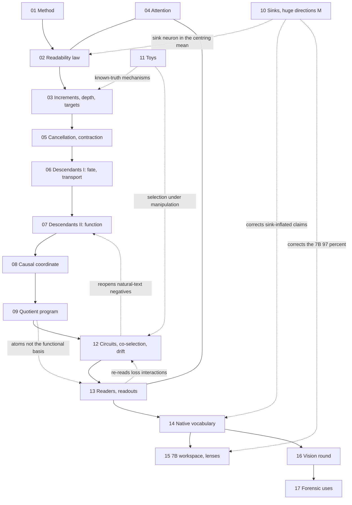

# Atlas of the WDD program: 432 experiments by technical area

This is the entry point to the whole program. It is small enough to paste into a new chat as context. It gives:

- what was asked;
- the seventeen technical areas;
- how they feed one another;
- the results everything rests on;
- the corrections later sessions made;
- where to find each script and result.

Each area has its own page in [`atlas/`](atlas/). A page gives the area's question and what it established. It then lists one row per experiment (question, result, status, and what it builds on and leads to), how the results flow, and links to other areas. [`atlas/index.tsv`](atlas/index.tsv) maps every experiment id to its area, session, status, script and result files.

## The program in brief

- **Weight-Dictionary Decomposition (WDD).** WDD reads a transformer's residual-stream state as a sparse combination of the model's own write vectors, usually with OMP.
  - The write vectors are token and position embeddings, MLP output rows (one per neuron), per-head output bases and biases.
  - Each vector is labelled with the component that wrote it. That label, the provenance, is what is new.
- **Models.**
  - The main five: GPT-2 small, Pythia-410m, Qwen2.5-0.5B, OLMo-1B-0724 and SmolLM2-135M.
  - Also used: Pythia training checkpoints and sizes from 70m to 1b, a random-init GPT-2, Qwen2.5-7B, and toy models trained from scratch.
- **Scale.** 432 experiment scripts (e00-e470 plus variants), 53 sessions, 2026-09-19 to 2026-09-25, one GPU. Most runs take 1-5 minutes.
- **Status counts** (from [`atlas/index.tsv`](atlas/index.tsv)): 113 established, 100 supported, 52 narrowed, 26 mixed, 114 refuted, 12 superseded, 6 null, 4 retracted, 5 tools.
- **Scope.** Negative results are kept. No claim is more general than these models.
- **Phase 1** (sessions 1-31, e00-e356): when a write can be read back from the state; why it fades; what it becomes downstream (the descendant); and what part of that matters causally (the quotient).
- **Phase 2** (session 32, e357-e373): the program's tools tested on known circuits, the co-selection proposal of "What if not Circuits?", and drift over training.
- **Phase 3** (sessions 33-53, e374-e470): readers and readouts; then self-description, meaning how well a model's own write rows describe its own states compared with controls (its "native vocabulary"). Also a 7B workspace agenda, the huge directions and sinks, a backcast "vision" round that trained models from scratch, causal tests of concept words and of a re-implemented block (session 46), WDD as a forensic instrument (sessions 47-48), the learning signal in native coordinates (session 49), whether the native words have a grammar (session 50), whether a description is a self-sufficient state (session 51), and native words as interchange coordinates (sessions 52-53).
- **Terms.**
  - *Identification (recall)*: the dominant true write is in the decoder's support.
  - *Prominence*: the write's projection on the centred state, over the state's norm.
  - *FVU*: the fraction of variance unexplained.
  - *Splice / loss recovered*: the state is replaced by its description and the change in next-token loss is measured.
  - *Descendant*: what a write becomes downstream.
  - *Quotient*: the low-dimensional causal part of the perturbation response.
  - *Controls for self-description*:
    - *rotated*: same Gram matrix, no provenance;
    - *covA*: Gaussian atoms with the dictionary's second moment;
    - *mix8*: sums of 8 atoms of one family;
    - per-block versions of covA and mix8;
    - PCA.
  - *Sink*: a position whose norm is above 10 times the median.
  - *M*: the top 8 principal directions of the states.

## The seventeen areas

| # | Area | Experiments | What it established |
| --- | --- | --- | --- |
| 01 | [Method: solvers, the dictionary, invariance, calibration](atlas/01_method.md) | 34: e00-e169, S1-S2 | Only a trained dictionary beats its rotation, by an extreme-value edge in the first ~8 atoms. OMP reconstructs best and identifies worst. Identification is limited by competition, not budget. Function follows reconstruction. |
| 02 | [When a write is readable: the prominence law, certificates](atlas/02_readability_law.md) | 33: e05-e206, S1-S3 | A write is read when its prominence beats a covariance-set competitor level (held out, zero parameters). Readability is a stable neuron trait, unrelated to importance. Two certificates. |
| 03 | [Where provenance survives: increments, depth, targets](atlas/03_increments_depth_targets.md) | 33: e02-e218, S1-S4 | Provenance is lost when writes accumulate: block increments read what states lose. An identified atom names who wrote a direction, not what caused it. |
| 04 | [Attention heads](atlas/04_attention.md) | 7: e13-e150, S1-S2 | Static head bases miss heads. OV value atoms rebuild head writes and recover attention patterns. |
| 05 | [Cancellation, erasure, the learned contraction](atlas/05_cancellation_contraction.md) | 29: e06-e220, S1-S4 | Erasure is rare, done by a crowd of later MLP writes, never attention. Every trained block contracts any direction by a gain derived from its weights, born as warmup ends. |
| 06 | [Descendants I: fate and transport](atlas/06_descendants_fate_transport.md) | 30: e221-e250, S4-S11 | A write is scattered, not damped. Its descendant still names the neuron (88-98%) and is the transported image of the write vector. A transported dictionary fails as a basis. |
| 07 | [Descendants II: function, sufficiency, dynamics](atlas/07_descendants_function.md) | 39: e251-e285b, S12-S21 | The descendant carries the write's function. Injected, it reproduces the effect, and it predicts its own future. Massive-activation neurons are the exception. |
| 08 | [The causal coordinate: compression, kill-tree, the quotient picture](atlas/08_causal_coordinate.md) | 32: e286-e316b, S22-S30 | Causal observables need 8-32 directions of a descendant, reconstruction 512-1024. The application (functional units, attribution) failed. |
| 09 | [The quotient program](atlas/09_quotient_program.md) | 38: e317-e356, S31 | Compressible, not structured. Shuffled-target fits, PCA and the discarded complement decode as well. WDD atoms are not the functional basis. |
| 10 | [Sinks, massive activations, the huge directions M](atlas/10_sinks_huge_directions.md) | 13: e20-e441, S1-S2, S44 | Sinks are one neuron's write. Phase 3's "86% / 97% of variance in 8 directions" was sink tokens; M holds 10-26% at ordinary positions. M is an early identity channel with a superquadratic knee. |
| 11 | [Synthetic constructions and toy transformers](atlas/11_toys_synthetic.md) | 16: s1-e386, S1-S3, S33-S34 | Known-truth systems reproduce misattribution, increment-versus-state reading and phase 2's selection claims. Three constructions are retracted. |
| 12 | [Phase 2: circuits, co-selection, drift, curvature](atlas/12_circuits_coselection_drift.md) | 27: e81-e373, S1-S2, S32 | Unit statistics find induction and IOI circuits in all five models, but not in natural-text averages. Co-selection peaks while a circuit forms. Interactions are large-move effects. Writes settle before function. |
| 13 | [Readers, readouts, stitching](atlas/13_readers_readouts.md) | 15: e374-e390, S33-S35 | Loss convexity biases interaction measures, so read them on logits. WDD plus a reader's metric finds induction edges. The 64-atom code keeps 84-99% of the loss, through provenance. |
| 14 | [Self-description: the native vocabulary](atlas/14_native_vocabulary.md) | 40: e391-e443, S36-S44 | 32-64 own words keep 90% of the loss. The vocabulary is learned: a per-block accent early, words from step 4000-16000. It survives covariance, lexicon and Gaussian-state controls. It is private across seeds. |
| 15 | [A 7B workspace agenda and established lenses](atlas/15_workspace_lenses.md) | 12: e415-e425, S40-S42 | At 7B, native words surface a hidden two-hop bridge that the logit lens misses. It is not a better reader in general. Most results have established names; the instrument is what is new. |
| 16 | [The vision round and its causal follow-ups](atlas/16_vision_round.md) | 19: e444-e455, S45-S46 | The vocabulary is written by training the writers, and the same function can be re-implemented with different words. Concept words hold across languages (7 / 15 / 22 of 24 nouns) and are causal handles: near natural size one word redirects 35-58% of translations (e455's 67-94% was a 6-8-fold injection). Word tables do not translate between models. |
| 17 | [WDD beyond description: forensics, steering, learning, grammar, self-consistency, interchange](atlas/17_forensic_instrument.md) | 15: e456-e470, S47-S53 | Self-description survives compression that breaks the model, so it does not detect damage. WDD names what a fine-tune changed but does not compress it. A native word steers as efficiently per unit of displacement as a dense vector. Its checksum, its ledger (for a state's future) and its forgery detection add nothing over simple baselines. It is a forward coordinate, not a learning one; its words have no grammar; what a description omits persists downstream. Across the band of blocks where a noun is written, a few native words are good interchange coordinates for it. |

## How the areas connect

The main line runs down the diagram as a chain of questions:

- Can a write be read back (01-03)?
- Why does it fade (05)?
- What does it become (06-07)?
- What part of that matters (08-09)?
- Do the tools see known circuits (12)?
- Is the sparse code faithful to the computation (13)?
- How well do the model's own weights describe its states (14)?
- What does that buy, at 7B and in models trained from scratch (15-16)?
- What can it do as a forensic tool: compression, model diffs, steering (17)?

Sinks (10) are a side branch that corrected several phase-3 numbers. The toys (11) test mechanisms where the truth is known.

## The spine: results the rest depends on

1. Only trained dictionaries describe their states better than their rotation; random init does not (e00, e01, e80). The edge is extreme-value, in the first ~8 atoms (e03, e09). [01]
2. Decoders answer different questions.
   - OMP reconstructs best and identifies worst; the dual-frame projection and LASSO add 11-21 points (e04, e45, e93).
   - Competition, not budget, limits identification (e10).
   - The spliced loss follows reconstruction, not the list of writers (e105). [01]
3. The prominence law. A write is identified when its prominence beats a covariance-matched competitor level.
   - The law is causal for OMP, and it predicts identification held out with no fitting (e56, e60, e127, e129).
   - Its one-shot form is partly definitional (audit). [02]
4. Readability is a stable neuron trait (ICC 0.95-0.97), mostly amplitude. It is unrelated to single-neuron importance (e05, e130, e59, e59b). There are two certificates: stability selection for OMP and a null z-score for the dual reading (e195, e200). [02]
5. Provenance is lost at accumulation.
   - Top-1 true writes are read at 0.85-1.00 from block increments and at 0.62-0.83 from states (e131).
   - The largest surviving write is read at 0.76-0.94 (e119).
   - An identified atom names who wrote a direction, not what caused it (e211). [03]
6. Erasure is rare (1-6% of tokens) and done by a crowd of later MLP writes (e08, e87, e185). Every trained block contracts any direction with a gain of -0.16 to -0.42, derived as normalisation gain times the MLP Jacobian trace. The contraction is zero at initialisation and born as warmup ends (e194, e210, e217). [05]
7. The contraction is scattering: a write's energy is kept while its direction spreads over thousands of later writers (e221-e225).
   - The descendant still names its neuron in 88-98% of tokens (e227).
   - It is the write vector's transported image (e231, e242).
   - It carries 6.0-6.4 of 7 bits (e237).
   - A transported dictionary still fails as a basis (e236). [06]
8. The descendant carries function. Injected, it reproduces the write's effect (0.28-0.62, against -0.29 to +0.16 for the write, e269), and it predicts its own future (e283). [07]
9. Two rungs: reconstruction needs 512-1024 directions, causal observables 8-32, for every perturbation family (e286, e304, e310). The ledger predicts joint effects (e313), but functional units and attribution failed as an application (e316, e316b). [08]
10. Compressible, not structured.
    - Shuffled-target fits, PCA and the discarded complement decode as well as the quotient (e340, e346, e347).
    - There is no null space, coset or fibre structure (e336, e338).
    - WDD atoms are not a privileged basis of it (e332-e334). [09]
11. Known circuits are real, redundant and large-move.
    - Unit statistics find induction and IOI circuits in all five models; natural-text averages hide them (e357, e358, e366).
    - Co-selection peaks while a circuit forms (e363, e370b).
    - Interactions are 2.4-48 times the local curvature (e371). [12]
12. Read interactions on logits, not the loss: 26-48% of pair signs flip (e377), and phase 2's growing redundancy was readout convexity (e380, e384). WDD's 64-atom code keeps 84-99% of the loss, and only rows close to the actual writers do this (e388-e390). [13]
13. Self-description is learned.
    - 32-64 own words keep 90% of the loss, where the largest actual writes need 1024 or more (e391, e395).
    - It is absent at initialisation in all five architectures (e401).
    - Early it is a per-block accent, 0.82 of the gap at step 1000; words take over between steps 4000 and 16000 (e443).
    - At the end it is word-level (e426), beyond the lexicon (e439) and beyond the states' covariance (e435). [14]
14. Sinks inflated the M claims.
    - Pythia's 86%, OLMo's 48% and Qwen-7B's 97% were single tokens; at ordinary positions M holds 10-26% (e432, e437b).
    - The false friends were sinks (e437).
    - M is an early identity channel, and removing it costs 2-4 times its quadratic prediction (e433, e441). [10]
15. At 7B, native words surface a hidden two-hop bridge in the middle layers: 0.11-0.21 against 0.00-0.01 for the lens (e420). The native lens is not better in general (e423-e425). [15]
16. The vocabulary is written.
    - Frozen random writer rows are barely used as words (e444b, e449). At language-model scale with the function held fixed, they are not used at all (e452).
    - A re-implemented block computes the same function with different words (e452).
    - Concept words hold across four languages and grow with scale (e448d).
    - Concept words are causal handles. Swapped at every depth they redirect translations and category answers (e455). Near natural size one word moves 35-58% of translations, since e455's swaps were 6-8 times natural (e458).
    - Words do not translate one to one between models, concept words included (e445, e453). [16]

17. As a forensic instrument WDD is limited.
    - Its self-description survives compression that breaks the model (e456).
    - It names the few words a fine-tune changed but does not compress the change (e457).
    - Its checksum confirms an intervention reached the intended word but predicts success no better than the intervention's size (e458).
    - Near-identical states have different futures through context, not history; the ledger adds nothing to the cosine (e460).
    - A forged write is barely detectable where it enters, and not at all a few blocks later (e461).
    - Per batch the gradient on a word is unrelated to it. Words form by rotation until about step 16000, then shrink in place, and the most used words get no more gradient (e462).
    - The words have no grammar: roles are carried by word choice, not inflection (e463), and a word written where it never fires is not corrected (e464).
    - A description is not a self-sufficient state: the network does not regrow what 16 words leave out, though it damps a random error of the same size (e465). Sixty-four extra dimensions still leave 7-11% of the loss missing (e466).
    - Positive: under interchange across blocks, one to four native words carry a translated noun between contexts (67-96% in Qwen), far better than rotated words or the task's principal directions at equal size (e469). This works only across the band of blocks where the noun is written (Qwen 0-6), and the carrier words turn over as it is re-written (e470). [17]

## Threads that cross areas

| Thread | Path through the program |
| --- | --- |
| Training dynamics | Neuron and law checkpoints (e05, e58: 02) → atom drift (e81: 12) → contraction born at warmup's end (e217: 05) → quotient born by step 4000, with the induction transition (e349: 09; e365, e373: 12) → neurons drift and co-selection is re-formed (e360-e364: 12) → halves co-adapt late (e378: 13) → self-description emerges (e395, e401, e405, e409: 14) → accent to words, steps 4000-16000 (e436, e443: 14) → training from scratch with frozen writers (e444, e449: 16) |
| The ladder of controls | rotated dictionary (e00: 01) → random-init dictionary (e80: 01) → covariance-matched competitors (e118, e127: 02) → covA, span, mix8, Fisher pursuit, a learned SAE (e399-e405: 14) → sinks kept exact (e437: 10) → per-block covA and mix8 (e443: 14) → lexicon removed, Gaussian states, context-only target (e439, e435, e440: 14) → frozen writers trained from scratch (e444b, e449: 16) → the function held fixed, writers frozen or retrained (e452: 16) |
| Readability versus function | readable is not important (e59, e59b: 02) → function follows reconstruction (e105: 01) → identified writes carry more function per unit energy in 4 of 5 models (e152, e165: 03) → the descendant carries function (e268, e269: 07) → the functional coordinate lives in the ledger's small-coefficient tail (e333: 09) → yet 64 own words keep the loss, by provenance (e388-e390: 13) → a re-description, not the largest writes (e391: 14) → a concept word swapped at every depth redirects the model (e455: 16), at natural size 35-58% (e458: 17) |
| Sinks and massive activations | sink neuron and last-block removal (e20, e55: 10) → sink in the centring mean (e89, e120, e126: 10) → massive neurons as the boundary of descendant laws (e250, e275b, e284b: 06, 07) → set point (e290: 08) → huge directions and false friends (e404, e411: 14; e418, e419: 15) → sink hygiene and the knee (e432-e441: 10) |
| Loss versus logit readout | natural-text interaction negatives (e264, e302: 07, 08) → circuits by pairwise ablation (e357-e372: 12) → the knee is the softmax, signs flip (e374, e377: 13) → redundancy re-read on logits (e380, e383, e384: 13) |
| Private versus shared vocabularies | seeds keep private languages; a shared functional subspace (e398: 14) → stages are mutually intelligible (e396, e402: 14) → no word-level translation between sizes (e445: 16) → concept words shared across human languages within one model (e448-e448e: 16) → one function, re-implemented with other words (e452: 16) → concept words correspond across sizes only at the concept level (e453: 16) |

## Corrections that supersede earlier claims

Area pages give the corrected version. Where the narrative in [`FINDINGS.md`](FINDINGS.md) differs from a page, the page follows the later correction or the recorded log.

- **Audit (session 1).**
  - e54's attention constant was N-fold too large.
  - e08 Pythia was rerun after a bias fix.
  - The prominence law is partly definitional, and its isotropic floor matched by coincidence (e62, e118, e127).
  - e47's target was near-circular (e119 replaces it).
  - S1b, S1c and S1d are retracted artifacts.
- **Session 31 over 28-30.** The 16-dimensional core is one of many equivalent high-variance projections, not a privileged subspace (e340, e346, e347).
- **Sessions 33-34 over phase 2.** Loss-level interaction and redundancy claims were mostly readout convexity. e264's KL control-pair redundancy is retracted (e383).
- **Session 38.** Early self-description is second-order (an accent). Only the late advantage is words.
- **Session 44.**
  - Pythia's 86%, OLMo's 48% and the 7B 97% of variance in M were sink or outlier tokens.
  - The step-4000 false friends were sinks.
  - Zipf-like usage is geometry.
  - The "sparser" and "denser" training trajectories are reconciled: the writes grow sparser from step 1000 to 16000 and denser again by the end.
- **Session 45.** Frozen writers are "barely", not "never", used as words. The native codec beats PCA only at 256-512 bits.
- **Session 47.** e455's concept-word swaps accumulated to 6-8 times natural size. Near natural size one word moves 35-58% of translations, not 67-94% (e458).
- **Session 52.** e451's weak single-depth effects are not because the concept left the position. Whole-state patching there at that one layer switches 78-99% of answers; one word is outvoted by the other directions that carry the noun (e469).
- **Found while building this atlas.** These are fixed in `FINDINGS.md` and `SYNTHESIS.md` where the narrative was wrong.
  - e198's recall right after the write is 0.95-1.00 only in Qwen and OLMo (Pythia 0.73-1.00, SmolLM2 0.51-1.00).
  - e152's per-energy ratios are 1.9-11x; the earlier 1.4-14x mixed raw and per-energy numbers.
  - e128's "mid layer" numbers are at level 6.
  - At the end of training, per-block word mixtures carry 0.12-0.52 of the self-description gap (e443). Per-block Gaussian words carry at most 0.33.
  - e245 on OLMo and e246 did run, according to the logs.
  - e438's attention shift is 1.75-3.1 times, not 2-3.

## Where things live

- **Scripts.** `scripts/<id>_<name>.py`, one per experiment. Each docstring states the question, the design and, from phase 3, a pre-registered guess. In the local sprint folder, phase 2 is in `scripts_phase2/` and phase 3 in `scripts_phase3/`.
- **Results.** `results/<id>_<name>_<model>.json`, one per run.
  - One line per run in `results/FINDINGS.log` (e00-e356).
  - `results/FINDINGS_phase2.log` (e357-e414).
  - `results/FINDINGS_box3.log` (e392b, e415-e450).
- **Narrative.**
  - [`FINDINGS.md`](FINDINGS.md): chronological, by session, with every number.
  - [`SYNTHESIS.md`](SYNTHESIS.md): what each session established.
  - [`GRAPH.md`](GRAPH.md): hypotheses H0-H262 with their tests and fates.
  - [`KILLED.md`](KILLED.md): every kill and retraction.
  - [`THEORY.md`](THEORY.md): transport theory and the self-description account.
  - [`RELATED_WORK.md`](RELATED_WORK.md).
  - [`VISION.md`](VISION.md): the backcast and a six-step roadmap.
- **Sessions to experiments.**
  - Phase 1:
    - S1 e00-e126 and s1-s2;
    - S2 e127-e182; S3 e183-e213; S4 e214-e222; S5 e223-e225; S6 e226-e230; S7 e231-e235; S8 e236-e240; S9 e241-e244; S10 e245-e247;
    - S11 e248-e250; S12 e251-e254; S13 e255-e258; S14 e259-e263; S15 e264-e267; S16 e268-e270; S17 e271-e272; S18 e273-e275b; S19 e276-e279; S20 e280-e284b;
    - S21 e285-e285b; S22 e286; S23 e287; S24 e288-e291; S25 e292-e295; S26 e296-e304; S27 e305-e308; S28 e309-e312; S29 e313-e315; S30 e316-e316b; S31 e317-e356.
  - Phase 2: S32 e357-e373.
  - Phase 3:
    - S33 e374-e382; S34 e383-e386; S35 e387-e390; S36 e391-e394; S37 e395-e398b; S38 e399-e406; S39 e407-e414;
    - S40 e415-e420; S41 e421-e422; S42 e421b, e423-e426; S43 e427-e431; S44 e432-e443 with e392b and e437b; S45 e444-e450; S46 e451-e455 with e452b; S47 e456-e459; S48 e460-e461; S49 e462; S50 e463-e464; S51 e465; S52 e466-e469; S53 e470.

## Open directions

[`VISION.md`](VISION.md) holds the roadmap:

- concept dictionaries at scale;
- a vocabulary card per model;
- monitoring vocabulary formation on real training runs;
- freezing writers while pre-training on real text;
- a functional (not Euclidean) self-description objective;
- an entropy-coded native codec.

Two standing negatives bound the claims:

- WDD atoms are a birth and provenance coordinate, not the functional basis (area 09).
- Native words are not the best sparse vocabulary: a learned SAE wins at small k (e403).

Sessions 46-47 add one direction: steering with native words. At natural size a concept word moves 35-58% of translations, about as efficiently per unit of displacement as a dense difference of means (e458); combinations of a few words, and more concepts and tasks, are the next tests. Session 52 found such combinations work as interchange coordinates across blocks (e469); the natural next step is the full causal-abstraction test on a task with a known high-level algorithm.
