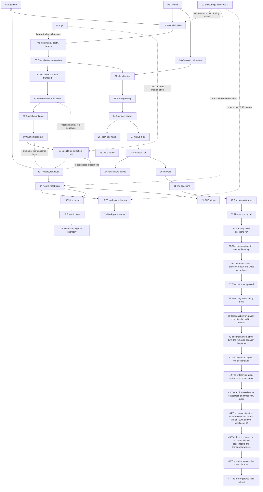

# Atlas of the WDD program: 616 experiments by technical area

This is the entry point to the whole program. It is small enough to paste into a new chat as context. For a shorter, theory-first version that says which routes are closed and why, read [`DIGEST.md`](DIGEST.md) first. This file gives:

- what was asked;
- the forty-seven technical areas;
- how they feed one another;
- the results everything rests on;
- the corrections later sessions made;
- where to find each script and result.

Each area has its own page in [`atlas/`](atlas/). A page gives the area's question and what it established. It then lists one row per experiment (question, result, status, and what it builds on and leads to), how the results flow, and links to other areas. [`atlas/index.tsv`](atlas/index.tsv) maps every experiment id to its area, session, status, script and result files.

## The program in brief

- **Weight-Dictionary Decomposition (WDD).** WDD reads a transformer's residual-stream state as a sparse combination of the model's own write vectors, usually with OMP.
  - The write vectors are token and position embeddings, MLP output rows (one per neuron), per-head output bases and biases.
  - Each vector is labelled with the component that wrote it. That label, the provenance, is what is new.
- **Models.**
  - The main five: GPT-2 small, Pythia-410m, Qwen2.5-0.5B, OLMo-1B-0724 and SmolLM2-135M.
  - Also used: Pythia training checkpoints and sizes from 70m to 1b, a random-init GPT-2, Qwen2.5-7B, and toy models trained from scratch.
- **Scale.** 616 experiment scripts (e00-e617 plus variants), 116 sessions, 2026-09-19 to 2026-10-09, one GPU. Most runs take 1-5 minutes.
- **Status counts** (from [`atlas/index.tsv`](atlas/index.tsv)): 172 established, 116 supported, 89 narrowed, 31 mixed, 153 refuted, 13 superseded, 14 null, 5 retracted, 23 tools.
- **Scope.** Negative results are kept. No claim is more general than these models.
- **Phase 1** (sessions 1-31, e00-e356): when a write can be read back from the state; why it fades; what it becomes downstream (the descendant); and what part of that matters causally (the quotient).
- **Phase 2** (session 32, e357-e373): the program's tools tested on known circuits, the co-selection proposal of "What if not Circuits?", and drift over training.
- **Phase 3** (sessions 33-116, e374-e617): readers and readouts; then self-description, meaning how well a model's own write rows describe its own states compared with controls (its "native vocabulary"). Also a 7B workspace agenda, the huge directions and sinks, a backcast "vision" round that trained models from scratch, causal tests of concept words and of a re-implemented block (session 46), WDD as a forensic instrument (sessions 47-48), the learning signal in native coordinates (session 49), whether the native words have a grammar (session 50), whether a description is a self-sufficient state (session 51), native words as interchange coordinates (sessions 52-53), the life cycle of native words (session 54), WDD applied to its own objects: fixed points, word algebra, role typing and induced geometry (session 55), the audits of its two open results (session 56), WDD put to WorkspaceBench's problems as a workspace reader (session 57), the instrument calibrated against classical theory (session 58), the provenance factor decomposed with a bridge to SAE features (session 59), and that bridge followed across depth and into activation, with the vocabulary's two clocks (session 60), the control that shows a feature is state-like, not write-like, in native words (session 61), and the follow-ups: the two clocks' anatomy in Pythia and OLMo, a second SAE family, and the kind of atom that becomes a word (session 62), what predicts whether a feature follows its writers, with the extreme-value account of vocabulary formation written into `THEORY.md` (session 63), and that account tested state by state and corrected: the floor stands, and the numerator is the centred chord of a position's largest writes (session 64), a partial predictor of the whole projection profile, with the crowd of small writes amplifying it early in training and contracting it late (session 65); the clean maximum is extreme-value selection over a nearly exchangeable residual, and the contraction is the MLPs' response to the chord, area 05's learned contraction, which spares the chord relative to any other direction (session 66); the contraction is isotropic and blind to the atoms in the linear regime, and the chord's sparing is a nonlinear, chord-amplitude effect (session 67) specific to the position's own writes, while a dense checkpoint sweep shows wordhood turning on as a fast crossover with sparsification before it and the contraction after (session 68), and, below step 512, the state cloud's collapse and re-expansion before sparsification, with the gradient spread rather than concentrated (session 69); and the rows that end as words have no lineage before sparsification, their selectivity leading their usage by a doubling and the early vocabulary being other rows (session 70); and the vocabulary is replaced in identity at the churn rate of the large rows, under a boundary that drifts toward larger, sparser rows and then holds (session 71); and that boundary is the extreme-value floor, which predicts the next checkpoint's entrants out of sample (session 72); the chord is not what carries a row to it, the prediction surviving the chord's replacement, permutation or removal, and the criterion holds across texts in three models (session 73); split into its parts, the state supplies that projection as a consensus, no part alone and attention least (session 74), and given its size the composition of the projection adds nothing to the prediction (session 75); by transport, the alignment is made locally and diffusely by the mass of small writes at the position, not imported from other positions and not by the words (session 76); counted causally the sources are a few thousand writes inside a cancelling mass, the loss gradient at the origin does not select the entrants, the rise of a future word's alignment is its row rotating toward the states where it already projects most and into the cloud's principal subspace, and given the largest projection the number of positions over the floor reads entry (session 77); in time, at a thousand steps, entry is a directed drift in which the row's breadth rises first, then a fast crossing in which the pull toward the best state doubles, the row's motion keeping its profile and the states' moving the maximum (session 78); and the drift is not the row's mean loss gradient at the time, raw or whitened, estimated at training-batch scale (session 79); a few percent of an entrant's motion is toward the mean state where its neuron fires, persisting and accumulating, the typical row's write drifts away from its read direction, and the motion is not in flat directions of the loss (session 80); the row set does not move as one, a common linear flow carrying a tenth of the motion early and a fortieth late and making no entrant, and the long displacement, mostly drift, is 1.09-1.18 times as curved as a random direction (session 81); and the bound that closes the line: everything at the origin predicts 0.049-0.072 of a row's eight-thousand-step displacement, all of it growth and read repulsion, the destination's geometry no more, while the size of the motion is predictable at R2 0.71-0.76 (session 82); and the criterion is largely generic, fixed random and rotated dictionaries followed through training foretelling their own entries at 0.81-0.81 against 0.91 for the native rows, whose frozen directions do as well as the moving ones (session 83); the stability is in the rows' individual orientations, not their covariance, its half-life about four thousand steps and growing, and a native word's angular basin is 26-29 degrees, twice a random dictionary's (session 84); the basin is the margin, directionally structured along the row's drift and its neighbours, and mostly the row's own (session 85); at equal margin a native word is no more robust than a random dictionary's, native minus random -0.14--0.05 in matched bins (session 86); the phenomenon does not depend on OMP, and its generic four fifths appear with no training at all, rows diffusing against a fixed Gaussian cloud, while a weak pull into the cloud supplies the native fifth (session 87); the factorial names the ingredient, a temporally coherent motion directed into the cloud, memory alone giving nothing, and Pythia's own increment sequences carry it to whatever rows receive them (session 88); the motion is aimed at the cloud the rows face, a turned cloud losing the fifth and a Gaussian cloud with its covariance keeping most of it, the pull's sign necessary, a fading pull no plateau, and the floor a one-way gate, words leaving above it by losing usage and breadth (session 89); and the exit is not a displacement but an erosion of the row's marginal alignments, mostly by the states' drift, with the takers unstructured, hysteresis generic, and the one-way gate the persistence of the native maximum, a random dictionary leaving through the floor (session 90); and what holds the maximum is the cloud's covariance, any direction in its persistent subspace keeping its alignments as the states move, while persistence is not stability, a stable word needing the individual orientation as well (session 91); and the cloud persists in most of its directions with its dynamic modes its variance modes, the native extremes persisting beyond the bulk where an isotropic atom's regress, while a Gaussian cloud with the real covariance and any temporal dynamics gives the spatial and temporal persistence but not the plateau or the retention, the native fifth living in the non-Gaussian extremes (session 92); and that fifth is sparse and row-wise, the top four projections per position grafted onto a Gaussian cloud restoring the plateau, the turnover, the retention and the gate, the real bulk carrying none of it, and the grafted pairs moved to random positions changing nothing, the vocabulary being the slow evolution of the set of rows the states make extreme somewhere (session 93); and on the write side each word's extremes are made by its own persistent ensemble of thousands of writers in a cancelling mass, the same population wherever they occur, specific to the row and not shared across words (session 94); and the coalition precedes the word, cohering across a future entrant's extreme positions four intervals before entry where a near miss matched on S has none, what rises across the entry being the coherence and the alignment, a quarter of the rise the row's rotation and a quarter the arrival of transported writes, the coalitions private and persistent beyond their contexts (session 95); and, after a channel selected by alignment with the row proved generic by construction, the neuron's selectivity for its future contexts precedes entry by eight intervals and a near miss is a row whose neuron loses it while its row approaches as an entrant's does (session 96); and WDD is not a proxy for that selectivity, six ordinary neuron statistics predicting entry at 0.74 out of sample against 0.88 for S and breadth, to which they add nothing (session 97); and a learned feature dictionary of the states sees the association by half, the feature nearest to a word's row at cosine 0.48 and at half of its contexts, no feature being the word's context set (session 98); and on a second family, OLMo-1B at the same token range, the gate, the native fifth, the coalition, its precedence and the necessity test replicate, most more strongly, while the word's own neuron's selectivity before entry and attention's half of an extreme do not (session 99); and, the critique of that reading anticipated and run, the OLMo neuron is selective by absolute activation and the top contributor to its extreme, attention's small share is OLMo's share of any state, the floor bounds entry from below on both models with thousands of non-words above it, and the tails carry the plateau, the gate and the turnover while the covariance keeps most of OLMo's retention (session 100); and, a map of twenty-one directions triaged and its nine open ones run, the vocabulary is a property of writing through rows to a residual stream (a state-space model has it more strongly than Pythia, vision transformers have it without tokens, three optimizers give it alike), it is conserved across scale by context sets that outlive their rows, entry is the row's turn into a direction the cloud already speaks and exit the cloud's erosion, the ledger reads neither corruption nor factual error, the instrument scales by screening, and the word set is a marginal statistic where the usage is the robust one (session 101); and, theory extraction, the open arrows of the mechanism tested and the map written: the partition of the state space is the data's (independent seeds twin at 0.34-0.38, Pythia to Mamba at 0.46), the loop runs from the data to the neuron, the write direction is what a neuron carries, the coalition is in Mamba, the association tracks generalisation in the toy, and a word is a large row that the cloud makes extreme at a class of contexts the data fixes, the span being the norm's and the association the data's (session 102); and the object separated into three: the class is the partition and the partition is the corpus's surface structure, the direction carries the class's downstream effect, and the row is the direction's implementation, recruited, transplantable as a label and computing nothing alone (session 103); and what has to travel: the producer coalition with the direction makes the entrant a word but does not carry the class's computation, which nothing short of the readout moves, so the effect is the direction's, its producers' and its readers' together; the native excess is a label-free detector of generalisation in the toy, never false and never early (session 104); and the instrument placed by two tests designed to let it lose: an autoencoder's features have the same producer coalitions, as coherent and as necessary, and the native excess does not predict generalisation ahead of the weight norm or the task's Fourier signal, so WDD's distinct element is parameter provenance of the association, which buys the developmental questions (session 105); and the developmental claim given its control: the class is in the cloud from the first checkpoint, the coalition coheres before the row is recruited, and an autoencoder trained at every checkpoint sees a minority of the classes and never the parameter (session 106); and responsibility migration read directly: the class with its direction is the invariant and the row its replaceable implementation, the row recruited is the nearest available row thousands of steps ahead, and a blocked row is replaced by the next (session 107); and recruitment forecast from row-free classes at time t with no future in the class, at AUC 0.927 / 0.932 two checkpoints ahead on both families (session 108); and the learning signal behind the turn, a small consistent drift the class's own positions drive, with the removed speaker tested at scale and the paper written (session 109); and the six directions beyond the descendants, recruitment shown not to be a performance event, bounded unlearning leaving the writers intact, pruning that helps whatever is pruned, twins that do not anchor a stitch, polysemanticity that grows through training, and the magnitude bias traced to the support (session 110); and the unlearning audit tested as its users would, where depth is read on the parameter side, the writers' activation and the rows' change, RMU overriding the state while the writers fire, fine-tuning recruiting rows unchanged, and the named writers' removal not unlearning (session 111); and the audit's baseline, causal test and three new subjects, a naive neuron selection matching the writers, silencing after an override buying relearning resistance, safety training recruiting writers as fine-tuning does, merging keeping both fine-tunes' recruits, and compression damage tracking silenced writers only through severity (session 112); and the refusal direction found real and not written by the harmful-request writers, the silenced writers restored without restoring the domain, the causal test shrinking at 410m and the audit holding at 1B (session 113); and the J-Lens connection, the class as the free expert partition for a transported write and the refusal verdict re-measured with transport (session 114); and the auditor weighed against the state of the art, a transferable rule for the share of a forget rise a relearning recovers, the benchmark bake-off where the audit has nothing to read, and the in-context attack that recovers nothing on the Pile (session 115); and the pre-registered held-out test, the rule fixed before the runs and scored on new domains, methods and an architecture (session 116).
- **Terms.**
  - *Identification (recall)*: the dominant true write is in the decoder's support.
  - *Prominence*: the write's projection on the centred state, over the state's norm.
  - *FVU*: the fraction of variance unexplained.
  - *Splice / loss recovered*: the state is replaced by its description and the change in next-token loss is measured.
  - *Descendant*: what a write becomes downstream.
  - *Quotient*: the low-dimensional causal part of the perturbation response.
  - *Controls for self-description*:
    - *rotated*: same Gram matrix, no provenance;
    - *covA*: Gaussian atoms with the dictionary's second moment;
    - *mix8*: sums of 8 atoms of one family;
    - per-block versions of covA and mix8;
    - PCA.
  - *Sink*: a position whose norm is above 10 times the median.
  - *M*: the top 8 principal directions of the states.

## The forty-seven areas

| # | Area | Experiments | What it established |
| --- | --- | --- | --- |
| 01 | [Method: solvers, the dictionary, invariance, calibration](atlas/01_method.md) | 34: e00-e169, S1-S2 | Only a trained dictionary beats its rotation, by an extreme-value edge in the first ~8 atoms. OMP reconstructs best and identifies worst. Identification is limited by competition, not budget. Function follows reconstruction. |
| 02 | [When a write is readable: the prominence law, certificates](atlas/02_readability_law.md) | 33: e05-e206, S1-S3 | A write is read when its prominence beats a covariance-set competitor level (held out, zero parameters). Readability is a stable neuron trait, unrelated to importance. Two certificates. |
| 03 | [Where provenance survives: increments, depth, targets](atlas/03_increments_depth_targets.md) | 33: e02-e218, S1-S4 | Provenance is lost when writes accumulate: block increments read what states lose. An identified atom names who wrote a direction, not what caused it. |
| 04 | [Attention heads](atlas/04_attention.md) | 7: e13-e150, S1-S2 | Static head bases miss heads. OV value atoms rebuild head writes and recover attention patterns. |
| 05 | [Cancellation, erasure, the learned contraction](atlas/05_cancellation_contraction.md) | 29: e06-e220, S1-S4 | Erasure is rare, done by a crowd of later MLP writes, never attention. Every trained block contracts any direction by a gain derived from its weights, born as warmup ends. |
| 06 | [Descendants I: fate and transport](atlas/06_descendants_fate_transport.md) | 30: e221-e250, S4-S11 | A write is scattered, not damped. Its descendant still names the neuron (88-98%) and is the transported image of the write vector. A transported dictionary fails as a basis. |
| 07 | [Descendants II: function, sufficiency, dynamics](atlas/07_descendants_function.md) | 39: e251-e285b, S12-S21 | The descendant carries the write's function. Injected, it reproduces the effect, and it predicts its own future. Massive-activation neurons are the exception. |
| 08 | [The causal coordinate: compression, kill-tree, the quotient picture](atlas/08_causal_coordinate.md) | 32: e286-e316b, S22-S30 | Causal observables need 8-32 directions of a descendant, reconstruction 512-1024. The application (functional units, attribution) failed. |
| 09 | [The quotient program](atlas/09_quotient_program.md) | 38: e317-e356, S31 | Compressible, not structured. Shuffled-target fits, PCA and the discarded complement decode as well. WDD atoms are not the functional basis. |
| 10 | [Sinks, massive activations, the huge directions M](atlas/10_sinks_huge_directions.md) | 13: e20-e441, S1-S2, S44 | Sinks are one neuron's write. Phase 3's "86% / 97% of variance in 8 directions" was sink tokens; M holds 10-26% at ordinary positions. M is an early identity channel with a superquadratic knee. |
| 11 | [Synthetic constructions and toy transformers](atlas/11_toys_synthetic.md) | 16: s1-e386, S1-S3, S33-S34 | Known-truth systems reproduce misattribution, increment-versus-state reading and phase 2's selection claims. Three constructions are retracted. |
| 12 | [Phase 2: circuits, co-selection, drift, curvature](atlas/12_circuits_coselection_drift.md) | 27: e81-e373, S1-S2, S32 | Unit statistics find induction and IOI circuits in all five models, but not in natural-text averages. Co-selection peaks while a circuit forms. Interactions are large-move effects. Writes settle before function. |
| 13 | [Readers, readouts, stitching](atlas/13_readers_readouts.md) | 15: e374-e390, S33-S35 | Loss convexity biases interaction measures, so read them on logits. WDD plus a reader's metric finds induction edges. The 64-atom code keeps 84-99% of the loss, through provenance. |
| 14 | [Self-description: the native vocabulary](atlas/14_native_vocabulary.md) | 40: e391-e443, S36-S44 | 32-64 own words keep 90% of the loss. The vocabulary is learned: a per-block accent early, words from step 4000-16000. It survives covariance, lexicon and Gaussian-state controls. It is private across seeds. |
| 15 | [A 7B workspace agenda and established lenses](atlas/15_workspace_lenses.md) | 12: e415-e425, S40-S42 | At 7B, native words surface a hidden two-hop bridge that the logit lens misses. It is not a better reader in general. Most results have established names; the instrument is what is new. |
| 16 | [The vision round and its causal follow-ups](atlas/16_vision_round.md) | 19: e444-e455, S45-S46 | The vocabulary is written by training the writers, and the same function can be re-implemented with different words. Concept words hold across languages (7 / 15 / 22 of 24 nouns) and are causal handles: near natural size one word redirects 35-58% of translations (e455's 67-94% was a 6-8-fold injection). Word tables do not translate between models. |
| 17 | [WDD beyond description: forensics, steering, learning, grammar, self-consistency, interchange, life cycle](atlas/17_forensic_instrument.md) | 16: e456-e471, S47-S54 | Self-description survives compression that breaks the model, so it does not detect damage. WDD names what a fine-tune changed but does not compress it. A native word steers as efficiently per unit of displacement as a dense vector. Its checksum, its ledger (for a state's future) and its forgery detection add nothing over simple baselines. It is a forward coordinate, not a learning one; its words have no grammar; what a description omits persists downstream. Across the band of blocks where a noun is written, a few native words are good interchange coordinates for it. Over training, becoming a word and becoming important are separate processes. |
| 18 | [WDD applied to itself: fixed points, word algebra, role typing, induced geometry, and their audits](atlas/18_recursion_composition.md) | 6: e472-e477, S55-S56 | Applied to its own description, WDD is a projection: one application is a fixed point, for rotated words too. Native handles for two attributes of one word act independently and compose in Qwen (gender alone 92%, both from two words 74%), where rotated words fail and the task's principal directions do as well; the gender handle is one shared MLP row that works across words and languages (98%). Identity handles are not typed by grammatical role, and for an entity copied into the answer native words are no better than rotated ones. WDD's distances between states are a coarse version of activation distance; its one native-only signal, the concentration of deep descriptions, survives its audit and is half prominence. |
| 19 | [WDD as a workspace reader: WorkspaceBench's problems](atlas/19_workspace_reader.md) | 6: e478-e482 with e478b, S57 | Against the benchmark's problems at 7B: the native reader almost never claims a wrong bridge country where the lens claims nothing, and no certificate helps where fabrication occurs (arithmetic); a concept held in mind is surfaced three times as often as by the lens, always as a computed MLP row and never as an echo; one native word carries a two-token name as a unit and disambiguates it (24 of 25) where the lens shows the second token in 4%; per-word reading loses half of a finished answer and reading the words as a whole recovers it; signs do not carry order. |
| 20 | [Calibration against classical theory](atlas/20_classical_calibration.md) | 13: e483-e493, e498, e500, S58-S62 | The detection threshold is a Gumbel law whose two parameters predict the detection curve within 0.1 (resolution 0.25-0.4 of the state's norm); its scale is the atoms' second moment for a rotated dictionary and 2.9-6.2 times that for the native one, a provenance factor that is write sparsity on an accent: the largest writes standing out, rising through training, over a collective alignment that forms by Pythia step 512 and decays (Pythia and OLMo). The description is a non-redundant code with correction; its first word carries 0.4-1.2 bits about the next token; the rows are the heavy-tailed directions of the states, which FastICA partly rediscovers; provenance loss has one timescale; MLP rows are the words at every checkpoint. |
| 21 | [The provenance layer under SAEs](atlas/21_sae_bridge.md) | 8: e494-e497, e499, e501, e502, e504, S59-S64 | A learned SAE feature's top native word is an MLP row for 76-93% of features at every depth of GPT-2, from any block; features are sparser in native words than in rotated ones but as sparse as a whole state, not a write (ReLU family), or between covariance-matched directions and states (TopK family); a quarter of the most used rows are features; a feature's top row separates the positions where it fires at AUC 0.62 (ReLU) and 0.73 (TopK), the eight-word ledger 0.61 and 0.83.; the TopK family's stronger row-following is its features' sparsity, not its parameterisation (e501); the other rows add modestly where features are sparse; on Pythia-160m the top row follows the feature but the features are not state-like |
| 22 | [The extreme-value model tested](atlas/22_model_tested.md) | 8: e503, e505-e511, S64-S68 | The floor stands (rotated calibration 0.97-1.00 in 27 cells); the numerator is neither the largest write's own coefficient (0.3-0.7 of a winning projection) nor the state cloud's second-order alignment (1.02-1.24 of the non-writers' 1.3-2.3 excess) but the position's chord of large writes, centred against the common direction they share, which predicts GPT-2's maximum within 13% and names the atom in a third to a half of states, with the crowd's contraction (OLMo) and the small writes (Pythia) as the corrections that matter; the accent is the dense sum on head atoms, the words the sparse chord; against the whole profile the chord is a partial predictor, and the crowd amplifies it early in training and contracts it late; the clean maximum is selection over a nearly exchangeable residual (GPT-2), and the crowd's contraction is the MLPs' response to the chord, born with area 05's learned contraction; the contraction itself is isotropic and blind to the atoms, and the chord's sparing is a nonlinear, chord-amplitude effect specific to the position's own writes (a fake chord of native rows is contracted like a random direction) |
| 23 | [The onset of wordhood in training](atlas/23_training_sweep.md) | 7: e512-e516, e515b, e516b, S68-S72 | At 18 Pythia checkpoints wordhood turns on in a fast phase (half the writer-win rate's rise between steps 2000 and 8000) and then creeps; sparsification precedes it, the contraction and the chord's growth follow; the accent is in place before step 512; the late attention phase erodes the last block's words; before it, the state cloud collapses to a dozen dimensions at steps 16-64 (the accent's birth) and sparsification begins as it re-expands, with the gradient spread, not concentrated; the future words have no lineage before sparsification, selectivity leading usage by a doubling from step 2000, and the early vocabulary is other rows; the vocabulary is replaced in identity at the churn rate of the large rows, under a boundary that drifts toward larger, sparser rows and then holds; the boundary is the extreme-value floor, which predicts the next checkpoint's entrants out of sample at 0.76-0.97 |
| 24 | [The boundary's carrier](atlas/24_selection_counterfactual.md) | 8: e517-e521, e517b, e519b, e521b, S73-S77 | Replacing, permuting or removing the position's 64 largest writes at every position leaves the prospective prediction of entry within 0.04 of the real state's, so the projection that predicts wordhood is carried by the state outside its largest writes; the entrants rise because their projections rise, not because the floor falls; the criterion picks a disjoint text set's new words at 0.86-0.97 in GPT-2, Pythia and OLMo; split into parts, no part supplies the projection alone, attention least, and the words are the atoms along which the parts agree, and given its size the composition of the projection adds nothing; and the alignment is made locally and diffusely by the mass of small writes at the position, not by descendants from elsewhere, not by the words, carried causally by a few thousand small writes inside a cancelling mass (the participation ratio of session 76 measured the cancellation) |
| 25 | [Training's hand](atlas/25_training_motion.md) | 5: e522-e524, e522b, e524b, S77-S78 | The loss gradient at the origin does not select the entrants (a one-step move along it, 12k and 65k tokens, reads entry at 0.47-0.55 in every form, Spearman 0.00-0.02 with the actual change, for the reliable part of the prediction; the row's own gradient direction is unmeasurable); the rise of a future word's alignment is the row moving toward the states (0.64-0.78 of the rise), not the states moving onto the row, every row rotating by a similar angle and growing; the entrants' rows move into the cloud's principal subspace and toward the states where they already project most, the maximum often moving to another position; and given S, the number of positions at which a row clears the floor reads entry at 0.71-0.85; in time, entry is a directed drift of five thousand steps or more in which breadth rises first, then a crossing of two thousand steps in which the pull toward the best state doubles, the row's own motion keeping its profile and the states' moving the maximum |
| 26 | [The drift's cause](atlas/26_drift_cause.md) | 7: e525-e530, e525b, S79-S82 | The directed drift of the rows near the floor is not their mean loss gradient at the time, raw or Adam-whitened, which at training-batch scale agrees with itself at cosine 0.08-0.18 and is followed by the thousand-step update at 0.01; not the co-active writes; and not a flat direction of the loss (the update's curvature 1.13-1.15 times a random direction's). A few percent of an entrant's motion is toward the mean state where its neuron fires and toward the state at its best position, persisting and accumulating over thousands of steps (the increments' lag correlation 0.11-0.17 out to six thousand steps); the typical row's write drifts away from its read direction; the bulk of every row's motion is growth along itself and an unexplained, mean-reverting remainder; the row set does not move as one, the best common linear flow carrying a tenth of the motion early and a fortieth late and making no entrant; separated by timescale the long displacement is 1.09-1.18 times as curved as a random direction and the oscillation axis 1.15-1.17; and the bound: everything at the origin predicts 0.049-0.072 of a row's eight-thousand-step displacement's energy, all of it growth and read repulsion, the destination's geometry no more, while the size of the motion is predictable at R2 0.71-0.76; the search for the drift's cause in local quantities closes here |
| 27 | [The native axes](atlas/27_native_axes.md) | 6: e531-e535, e534b, S83-S87 | The prospective criterion is four fifths generic: fixed random and rotated dictionaries followed through training foretell their own entries at 0.81-0.86 against 0.91-0.94 for the native rows, whose frozen directions do as well as the moving ones; what the native rows have is stability, half their word set surviving four thousand steps against a sixth, and it is in their individual orientations, not their covariance (matched atoms keep 0.19-0.20); the native half-life is about four thousand steps and grows as the row set settles; a native word's angular basin is 26-29 degrees, twice a random dictionary's, by its margin above the competitors; the basin is the margin, directionally structured along the row's drift and its neighbours, and mostly the row's own (its competitors' random motion leaves 0.79-0.89 of the words); at equal margin a native word is no more robust to rotation than a random dictionary's word; none of it depends on OMP, three other definitions of wordhood giving the same criterion and advantage |
| 28 | [The synthetic null](atlas/28_synthetic_null.md) | 3: e536-e538, S87-S89 | Rows diffusing on the sphere against a fixed Gaussian cloud with the real covariance, with no training, show the criterion at 0.75-0.80, breadth before the maximum, turnover and retention 0.32, the generic four fifths of e531; memory alone adds only memory; a temporally coherent motion into the cloud adds the native fifth (0.88, 0.52, a crossing through the floor), and Pythia's own increment sequences carry it to any recipient; the motion is aimed at the cloud the rows face (turned by a fixed rotation the cloud loses the fifth, 0.72 and 0.13; a Gaussian cloud with its covariance keeps most of it, 0.88 and 0.41); the pull's sign is necessary and a fading pull gives a slow approach, not Pythia's jump to a plateau |
| 29 | [How a word leaves](atlas/29_exits.md) | 6: e538b-e541b, S89-S91 | The floor is a gate in one direction for the native rows: an entry is a crossing (0.37 of the entrants under the floor two intervals before), an exit a loss of usage and breadth with the projection kept (0.77-0.82 of the leavers over the floor at the first checkpoint out); the exit is not a displacement, the field at the lost positions still (0.88 to 0.88) and the leaver's own projection falling (0.92 to 0.79), the takers at the null in number, class, cosine and neighbour rank, entrants never displacing a leaver; the erosion is mostly the states' drift, the maximum relocating above the floor; hysteresis (a word stays where a matched non-word does not enter) is generic, and so is the erosion, but the gate is native: a random dictionary's words leave through the floor (0.24 over it), isotropic diffusion's likewise, the pull worlds' half; the gate is the persistence of the native maximum, which sits at S 1.25-1.44 while the breadth erodes; what holds the maximum is the cloud's covariance, a native row's alignment at a position not regressing at equal level where a random atom's does, covariance-matched atoms persisting like the rows, and a null with their kernel reproducing the native maximum, while persistence is not stability, the covariance atoms' words churning below the floor, so that a stable word needs the persistent subspace and the individual orientation that sets it high |
| 30 | [The tails](atlas/30_tails.md) | 4: e542-e544, e544b, S92-S93 | The cloud persists in most of its directions and its dynamic modes are its variance modes; a native row's whole profile persists like an isotropic atom's while its extremes persist beyond its bulk; a Gaussian cloud with the real covariance at every checkpoint gives, at any temporal dynamics, the spatial and temporal persistence but words at S 1.07 with retention 0.35; the native fifth is sparse and row-wise: the top four real projections per position grafted onto that cloud restore the plateau (1.32), the turnover (91 entries per interval), the retention (0.51) and the gate (0.88), the real bulk with those projections Gaussianised has none of it, and the grafted pairs moved to random positions at every checkpoint give the same vocabulary, so the vocabulary is the slow evolution of the set of rows the states make extreme somewhere |
| 31 | [The coalitions](atlas/31_coalitions.md) | 5: e545-e547, e546b, e547b, S94-S96 | Each word's extremes are written by its own persistent ensemble of thousands of writers in a cancelling mass, more than half of the projection transported by attention, the same population wherever they occur, specific to the row and not shared across words; the coalition precedes the word, cohering across a future entrant's extreme positions four intervals before entry (0.42 against 0.20 for a near miss matched on S) while the contexts are as stable for both; what rises across the entry is the coherence, the own neuron's contribution and the alignment, a quarter of the rise the row's rotation, a quarter the arrival of transported writes; the coalitions are private (0.575 against 0.013) and persist beyond their contexts (0.873 against a selection-matched 0.599); a channel selected by alignment with the row is generic by construction and says nothing about which came first; the neuron's selectivity for its future contexts precedes entry (z 1.61 eight intervals before, 2.85 at entry) and a near miss is a row whose neuron loses it while its row approaches as an entrant's does; the coalitions' families are few and are near-duplicate rows at the same contexts |
| 32 | [The necessity tests](atlas/32_necessity.md) | 2: e548, e549, S97-S98 | WDD is not a proxy for neuron selectivity: six ordinary statistics of a neuron and its row predict entry at 0.74 out of sample, S and breadth at 0.88, and the activation side adds nothing to WDD, because a word's extreme contexts are the coalition's, where the neuron fires selectively but not most; a learned feature dictionary of the states sees the association by half, no feature matching a word's context set as a set (Jaccard 0.19), the feature nearest to the row at cosine 0.48 and at half of its contexts, and the nearest row to a feature a word for 0.20 of features against a base rate of 0.01 |
| 33 | [The second model](atlas/33_second_model.md) | 6: e550-e555, S99-S100 | On OLMo-1B at steps 1000-16000 (block 8) the chain of sessions 89-97 replicates, most of it more strongly: the criterion 0.94 against 0.80 for random atoms, retention 0.64 against 0.19, the gate one-way for the rows (0.96 over the floor at exit) and two-way for random atoms, the rows' extremes persisting beyond their bulk, the private persistent coalition (0.731 within a row, 0.969 across eight thousand steps) preceding the word (0.52 against 0.31 for near misses), and the necessity test (S and breadth 0.92 against 0.78); session 100 re-measured the two apparent differences: by absolute activation the OLMo entrant's neuron is selective before entry (z 2.63 eight intervals before) and is the largest contributor to its extreme, attention's small share (0.27) is OLMo's share of any state, thousands of non-words sit over the floor on both models so the floor bounds entry from below rather than defining it, and the tails carry the plateau, the gate and the turnover on OLMo while the covariance keeps most of its retention |
| 34 | [The map: nine directions run](atlas/34_map.md) | 13: e556-e564 with e557b, e558b, e561b, e564b, S101 | A twenty-one-direction map triaged against the record and its nine open directions run in one session: the vocabulary is a property of writing through rows to a residual stream, present in a state-space model with neither attention nor MLPs (Mamba, advantage 0.258 against Pythia-160m's 0.188, words at S 1.78), in two vision transformers without tokens (advantage 0.105 / 0.161, broader words) and in the grokking toy under three optimizers alike; conserved across scale by its context sets (0.40 of 410m's words twinned in 160m against a null of 0.03, mostly not token identities, the same rate across a data twin, three quarters of the within-run rate) while the rows forget their initialization (0.071) and the context sets outlive their rows (0.55 against 0.21 by index); entry is the row's turn into a direction the cloud already speaks (1.29 in the old cloud) and exit the cloud's erosion, a transplanted neuron brings its word (0.68-0.80), a trajectory merge has no barrier; the ledger reads neither upstream corruption nor factual error (no state does; invented names are more spoken); 1024 candidates by projection reproduce OMP at 1.9-4.6 times the speed; continued training moves the states, not the rows, and the word set is a marginal statistic (Jaccard 0.86 under noise costing +0.03 nats) where the usage correlation is the robust one |
| 35 | [Theory extraction: the mechanism map](atlas/35_mechanism_map.md) | 12: e565-e572 with e566b, e566c, e566d, e569b, S102 | The question above the program, why a trained network organises its computation into persistent associations between native write directions and classes of its state distribution, answered arrow by arrow in MECHANISM_MAP.md after the open arrows were tested: the partition of the state space is the data's (independent seeds twin at 0.34-0.38 against a null of 0.03; Pythia-410m to Mamba-130m 0.46, to OLMo-1B 0.41 by character spans); the loop runs from the data to the neuron (the row turns toward the cloud's variance, 1.035 against a random turn's 0.970, and the cloud does not grow along the row); the write direction is what a later neuron carries into an earlier model (0.54 against 0.18 for the read row); the coalition is in Mamba, stronger (0.857 within a row against 0.000); in the toy the association tracks generalisation under every knob; stability has levels (row identity > usage > function > membership); norm-matched rows describe the states equally at K=8 but are used 0 times against 19, sit under the floor and twin at 0.02 against 0.40, so the span is the norm's and the association the data's; the invented-name row is a generic construction word with no causal role for its own write |
| 36 | [The object: class, direction or row, and what has to travel](atlas/36_object.md) | 9: e573-e579 with e573b, e575b, S103-S104 | The one question left above the map, whether a context class or its row is the object, generalised into five hypotheses and run: the class is the partition and the partition is the corpus's surface structure (the token, the previous token and the position predict a word's context set at AUC 0.853; not an output partition; two vision models with different objectives share only its spatial layout); the direction carries the function (a class that changes rows changes its direction, cosine 0.133, and its downstream effect, 0.156 against 0.449 for kept rows; within one model two words sharing a class have effects as alike as their directions, correlation 0.86); the row is the implementation (frozen trained rows draw a fresh network's usage without their classes; a transplanted direction becomes a word without carrying computation, KL 0.0021; the words are read no more than other rows): the data fixes the classes, training fixes the directions, the rows are where the directions live; what has to travel (session 104): the direction alone makes 0.60 of entrants words, the coalition of 128 producers 0.47, both 0.93, and nothing short of the readout moves the recipient's predictions at the class toward the donor (-0.066 for 512 producers with the direction, -0.873 for the readout alone): the effect is the direction's, its producers' and its readers' together; and the native excess is a label-free detector of generalisation in the toy, never false, never early |
| 37 | [The instrument placed](atlas/37_instrument_placed.md) | 3: e580, e580b, e581, S105 | Two tests designed to let WDD lose: an autoencoder's features on the same states have producer coalitions as coherent as the words' (0.692 against 0.672, random directions 0.154) and as necessary (drop 0.92 against 0.77), with different producers (Jaccard 0.07), so the producer-consumer decomposition belongs to any spoken direction attribution can reach; and over 20 toy trajectories the best WDD statistic predicts generalisation a thousand steps ahead at AUC 0.824 against 0.961 for the best classic baseline. The placement: WDD's distinct element is parameter provenance of the association, which buys the developmental questions and not the descriptive or the detector ones |
| 38 | [Watching words being born](atlas/38_born.md) | 3: e582-e584, S106 | The developmental claim given its control: over sixteen checkpoints and 241 eventual words every class coheres in the cloud from the first checkpoint, the rows are recruited at step 7.0 thousand at the median and the coalition coheres before recruitment (0.84); an autoencoder trained at every checkpoint has a persistent feature for 0.31 of the classes, sees those before the row, and does not date the parameter (its decoder at cosine 0.11 with the row at recruitment, pointing at it 7.0 checkpoints later for 33 words): the order of birth is any dictionary's, which parameter takes responsibility and when is the native one's |
| 39 | [Responsibility migration read directly, and the forecast](atlas/39_migration.md) | 4: e585-e588, S107-S108 | Three experiments outside the control loop: a class has one speaker at the median after a gap, its own direction is at cosine 0.85 with its step-16000 direction at step 4000 when the row is the speaker for 0.06 of classes and at 0.86 at the final model when the row is the speaker for 0.38 (the class with its direction is the invariant, the row its replaceable implementation); the row that will be recruited is the first of 53,248 by its ratio over the class two checkpoints ahead for 0.52 of words and in the top ten for 0.84 (recruitment is the geometry's); with its 32 eventual words frozen the toy reaches test accuracy 1.00 with a vocabulary on other neurons, a third of the classes re-appearing on substitutes (block the row and the network recruits others); and the forecast with no future in the class: row-free clusters at t pick the row that will be recruited two checkpoints later at AUC 0.927 on Pythia-410m and 0.932 on OLMo-1B (eight ahead 0.869 / 0.848), the class side adding +0.006 / +0.003 to the row's own S (session 108) |
| 40 | [The mechanism of the turn, the removed speaker, the paper](atlas/40_turn_and_paper.md) | 2: e589, e590, S109 | The last mechanistic hole and the scale test, then the paper: two checkpoints before recruitment the eventual row's gradient step points toward its class at mean cosine +0.020 (3.8 standard errors; controls at zero), the class's positions supplying 0.215 of the row's gradient at 0.006 of positions, a drift the class's own loss drives; thirty speakers removed and frozen at step 8000 and trained 2.5M tokens leave 0.17 of their classes with a substitute (unfrozen 0.30), the loss at the classes 3.583 -> 3.588 -> 3.636; PAPER.md states the record as one falsifiable sequence with the network as its subject and WDD as the instrument that follows the parameter |
| 41 | [Six directions beyond the descendants](atlas/41_six_directions.md) | 12: e591-e596 with e591b, e591c, e592b, e593b, e593c, e593d, S110 | The six directions left after the paper, each with its controls: recruitment is not a performance event (the class's loss drops -0.1231 across it, its token-matched controls -0.1380; the row's direction removed from the class costs 0.0047 nats two checkpoints before recruitment and 0.0109 after); bounded unlearning leaves the forget words' rows untouched (cosine 1.0000) and silences them at the forgotten classes (0.47 still write, from 1.00), the share tracking relearnability; pruning helps grokking whatever is pruned and S ranks the recruits below average until generalisation; twins are not stitching anchors; classes per word rise 0.15 to 3.53 through training at a K-dependent level; the magnitude bias is the support's |
| 42 | [The unlearning audit, tested as its users would](atlas/42_audit_users.md) | 4: e597, e597b, e600, e601, S111 | The audit against five unlearning methods, two domains, two sizes, a probe and three attacks: no training method touches the rows (cosine 0.9991 to 1.0000); ascent, difference and NPO silence the writers on 160m PubMed (activation 0.53 to 0.82) and not elsewhere (0.90 to 0.99); RMU leaves them firing (1.00), overrides the state and is the shallowest (recovery 0.83 to 0.96); dampening alone reaches the rows and relearns slowest; depth is read on the parameter side (the writers' activation 0.82 with the recovery on both sizes, against still-writing 0.39 and the probe 0.67, which invert or vanish on 410m); fine-tuning recruits existing rows unchanged; removing the named writers does not unlearn on its own, and after silencing slows the relearning |
| 43 | [The audit's baseline, its causal test, and three new audits](atlas/43_audit_baselines.md) | 7: e602-e606 with e602b, e603b, S112 | The naive-selection baseline with seeds (a difference-selected set overlapping the writers by Jaccard 0.06 correlates with relearnability at 0.83 against the writers' 0.89), the separable interventions with three seeds (silencing the writers' inputs adds 55 relearning steps after RMU, 40 after ascent), and three new audits: safety training recruits the harmful-request writers by feeding them 2.03 times more with rows at cosine 0.9973, and benign fine-tuning erodes refusal with those writers still firing, an override downstream of them (the two prefix jailbreaks did not move this model); merged fine-tunes keep both sets of recruits because they recruit different rows; compression damage tracks silenced writers across compressions (Spearman -0.94) through severity, not within one |
| 44 | [The refusal direction, writer rescue, the causal test at 410m, and the baseline at 1B](atlas/44_refusal_direction_rescue.md) | 5: e607-e610 with e608b, S113 | The refusal direction of a chat model is real (ablation takes refusal from 0.93 to 0.04) and is not written by the writers that fire on harmful requests (rows' cosine 0.034 against 0.024 for any row), which keep firing under its ablation; restoring the silenced writers after an unlearning recovers 0.09 of the rise and restoring every MLP neuron of blocks 0-B 0.02, so the writers are the route back and not the store; at 410m silencing them after ascent adds only 10 relearning steps (random rows 0); the audit holds at 1B (writers 0.90, difference-selected 0.87) |
| 45 | [The J-Lens connection: class-conditioned descendants and transported writers](atlas/45_jlens_connection.md) | 2: e611, e612, S114 | A write's class is the partition the J++ Lens learns with k-means: at block 4 of Pythia-410m the class-conditioned transport map predicts a write's actual logit change at cosine 0.283 against 0.210 for a random-subset map of the same size, 0.071 for the all-positions map and 0.065 for the raw row, the estimate mattering more than the conditioning and the class map worse outside its class; and with transport the harmful-request writers' cosine with the refusal direction is 0.101 (raw 0.034), silencing them leaving refusal at 0.89 from 0.93 (random rows 0.93) |
| 46 | [The auditor against the state of the art](atlas/46_auditor_sota.md) | 4: e613, e613b, e614, e616, S115 | A threshold on the writers' activation tuned on four unlearning methods flags the fifth as shallow at 0.89 accuracy (AUC 0.93; naive sets 0.78 to 0.83, the probe 0.84), while the steps a relearning takes follow the forget rise; on TOFU the audit has nothing to read (the forget set is not a domain: 2 of 256 words pass the threshold and the 32 ranked writers fire at 0.99 to 1.00 after every method); the output KL (0.82) and drift (0.76) rank the methods' depth there and the membership test passes the shallowest method (-0.57); on the Pile a page of the forgotten domain in the prompt undoes nothing at 160m, 410m and 1B (after RMU 160m -0.02 / -0.12; 410m -0.04 / -0.22; 1B -0.13 / -0.37), deepening ascent's rise by up to +0.94 nats instead, while an off-domain page recovers 0.03 to 0.35; on TOFU two forget pairs in the prompt recover 0.26 / 0.22 / 0.39 of the rise after ascent / NPO / RMU |
| 47 | [The pre-registered held-out test](atlas/47_heldout_test.md) | 3: e617, e617a, e617b, S116 | at the rules fixed before the runs, the writers' activation flags shallow unlearning on the held-out domains at 0.62 accuracy (AUC 0.85; majority 0.55; difference-selected 0.62, ratio-selected 0.71, probe 0.63), on the held-out methods at 0.51 (difference-selected 0.49, probe 0.50) and on the held-out architecture at 0.73 (difference-selected 0.67, probe 0.67); the ranking travels where the cut does not: AUC 0.85 on the held-out domains, 0.91 on the held-out methods, 0.93 on the architecture, against the difference-selected set's 0.90 / 0.96 / 0.80 and the probe's 0.76 / 0.82 / 0.47; adding the writers' activation to a model of the forget rise, the output KL and the drift moves the leave-one-domain-out accuracy from 0.55 to 0.84 (the difference-selected set 0.85, the probe 0.65, the writers alone 0.81; 255 conditions, 7 domains); silencing the writers' inputs after unlearning to +2 adds +2 steps to the relearning on the held-out domains against +2 for the difference-selected set and +0 for a random set of the same size (42 conditions; WDD beats the difference-selected set in 0.12 and random in 0.48); after the gradient methods silencing the writers' inputs adds +36 (ga), +20 (gd), +35 (npo), +54 (scrub) steps, the difference-selected set +36, +8, +48, +23, a random set +0, +0, +0, +0; after RMU, dampening and task-vector negation nothing moves |

## How the areas connect

```mermaid
flowchart TD
  A01["01 Method"] --> A02["02 Readability law"]
  A02 --> A03["03 Increments, depth, targets"]
  A03 --> A05["05 Cancellation, contraction"]
  A05 --> A06["06 Descendants I: fate, transport"]
  A06 --> A07["07 Descendants II: function"]
  A07 --> A08["08 Causal coordinate"]
  A08 --> A09["09 Quotient program"]
  A09 --> A12["12 Circuits, co-selection, drift"]
  A12 --> A13["13 Readers, readouts"]
  A13 --> A14["14 Native vocabulary"]
  A14 --> A15["15 7B workspace, lenses"]
  A14 --> A16["16 Vision round"]
  A16 --> A17["17 Forensic uses"]
  A17 --> A18["18 Recursion, algebra, geometry"]
  A15 --> A19["19 Workspace reader"]
  A01 --> A20["20 Classical calibration"]
  A14 --> A21["21 SAE bridge"]
  A20 --> A22["22 Model tested"]
  A22 --> A23["23 Training sweep"]
  A23 --> A24["24 Boundary carrier"]
  A24 --> A25["25 Training's hand"]
  A25 --> A26["26 Drift's cause"]
  A24 --> A27["27 Native axes"]
  A27 --> A28["28 Synthetic null"]
  A28 --> A29["29 How a word leaves"]
  A28 --> A30["30 The tails"]
  A30 --> A31["31 The coalitions"]
  A31 --> A32["32 The necessity tests"]
  A32 --> A33["33 The second model"]
  A33 --> A34["34 The map: nine directions run"]
  A34 --> A35["35 Theory extraction: the mechanism map"]
  A35 --> A36["36 The object: class, direction or row, and what has to travel"]
  A36 --> A37["37 The instrument placed"]
  A37 --> A38["38 Watching words being born"]
  A38 --> A39["39 Responsibility migration read directly, and the forecast"]
  A39 --> A40["40 The mechanism of the turn, the removed speaker, the paper"]
  A40 --> A41["41 Six directions beyond the descendants"]
  A41 --> A42["42 The unlearning audit, tested as its users would"]
  A42 --> A43["43 The audit's baseline, its causal test, and three new audits"]
  A43 --> A44["44 The refusal direction, writer rescue, the causal test at 410m, and the baseline at 1B"]
  A44 --> A45["45 The J-Lens connection: class-conditioned descendants and transported writers"]
  A45 --> A46["46 The auditor against the state of the art"]
  A46 --> A47["47 The pre-registered held-out test"]
  A05 --> A22
  A04["04 Attention"] --- A02
  A04 --- A13
  A10["10 Sinks, huge directions M"] -.->|sink neuron in the centring mean| A02
  A10 -.->|corrects sink-inflated claims| A14
  A10 -.->|corrects the 7B 97 percent| A15
  A11["11 Toys"] -.->|known-truth mechanisms| A03
  A11 -.->|selection under manipulation| A12
  A12 -.->|reopens natural-text negatives| A07
  A13 -.->|re-reads loss interactions| A12
  A09 -.->|atoms not the functional basis| A13
```

The main line runs down the diagram as a chain of questions:

- Can a write be read back (01-03)?
- Why does it fade (05)?
- What does it become (06-07)?
- What part of that matters (08-09)?
- Do the tools see known circuits (12)?
- Is the sparse code faithful to the computation (13)?
- How well do the model's own weights describe its states (14)?
- What does that buy, at 7B and in models trained from scratch (15-16)?
- What can it do as a forensic tool: compression, model diffs, steering (17)?
- What does WDD show when applied to its own objects: fixed points, composition of handles, roles, geometry (18)?
- Does it answer a workspace benchmark's problems: trust, prompt echo, multi-token concepts, order (19)?
- What is it as an instrument, calibrated against classical theory (20)?
- What is a learned SAE feature made of, in the model's own words (21)?

Sinks (10) are a side branch that corrected several phase-3 numbers. The toys (11) test mechanisms where the truth is known.

## The spine: results the rest depends on

1. Only trained dictionaries describe their states better than their rotation; random init does not (e00, e01, e80). The edge is extreme-value, in the first ~8 atoms (e03, e09). [01]
2. Decoders answer different questions.
   - OMP reconstructs best and identifies worst; the dual-frame projection and LASSO add 11-21 points (e04, e45, e93).
   - Competition, not budget, limits identification (e10).
   - The spliced loss follows reconstruction, not the list of writers (e105). [01]
3. The prominence law. A write is identified when its prominence beats a covariance-matched competitor level.
   - The law is causal for OMP, and it predicts identification held out with no fitting (e56, e60, e127, e129).
   - Its one-shot form is partly definitional (audit). [02]
4. Readability is a stable neuron trait (ICC 0.95-0.97), mostly amplitude. It is unrelated to single-neuron importance (e05, e130, e59, e59b). There are two certificates: stability selection for OMP and a null z-score for the dual reading (e195, e200). [02]
5. Provenance is lost at accumulation.
   - Top-1 true writes are read at 0.85-1.00 from block increments and at 0.62-0.83 from states (e131).
   - The largest surviving write is read at 0.76-0.94 (e119).
   - An identified atom names who wrote a direction, not what caused it (e211). [03]
6. Erasure is rare (1-6% of tokens) and done by a crowd of later MLP writes (e08, e87, e185). Every trained block contracts any direction with a gain of -0.16 to -0.42, derived as normalisation gain times the MLP Jacobian trace. The contraction is zero at initialisation and born as warmup ends (e194, e210, e217). [05]
7. The contraction is scattering: a write's energy is kept while its direction spreads over thousands of later writers (e221-e225).
   - The descendant still names its neuron in 88-98% of tokens (e227).
   - It is the write vector's transported image (e231, e242).
   - It carries 6.0-6.4 of 7 bits (e237).
   - A transported dictionary still fails as a basis (e236). [06]
8. The descendant carries function. Injected, it reproduces the write's effect (0.28-0.62, against -0.29 to +0.16 for the write, e269), and it predicts its own future (e283). [07]
9. Two rungs: reconstruction needs 512-1024 directions, causal observables 8-32, for every perturbation family (e286, e304, e310). The ledger predicts joint effects (e313), but functional units and attribution failed as an application (e316, e316b). [08]
10. Compressible, not structured.
    - Shuffled-target fits, PCA and the discarded complement decode as well as the quotient (e340, e346, e347).
    - There is no null space, coset or fibre structure (e336, e338).
    - WDD atoms are not a privileged basis of it (e332-e334). [09]
11. Known circuits are real, redundant and large-move.
    - Unit statistics find induction and IOI circuits in all five models; natural-text averages hide them (e357, e358, e366).
    - Co-selection peaks while a circuit forms (e363, e370b).
    - Interactions are 2.4-48 times the local curvature (e371). [12]
12. Read interactions on logits, not the loss: 26-48% of pair signs flip (e377), and phase 2's growing redundancy was readout convexity (e380, e384). WDD's 64-atom code keeps 84-99% of the loss, and only rows close to the actual writers do this (e388-e390). [13]
13. Self-description is learned.
    - 32-64 own words keep 90% of the loss, where the largest actual writes need 1024 or more (e391, e395).
    - It is absent at initialisation in all five architectures (e401).
    - Early it is a per-block accent, 0.82 of the gap at step 1000; words take over between steps 4000 and 16000 (e443).
    - At the end it is word-level (e426), beyond the lexicon (e439) and beyond the states' covariance (e435). [14]
14. Sinks inflated the M claims.
    - Pythia's 86%, OLMo's 48% and Qwen-7B's 97% were single tokens; at ordinary positions M holds 10-26% (e432, e437b).
    - The false friends were sinks (e437).
    - M is an early identity channel, and removing it costs 2-4 times its quadratic prediction (e433, e441). [10]
15. At 7B, native words surface a hidden two-hop bridge in the middle layers: 0.11-0.21 against 0.00-0.01 for the lens (e420). The native lens is not better in general (e423-e425). [15]
16. The vocabulary is written.
    - Frozen random writer rows are barely used as words (e444b, e449). At language-model scale with the function held fixed, they are not used at all (e452).
    - A re-implemented block computes the same function with different words (e452).
    - Concept words hold across four languages and grow with scale (e448d).
    - Concept words are causal handles. Swapped at every depth they redirect translations and category answers (e455). Near natural size one word moves 35-58% of translations, since e455's swaps were 6-8 times natural (e458).
    - Words do not translate one to one between models, concept words included (e445, e453). [16]

17. As a forensic instrument WDD is limited.
    - Its self-description survives compression that breaks the model (e456).
    - It names the few words a fine-tune changed but does not compress the change (e457).
    - Its checksum confirms an intervention reached the intended word but predicts success no better than the intervention's size (e458).
    - Near-identical states have different futures through context, not history; the ledger adds nothing to the cosine (e460).
    - A forged write is barely detectable where it enters, and not at all a few blocks later (e461).
    - Per batch the gradient on a word is unrelated to it. Words form by rotation until about step 16000, then shrink in place, and the most used words get no more gradient (e462).
    - The words have no grammar: roles are carried by word choice, not inflection (e463), and a word written where it never fires is not corrected (e464).
    - A description is not a self-sufficient state: the network does not regrow what 16 words leave out, though it damps a random error of the same size (e465). Sixty-four extra dimensions still leave 7-11% of the loss missing (e466).
    - Positive: under interchange across blocks, one to four native words carry a translated noun between contexts (67-96% in Qwen), far better than rotated words or the task's principal directions at equal size (e469). This works only across the band of blocks where the noun is written (Qwen 0-6), and the carrier words turn over as it is re-written (e470).
    - Over training, a neuron's usage as a word and its importance evolve independently: neither leads, and words that fall out of use keep their importance (e471). [17]

18. WDD applied to itself adds little, but native handles compose.
    - Re-describing a description reproduces it: one application is a fixed point for 96-100% of states, for rotated words too (e472).
    - Native handles for gender and generation act independently and combine from different source words in Qwen (92% gender only, 74% both from two words), where rotated words fail; the task's principal directions do as well (e473).
    - Identity handles are not typed by grammatical role, and for an entity copied into the answer native words are no better than rotated ones (e474).
    - WDD's distances between states predict behaviour worse than activation distance and add little beyond it, mostly as rotated words do; one native-only signal sits in the shape of deep descriptions (e475).
    - That signal is not an artefact and not a proxy for norm, position, confidence or token identity; half of it is prominence, the rest is open (e476).
    - The gender handle is a shared word: found on other kinship words in other languages it flips only gender in 98% of items, and one MLP row recurs in 91% of items; generation is only half shared (e477). [18]

19. As a workspace reader, WDD answers two of WorkspaceBench's problems and not the others.
    - Its claims are trustworthy where it claims at all: 73 of 73 bridge countries right at the subject token, where the lens claims nothing (e478); where fabrication occurs, no certificate helps (e478b).
    - Provenance separates computed content from prompt echo: a concept held in mind is surfaced three times as often as by the lens, always on MLP rows (e479).
    - One native word carries a two-token name as a unit and disambiguates it (e481).
    - Per-word reading loses half of a finished answer; the words read as a whole recover it (e480). Signs do not carry order (e482). [19]

20. Calibrated against classical theory, WDD is a detector with a known threshold law.
    - The competitor maximum is Gumbel, grows as sqrt(2 ln m), and predicts the detection curve within 0.1; resolution 0.25-0.4 of the state's norm (e483).
    - Its scale is the atoms' second moment for a rotated dictionary and 2.9-6.2 times that for the native one; this provenance factor falls with depth and rises through training (e492).
    - The description is a non-redundant code with correction (e484, e490); its first word carries 0.4-1.2 bits about the next token (e485); its stream has half the text's sequential structure (e487); the Heaps exponent is not a provenance signature (e486).
    - The rows are the heavy-tailed directions of the states (e488), which FastICA partly rediscovers (e489); provenance loss has one timescale, the contraction's (e491).
    - The provenance factor is write sparsity on an accent: the largest writes standing out (rising through training) over a collective alignment present from step 512 (e493); across 45 checkpoint-block cells the writers' part tracks write sparsity and the non-writers' part the state cloud's second-order alignment, and neither predicts the other (e498). OLMo shows the same two clocks, the accent decaying after its early peak. MLP rows are the words at every checkpoint, though attention comes to carry most of the state's energy (e500). [20]

21. A learned SAE feature has a state's provenance profile, not a write's.
    - Its top native word is an MLP row for 76-93% of features at every depth, from any block; a quarter of the most used rows are features; the frequent features are the nearest to single rows (e494, e495).
    - It is as sparse in native words as a whole state, far sparser than a random or covariance-matched direction (e497); on an independently trained TopK family it sits between covariance-matched directions and states (e499).
    - Its firing follows its top row's activity partly, AUC 0.62 on the ReLU family and 0.73 on the TopK family; the eight-word ledger reaches 0.83 on the TopK family and adds nothing on the ReLU one (e496, e499). The TopK lead is the features' own sparsity: at matched frequency the families are alike, and the family label carries nothing (e501); the other rows add modestly where features are sparse, and the non-MLP part of the state carries the firing (e502, e504). [21]

22. The extreme-value model, tested state by state, keeps its floor and loses its numerator.
    - The Gumbel floor is right for provenance-free atoms in every model, block and checkpoint (rotated calibration 0.97-1.00; e503, e506).
    - A word's projection is its own coefficient only in part (0.3-0.7); the position's other large writes supply the rest through their cosines, the crowd of small writes subtracts, and the top non-writer atom is the chord's shadow (GPT-2, OLMo) or attention's (Pythia); the non-writers' excess is a tail, not second-order alignment (1.02-1.24 of 1.3-2.3) (e503, e505).
    - The largest writes summed as written overshoot the maximum twofold where they are as large as the state, because of the common direction they share; centred, the chord predicts GPT-2's level within 1-13% and names the atom in a third to a half of states, the crowd's contraction mattering in OLMo and the small writes in Pythia; over Pythia's training the carrier moves from the dense sum on head atoms (the accent, step 512) to the sparse chord (the words) (e505, e506). [22]
    - Against the whole profile the centred chord is a partial predictor (GPT-2: calibrated within 13-25%, the largest atom in 32-46% of states, the true top hundred ordered at 0.3-0.4), and the crowd's gain along it runs from +1.4 at Pythia step 512 to -0.64 at the end while attention's rises from nothing to 0.3-0.5 (e507). [22]
    - The chord's clean maximum in GPT-2 is extreme-value selection over a nearly exchangeable residual (the null reproduces the level within 2% and the winner's rank), while OLMo's residual contracts the chord's extremes and Pythia's mid-training residual reinforces them (e508); the crowd's contraction is the MLPs' response to the chord (1.2-1.9 times the actual gain), born with area 05's learned contraction, and a random direction of the chord's size is contracted two to three times more: the contraction spares the chord (e509), but not the atoms: as a linear response it is isotropic within 25% and native rows are contracted slightly more than random directions; the chord's sparing is a nonlinear effect at chord amplitude, present in GPT-2 and late Pythia and reversed in OLMo (e510). [22]
    - The sparing is the position's own writes: a fake chord of native rows with the same coefficients and norm, even of the most-used rows, is contracted like a random direction (e511). [22]

23. Wordhood turns on in training as a fast crossover with an order, not a discontinuity.
    - At 18 Pythia checkpoints half of the writer-win rate's rise falls between steps 2000 and 8000, the most concentrated change of nine observables; sparsification precedes it (midpoint near step 1500-1700), the crowd's gain and the contraction follow (2400-15400), the chord's amplitude grows last (14000-19000); the accent is in place before step 512; the state's late attention phase erodes the last block's words (e512). [23]
    - Below step 512: a transient gradient concentration in the first 16 steps, the state cloud's collapse to 9-16 dimensions at steps 16-64 with attention's share collapsing and the accent born, a plateau to step 256, then sparsification as every row turns selective while the cloud re-expands and attention returns; the gradient is spread when the writes sparsify (e513). [23]
    - The rows that end as words are indistinguishable from magnitude-matched non-words through step 1000 (against the population they are the larger rows from step 1000); selectivity and write kurtosis separate at steps 2000-3000, one doubling before usage, and grow with it to the end; gradient share never separates and direction only at step 64000; before step 2000 the future words are used less than their controls; the early wins of e512-e513 were the embedding, the maxima of steps 512-2000 head atoms, the rise from 2000 MLP writers (e514). [23]
    - The vocabulary is replaced in identity (a twentieth of the step-1000 words survive; seven-tenths of the end's words are new after step 4000) at the rate the 256 largest rows churn, under a boundary that through steps 256-16000 admits rows more selective and larger than those it releases and then holds; the words are never the largest rows (e515, e515b). [23]
    - The boundary is the floor: a non-word row's largest projection over the calibrated Gumbel floor at a checkpoint picks the next checkpoint's entrants at AUC 0.76-0.97, ahead of magnitude, selectivity and kurtosis (0.5-0.7) and level with usage; the own write almost never clears the floor and governs staying instead (0.90-0.99) (e516, e516b). [23]

24. The floor selects, but the chord is not what lifts a row to it.
    - Replacing, permuting or removing the position's 64 largest writes at every position leaves the prospective prediction of entry within 0.04 of the real state's; the projection that predicts wordhood is carried by the embeddings, attention and the crowd; the entrants rise because their projections rise (three fifths over training) while the floor drifts by a tenth (e517, e517b).
    - Across texts at the end of training the criterion picks a disjoint set's new words at 0.86-0.97 in GPT-2, Pythia and OLMo (e518). [24]
    - Split exactly into centred parts, no part supplies the predictive projection alone (attention 0.56-0.68, the crowd 0.69-0.79, the chord 0.69-0.89, all MLP writes 0.78-0.86, the whole 0.86-0.97); the parts clear the floor for most rows each while the whole does for a tenth, so the words are the atoms along which the parts add rather than cancel (e519, e519b). [24] Given its size, the composition adds nothing: the agreement of the parts is at chance within deciles of the size, and rows near the floor enter at the same rate whether their parts agree or cancel (e520). [24]
    - By first-order transport validated by ablation, a future word's projection is supplied 0.62-0.75 by the MLP writes at the same position, 0.14-0.24 by attention's outputs and 0.00-0.06 by writes elsewhere; current words supply under a tenth and the sources number tens of thousands (e521). [24]
    - Counted causally the sources are a few thousand writes: ablating the top thousand attributed writes removes half of the projection and the top ten thousand nine tenths, inside a cancelling mass thirty to sixty times the projection (e521b). [24]
    - The loss gradient at the origin does not select the entrants: a one-step move along it changes S in a way that reads entry at 0.47-0.55 in every form, with a reliable prediction (split-half 0.19-0.44); the row's own gradient direction is unmeasurable at 65k tokens (e522, e522b). [25]
    - The rise of a future word's alignment is the row moving toward the states (0.64-0.78 of the rise at block 12), not the states moving onto the row; every row rotates by a similar angle (cosine 0.82-0.88) and grows (e522). [25]
    - The entrants' rows move into the cloud's principal subspace (1.5-2 times the isotropic fraction) and toward the state at their best position (cosine 0.09-0.12 against 0.00 at random positions), the maximum often moving elsewhere; and given S the count of positions over the floor reads entry at 0.71-0.85 (e523). [25]
    - In time: a directed drift of five thousand steps or more (consecutive increments at cosine 0.28-0.31 against 0.24-0.25 for matched rows) in which breadth rises first (13 to 18 positions over three quarters of the floor against 9-10) while the maximum barely moves, then a crossing of two thousand steps (the maximum 1.07 to 1.25, positions over the floor 1 to 7, the pull toward the best state doubled), then a plateau; the row's motion keeps its profile (0.96-0.99) and the states' moves the maximum (e524b). [25]
    - The drift is not the row's mean gradient at the time: at training-batch scale a row's gradient agrees with itself at cosine 0.08-0.18, the thousand-step update follows it at 0.01, the Adam-whitened direction is the same, and the entrants' gradients are no more consistent and no better aimed than matched rows' (e525, e525b). [26]
    - A few percent of an entrant's thousand-step motion is toward the mean state where its neuron fires and toward the state at its best position (cosine 0.05-0.10; the five origin-time targets explain 2-4% of the energy, rising to 5-9% over four thousand steps), the typical row's write drifts away from its read direction, and the increments' direction has long memory (0.11-0.17 out to six thousand steps) (e526). [26]
    - The drift is not in flat directions: the curvature along the thousand-step update is 1.13-1.15 times a random direction's, the gradient's 3.80-4.68 times, the entrants' no flatter than matched rows' (e527). [26]
    - The row set does not move as one: the best single linear map over all rows carries 0.06-0.10 of the increments' energy at 1000-5000 and 0.02-0.03 by 15000, favours the cloud's principal subspace only in the first interval, persists at cosine 0.42-0.48, and reproduces 0.11-0.26 of the entrants' rise before step 5000 and none after (e528). [26]
    - Separated by timescale, the eight-thousand-step displacement is 1.09-1.18 times as curved as a random direction and the oscillation axis 1.15-1.17; entrants and matched rows alike (e529). [26]
    - The bound: fitted on half the rows and scored on the other half, everything at the origin predicts 0.049-0.072 of a row's eight-thousand-step displacement's energy (growth and read repulsion; the non-radial part at 0.015 or less), the destination's geometry no more, entrants no more than matched rows; the size of the motion is predictable at R2 0.71-0.76 (e530). [26]
    - The criterion is largely generic: fixed random and rotated dictionaries followed through training against the moving states foretell their own entries at 0.81-0.81 over four thousand steps (0.86-0.86 over one) against 0.91 (0.94) for the native rows; the native rows frozen at step 4000 do as well as the moving ones (0.91) with the same entries per interval; the native directions' distinction is stability, half the word set surviving four thousand steps against a sixth for random directions (e531). [27]
    - The stability is in the rows' orientations, not their covariance: random atoms with the dictionary's or the cloud's covariance keep 0.19-0.20 of their words over four thousand steps against 0.50; the native half-life is about four thousand steps against one, and grows as the row set settles (e532). [27]
    - A native word's angular basin is wide: half survive a rotation of 26-29 degrees statically and 32-33 prospectively, a random dictionary's words 13-16, the difference being the margin above the competitors (e533). [27]
    - The basin's anatomy: rotation toward the row's future direction and its nearest atom is safer than random, away from the nearest atom worse, into the cloud's principal subspace a gain; every non-word atom rotated 20 degrees leaves 0.79-0.89 of the words and the five nearest atoms approaching remove 0.30-0.39; within quartiles of S native and random words survive alike, the width being the margin (e534). [27]
    - Retention is the margin's function: survival rises steeply with S for native and random words alike, and at equal S the native words are no more robust (0.50-0.54 against 0.46-0.51 within S 0.9-1.25) (e534b). [27]
    - Without OMP the phenomenon stands: nearest-neighbour, top-16 and count-over-floor wordhood give the criterion at 0.92-0.96 and native retention 2.3-3.2 times random (e535). [27]
    - Without training its generic four fifths stand: rows diffusing on the sphere against a fixed Gaussian cloud with the real covariance show the criterion at 0.80/0.75, breadth before the maximum, turnover and retention 0.32, but words at the floor and no memory; a weak pull into the cloud supplies AUC 0.88, retention 0.52 and a crossing past the floor (e536). [28]
    - Which ingredient makes which statistic: isotropic diffusion gives the generic criterion, breadth-first entry and turnover; memory alone nothing more (retention 0.24 against 0.31); the pull into the cloud the native excess (0.88, 0.52, a crossing through the floor); Pythia's own increment sequences given to other rows keep the whole phenomenology (0.88, 0.47) and collapse when their temporal coherence is destroyed (0.70, 0.10) (e537). [28]
    - The motion is aimed at the cloud the rows face: the real rows' sequences against the same cloud turned by a fixed rotation give 0.72 and 0.13 with the words at the floor, against a Gaussian cloud with the real covariance 0.88 and 0.41; the pull's sign is necessary and a pull fading toward a target margin gives a slow approach, not Pythia's jump to a plateau (e538). [28]
    - The floor is a one-way gate: an entry is a crossing (0.37 of the entrants under the floor two intervals before, S +0.13 across the event), an exit a loss of usage and breadth with the projection kept (0.82 of the leavers above the floor at the first checkpoint out, S -0.09, usage 1.29 to 0.67 of the threshold) (e538b). [29]
    - An exit is not a displacement: at the positions a leaver loses the cutoff is still (0.88 to 0.88) and its own projection falls (0.92 to 0.79); the takers are at the null in number, class, cosine and neighbour rank; entrants displace non-words and never a leaver; hysteresis is generic (a random dictionary 0.32, the synthetic worlds 0.30-0.72 against the native 0.41-0.54) but the gate is native: a random dictionary's leavers are under the floor at exit (0.24 over it), isotropic diffusion's 0.37, the pull worlds' 0.52-0.56 (e539, e540). [29]
    - The erosion is mostly the states' drift: at the lost positions the cosine falls -0.020, -0.015 from the states and -0.006 from the row; the cosine at the leaver's old peak falls as much while its S holds, the maximum relocating (e539b). [29]
    - What holds the maximum is the cloud's covariance: at equal level a native row's projection at a position does not regress over a thousand steps (1.01, 1.12, 1.26 from 1.0-1.1, 1.1-1.2, 1.2-1.4) where a random atom's does (0.93, 1.03, 1.10); covariance-matched atoms persist like the rows and a null with their kernel reproduces the native maximum; breadth alone, peak memory and usage clusters are dead (e541, e541b). [29]
    - Persistence is not stability: the covariance-matched atoms' maxima are the most persistent (0.85 across four thousand steps) and their words churn (retention 0.29) below the floor (S 0.90); a native word has the persistent subspace and the individual orientation that sets it at S 1.28 (e541b). [29]
    - The cloud persists in most of its directions (277 above 0.9 across a thousand steps) and its dynamic modes are its variance modes (overlap 0.95); a native word's whole profile persists like an isotropic atom's (0.905 against 0.899) but its extremes persist beyond its bulk (0.961 against 0.900, an isotropic atom's flat at 0.900); the rows do not lead the cloud (e542). [30]
    - A Gaussian cloud with the real covariance cannot give the native vocabulary at any temporal dynamics: independent samples keep the criterion (0.88) and much of the retention (0.37) with no per-position persistence, coupled clouds restore the per-position persistence and the peak's provenance, and every one gives words at S 1.08 with retention 0.37-0.42 against 1.28 and 0.50 for the real states (e543). [30]
    - The native fifth is sparse and row-wise: the top four real projections per position (of 53,248) grafted onto the Gaussian cloud restore the plateau (1.32), the turnover (91 entries per interval), the retention (0.51) and the gate (0.88) of the real states (1.28, 96, 0.50, 0.79); the real states with those projections Gaussianised fall below the Gaussian cloud (retention 0.16); the tail's mass reads entry, not its shape (e544). [30]
    - The set of extreme rows, not their positions: the grafted pairs moved to random positions at every checkpoint give the same vocabulary (retention 0.51, gate 0.89) with the per-position persistence gone; scrambling the checkpoints keeps the set's long-range overlap and loses its consecutive coherence (125 entries against 91) (e544b). [30]
    - Each word's extremes are written by its own persistent ensemble: 9232 effective MLP writers in a cancelling mass with 0.57 of the projection transported by attention; the same population at all of a row's extremes (cosine 0.489 against 0.001 across rows), none for random directions (0.083), not shared across words (effective rank 63.6 of 247), persisting through training (0.882 from step 8000 to 16000) (e545). [31]
    - The coalition precedes the word: four intervals before entry a future entrant's writers cohere across its future extreme positions at 0.42 against 0.20 for a near miss matched on S, the contexts as stable for both; what rises is the coherence (2.45 to 3.72), the own neuron's contribution and the alignment; the coalitions are private (0.575 own row against 0.013 other words) and persist beyond their contexts (0.873 against a selection-matched 0.599) (e546). [31]
    - The rise of an entrant's projection, additively: a quarter the row's rotation, a quarter the attention outputs' own motion (transported writes arriving), an eighth the local writers' motion, the activations' change slightly negative (e546b). [31]
    - A coalition selected by its alignment with the row cannot say which came first: for random non-words the channel is as stable, the row approaches it as much and the displacement points at it as well (0.458 against 0.488); what survives is the entrant's displacement toward the states at its future contexts (0.171 against 0.028); the families of coalitions are few (176 of 256 words alone) and are near-duplicate rows at the same contexts (e547). [31]
    - The neuron's selectivity precedes entry and its loss makes a near miss: z 1.61 eight intervals before and 2.85 at entry for entrants, 0.02 for random non-words; a near miss's 1.91 falling to 0.57 while its row approaches the class as an entrant's does (0.140 against 0.174) (e547b). [31]
    - WDD is not a proxy for neuron selectivity: six ordinary statistics of a neuron and its row predict entry four intervals ahead at 0.74 out of sample, S and breadth at 0.88; the activation side added to WDD adds +0.001, WDD added to the activation side +0.142; S and breadth lead at every horizon; a word's extreme contexts are the coalition's, where the neuron fires selectively but not most (e548). [32]
    - A learned feature dictionary of the states sees the association by half: no feature matches a word's context set as a set (Jaccard 0.19, 0.28 of words at 0.25 against 0.17 of random rows), the feature nearest to the row sits at cosine 0.48 (random rows 0.16) and fires at 0.50 of the word's extreme positions, and the nearest row to a feature is a word for 0.20 of features against a base rate of 0.01 (e549). [32]
    - The second model: on OLMo-1B at steps 1000-16000 the gate (0.96 against 0.17), the native fifth (0.94 against 0.80, retention 0.64 against 0.19), the extremes' persistence beyond the bulk, the coalition (0.731 within a row, persistence 0.969 against a null of 0.511), its precedence (0.52 against 0.31) and the necessity test (WDD adds +0.133, the reverse -0.004) replicate; the word's own neuron's selectivity (z 0.06 at k=-8) and attention's half (0.14) do not (e550-e553). [33]
    - The critique run: by absolute activation the OLMo entrant's neuron is selective eight intervals before entry (z 2.63 rising to 6.53) and its own write is the largest contributor to its extreme (rank 0), the signed statistic of session 99 having misled; the near miss keeps its selectivity on OLMo and only the coalition's coherence separates it; attention's share of the state is 0.27 everywhere on OLMo; 3312 (Pythia) and 4252 (OLMo) non-words sit over the floor at step 8000, entrants entering at 1.15-1.17 times the words' tenth percentile (e554); on OLMo the Gaussian cloud keeps 0.58 of 0.64 retention but not the plateau (1.16 against 1.70) or the gate (0.71 against 0.95), which the top-4 graft restores (e555). [33]
    - The map's nine open directions run: Mamba-130m and 370m have the vocabulary with neither attention nor MLPs (advantage 0.258 / 0.266 against Pythia-160m's 0.188), ViT and DeiT have it without tokens (0.105 / 0.161), AdamW, sign momentum and clipped SGD grok to the same advantage (0.76 / 0.73 / 0.72); 0.40 of 410m's words have a 160m context-set twin (null 0.03), the context sets outlive their rows within a run (0.55 against 0.21); the 16000 direction of an entrant already sits at 1.29 in the 8000 cloud and the whole neuron carries the word when transplanted (0.68); the ledger is no detector of corruption (0.504) or of factual error (confidence 0.85); 1024 candidates reproduce OMP at 4.6 times the speed at scale; continued training rotates the rows by 1e-4 for two nats, and noise costing +0.03 nats already moves the word set to Jaccard 0.86 (e556-e564). [34]
    - Theory extraction: the mechanism map (MECHANISM_MAP.md) with every arrow annotated per model; the open arrows tested first: independent seeds twin by context sets at 0.34-0.38 and Pythia-410m twins with Mamba-130m at 0.46 and OLMo-1B at 0.41 by character spans (the partition is the data's); the row turns toward the cloud's variance and the cloud does not grow along the row (1.035 against 0.970; 0.997 against 0.997); the write direction carries the word (0.54 against 0.18 for the read row); Mamba's coalition 0.857 within a row; the toy's association tracks generalisation under every knob; norm-matched rows describe equally but are not words (usage 0 against 19, twins 0.02 against 0.40) (e565-e572). [35]
    - The object separated: the partition is the corpus's surface structure (AUC 0.853 from the token, the previous token and the position), not an output partition, not what later blocks read, shared by two vision models only in its spatial layout; the direction carries the function (effect cosine tracks direction cosine at 0.86; a class that changes rows changes its effect, 0.156 against 0.449); the row is the implementation (frozen trained rows draw usage without their classes; the transplanted direction carries a label and no computation, KL 0.0021) (e573-e577). [36]
    - What has to travel: the coalition of 128 producers with the direction makes 0.93 of entrants words but closes -0.022 of the gap at the class; 512 producers -0.066; the readout alone -0.873 (-0.994 elsewhere) (e578); the native excess separates every generalising toy run from every memorising one at the step test accuracy crosses one half (e579). [36]
    - The instrument placed: an autoencoder's features have producer coalitions as coherent (0.692 against 0.672) and as necessary (0.92 against 0.77) as the words', with different producers; the best WDD statistic predicts generalisation a thousand steps ahead at AUC 0.824 against 0.961 for the best classic baseline (e580-e581). [37]
    - Watching words being born: every class present from step 1000, the rows recruited at step 7.0 thousand at the median, the coalition coherent 5.0 checkpoints before (0.84); a per-checkpoint autoencoder has a persistent feature for 0.31 of the classes and its decoder at cosine 0.11 with the row at recruitment, pointing at it 7.0 checkpoints later (e584). [38]
    - Responsibility migration read directly: one speaker per class after a gap; the class's direction at cosine 0.85 with its 16000 direction at step 4000 and 0.86 at the final model while the row is the speaker for 0.06 and 0.38; the recruit is the first of 53,248 by its ratio over the class two checkpoints ahead for 0.52 (top ten 0.84); the toy with its eventual words frozen still generalises (1.00) with a vocabulary on other neurons, a third of the classes on substitutes (e585-e587). [39]
    - The forecast: row-free clusters at t pick the row recruited two checkpoints later at AUC 0.927 (Pythia-410m) and 0.932 (OLMo-1B), eight ahead 0.869 / 0.848; the row's own S 0.926 / 0.965, the class side adding +0.006 / +0.003 (e588). [39]
    - The mechanism of the turn: the eventual row's step points toward its class at mean cosine +0.020 (3.8 s.e.) with the class's positions supplying 0.215 of its gradient at 0.006 of positions (e589); thirty speakers removed at step 8000 leave 0.17 of their classes with a substitute after 2.5M tokens (e590); PAPER.md. [40]
    - Six directions beyond the descendants: recruitment is not a performance event (class -0.1231 against token-matched -0.1380; removal 0.0047 before, 0.0109 after) (e591); bounded unlearning leaves the forget rows untouched (cosine 1.0000) and silenced at the forgotten classes (0.47 still write) (e592b); pruning helps grokking whatever is pruned (e593, e593c); twins do not anchor a stitch (e594); classes per word 0.15 to 3.53 (e595); the magnitude bias is the support's (e596). [41]
    - The audit tested as its users would: no training method touches the rows; ascent, difference and NPO silence the writers on 160m PubMed (activation 0.53 to 0.82) and not elsewhere (0.90 to 0.99), RMU never does (1.00) and is the shallowest (recovery 0.83 to 0.96), dampening reaches the rows (2.27 to 12.68 times same-norm rows); the writers' activation tracks the recovery at 0.82 on both sizes, still-writing 0.39 (-0.68 on 410m), the probe 0.67 (-0.03) (e597); fine-tuning recruits rows unchanged (e600); zeroing the named writers costs +0.08 nats, zeroing them after ascent slows the relearning (e601). [42]
    - The baseline, the causal test and three new audits: difference-selected neurons 0.83 against the writers' 0.89 with relearnability (e602); silencing the writers' inputs adds 55 relearning steps after RMU (e603); safety training leaves the harmful-request writers' rows at cosine 0.9973 and benign fine-tuning erodes refusal with them still firing (e604); merged fine-tunes keep 1.00 / 0.90 of their recruits (e605); compression damage tracks silenced writers across compressions (-0.94) but not within one (e606). [43]
    - The refusal direction, rescue, 410m and 1B: the direction's ablation takes refusal from 0.93 to 0.04 with the harmful-request writers firing at 0.99 and their rows at cosine 0.034 with it (e607); restoring the writers recovers 0.09 of an ascent's rise, every MLP neuron of blocks 0-B 0.02 (e609); at 410m silencing them after ascent adds only 10 relearning steps, random rows 0 (e608); at 1B the writers' activation tracks relearnability at 0.90, difference-selected 0.87 (e610). [44]
    - The J-Lens connection: the class-conditioned transport map predicts a write's logit change at cosine 0.283 against 0.210 for a random subset of the same size, 0.071 for all positions and 0.065 raw at block 4 (e611); with transport the harmful-request writers' cosine with the refusal direction is 0.101 and silencing them leaves refusal at 0.89 (e612). [45]
    - The auditor against the state of the art: a threshold on the writers' activation transfers to an unseen method at 0.89 (naive sets 0.78 to 0.83, probe 0.84) (e616); on TOFU the audit has nothing to read (the forget set is not a domain: 2 of 256 words pass the threshold and the 32 ranked writers fire at 0.99 to 1.00 after every method); the output KL (0.82) and drift (0.76) rank the methods' depth there and the membership test passes the shallowest method (-0.57) (e613, e613b); on the Pile a page of the forgotten domain in the prompt undoes nothing at 160m, 410m and 1B (after RMU 160m -0.02 / -0.12; 410m -0.04 / -0.22; 1B -0.13 / -0.37), deepening ascent's rise by up to +0.94 nats instead, while an off-domain page recovers 0.03 to 0.35 (e614). [46]
    - The pre-registered held-out test: at the rules fixed before the runs, the writers' activation flags shallow unlearning on the held-out domains at 0.62 accuracy (AUC 0.85; majority 0.55; difference-selected 0.62, ratio-selected 0.71, probe 0.63), on the held-out methods at 0.51 (difference-selected 0.49, probe 0.50) and on the held-out architecture at 0.73 (difference-selected 0.67, probe 0.67); the ranking travels where the cut does not: AUC 0.85 on the held-out domains, 0.91 on the held-out methods, 0.93 on the architecture, against the difference-selected set's 0.90 / 0.96 / 0.80 and the probe's 0.76 / 0.82 / 0.47; adding the writers' activation to a model of the forget rise, the output KL and the drift moves the leave-one-domain-out accuracy from 0.55 to 0.84 (the difference-selected set 0.85, the probe 0.65, the writers alone 0.81; 255 conditions, 7 domains); silencing the writers' inputs after unlearning to +2 adds +2 steps to the relearning on the held-out domains against +2 for the difference-selected set and +0 for a random set of the same size (42 conditions; WDD beats the difference-selected set in 0.12 and random in 0.48); after the gradient methods silencing the writers' inputs adds +36 (ga), +20 (gd), +35 (npo), +54 (scrub) steps, the difference-selected set +36, +8, +48, +23, a random set +0, +0, +0, +0; after RMU, dampening and task-vector negation nothing moves (e617, e617a, e617b). [47]

## Threads that cross areas

| Thread | Path through the program |
| --- | --- |
| Training dynamics | Neuron and law checkpoints (e05, e58: 02) → atom drift (e81: 12) → contraction born at warmup's end (e217: 05) → quotient born by step 4000, with the induction transition (e349: 09; e365, e373: 12) → neurons drift and co-selection is re-formed (e360-e364: 12) → halves co-adapt late (e378: 13) → self-description emerges (e395, e401, e405, e409: 14) → accent to words, steps 4000-16000 (e436, e443: 14) → training from scratch with frozen writers (e444, e449: 16) |
| The ladder of controls | rotated dictionary (e00: 01) → random-init dictionary (e80: 01) → covariance-matched competitors (e118, e127: 02) → covA, span, mix8, Fisher pursuit, a learned SAE (e399-e405: 14) → sinks kept exact (e437: 10) → per-block covA and mix8 (e443: 14) → lexicon removed, Gaussian states, context-only target (e439, e435, e440: 14) → frozen writers trained from scratch (e444b, e449: 16) → the function held fixed, writers frozen or retrained (e452: 16) |
| Readability versus function | readable is not important (e59, e59b: 02) → function follows reconstruction (e105: 01) → identified writes carry more function per unit energy in 4 of 5 models (e152, e165: 03) → the descendant carries function (e268, e269: 07) → the functional coordinate lives in the ledger's small-coefficient tail (e333: 09) → yet 64 own words keep the loss, by provenance (e388-e390: 13) → a re-description, not the largest writes (e391: 14) → a concept word swapped at every depth redirects the model (e455: 16), at natural size 35-58% (e458: 17) |
| Sinks and massive activations | sink neuron and last-block removal (e20, e55: 10) → sink in the centring mean (e89, e120, e126: 10) → massive neurons as the boundary of descendant laws (e250, e275b, e284b: 06, 07) → set point (e290: 08) → huge directions and false friends (e404, e411: 14; e418, e419: 15) → sink hygiene and the knee (e432-e441: 10) |
| Loss versus logit readout | natural-text interaction negatives (e264, e302: 07, 08) → circuits by pairwise ablation (e357-e372: 12) → the knee is the softmax, signs flip (e374, e377: 13) → redundancy re-read on logits (e380, e383, e384: 13) |
| Private versus shared vocabularies | seeds keep private languages; a shared functional subspace (e398: 14) → stages are mutually intelligible (e396, e402: 14) → no word-level translation between sizes (e445: 16) → concept words shared across human languages within one model (e448-e448e: 16) → one function, re-implemented with other words (e452: 16) → concept words correspond across sizes only at the concept level (e453: 16) |

## Corrections that supersede earlier claims

Area pages give the corrected version. Where the narrative in [`FINDINGS.md`](FINDINGS.md) differs from a page, the page follows the later correction or the recorded log.

- **Audit (session 1).**
  - e54's attention constant was N-fold too large.
  - e08 Pythia was rerun after a bias fix.
  - The prominence law is partly definitional, and its isotropic floor matched by coincidence (e62, e118, e127).
  - e47's target was near-circular (e119 replaces it).
  - S1b, S1c and S1d are retracted artifacts.
- **Session 31 over 28-30.** The 16-dimensional core is one of many equivalent high-variance projections, not a privileged subspace (e340, e346, e347).
- **Sessions 33-34 over phase 2.** Loss-level interaction and redundancy claims were mostly readout convexity. e264's KL control-pair redundancy is retracted (e383).
- **Session 38.** Early self-description is second-order (an accent). Only the late advantage is words.
- **Session 44.**
  - Pythia's 86%, OLMo's 48% and the 7B 97% of variance in M were sink or outlier tokens.
  - The step-4000 false friends were sinks.
  - Zipf-like usage is geometry.
  - The "sparser" and "denser" training trajectories are reconciled: the writes grow sparser from step 1000 to 16000 and denser again by the end.
- **Session 45.** Frozen writers are "barely", not "never", used as words. The native codec beats PCA only at 256-512 bits.
- **Session 47.** e455's concept-word swaps accumulated to 6-8 times natural size. Near natural size one word moves 35-58% of translations, not 67-94% (e458).
- **Session 52.** e451's weak single-depth effects are not because the concept left the position. Whole-state patching there at that one layer switches 78-99% of answers; one word is outvoted by the other directions that carry the noun (e469).
- **Found while building this atlas.** These are fixed in `FINDINGS.md` and `SYNTHESIS.md` where the narrative was wrong.
  - e198's recall right after the write is 0.95-1.00 only in Qwen and OLMo (Pythia 0.73-1.00, SmolLM2 0.51-1.00).
  - e152's per-energy ratios are 1.9-11x; the earlier 1.4-14x mixed raw and per-energy numbers.
  - e128's "mid layer" numbers are at level 6.
  - At the end of training, per-block word mixtures carry 0.12-0.52 of the self-description gap (e443). Per-block Gaussian words carry at most 0.33.
  - e245 on OLMo and e246 did run, according to the logs.
  - e438's attention shift is 1.75-3.1 times, not 2-3.

## Where things live

- **Scripts.** `scripts/<id>_<name>.py`, one per experiment. Each docstring states the question, the design and, from phase 3, a pre-registered guess. In the local sprint folder, phase 2 is in `scripts_phase2/` and phase 3 in `scripts_phase3/`.
- **Results.** `results/<id>_<name>_<model>.json`, one per run.
  - One line per run in `results/FINDINGS.log` (e00-e356).
  - `results/FINDINGS_phase2.log` (e357-e414).
  - `results/FINDINGS_box3.log` (e392b, e415-e450).
- **Narrative.**
  - [`FINDINGS.md`](FINDINGS.md): chronological, by session, with every number.
  - [`SYNTHESIS.md`](SYNTHESIS.md): what each session established.
  - [`GRAPH.md`](GRAPH.md): hypotheses H0-H548 with their tests and fates.
  - [`MECHANISM_MAP.md`](MECHANISM_MAP.md): the mechanism from the data to behaviour, every arrow annotated with its status and evidence per model, and the arrows still open (session 102).
  - [`PAPER.md`](PAPER.md): the write-up as one argument, structure then alignment then recruitment then distributed implementation then replacement, with what WDD is and is not (session 109).
  - [`KILLED.md`](KILLED.md): every kill and retraction.
  - [`THEORY.md`](THEORY.md): transport theory, the self-description account, (section 3m) the extreme-value account of why sparse writers become words, and (section 3n) its test and correction: the chord and the crowd.
  - [`RELATED_WORK.md`](RELATED_WORK.md).
  - [`DIGEST.md`](DIGEST.md): the ten-minute, theory-first summary, with the list of routes the mathematics closes.
  - [`VISION.md`](VISION.md): the backcast and a six-step roadmap.
  - [`NEXT.md`](NEXT.md): the backlog of experiments not yet run, with designs.
- **Sessions to experiments.**
  - Phase 1:
    - S1 e00-e126 and s1-s2;
    - S2 e127-e182; S3 e183-e213; S4 e214-e222; S5 e223-e225; S6 e226-e230; S7 e231-e235; S8 e236-e240; S9 e241-e244; S10 e245-e247;
    - S11 e248-e250; S12 e251-e254; S13 e255-e258; S14 e259-e263; S15 e264-e267; S16 e268-e270; S17 e271-e272; S18 e273-e275b; S19 e276-e279; S20 e280-e284b;
    - S21 e285-e285b; S22 e286; S23 e287; S24 e288-e291; S25 e292-e295; S26 e296-e304; S27 e305-e308; S28 e309-e312; S29 e313-e315; S30 e316-e316b; S31 e317-e356.
  - Phase 2: S32 e357-e373.
  - Phase 3:
    - S33 e374-e382; S34 e383-e386; S35 e387-e390; S36 e391-e394; S37 e395-e398b; S38 e399-e406; S39 e407-e414;
    - S40 e415-e420; S41 e421-e422; S42 e421b, e423-e426; S43 e427-e431; S44 e432-e443 with e392b and e437b; S45 e444-e450; S46 e451-e455 with e452b; S47 e456-e459; S48 e460-e461; S49 e462; S50 e463-e464; S51 e465; S52 e466-e469; S53 e470; S54 e471; S55 e472-e475; S56 e476-e477; S57 e478-e482 with e478b; S58 e483-e492; S59 e493-e494; S60 e495-e496; S61 e497; S62 e498-e500; S63 e501; S64 e502-e506; S65 e507; S66 e508-e509; S67 e510; S68 e511-e512; S69 e513; S70 e514; S71 e515, e515b; S72 e516, e516b; S73 e517, e517b, e518; S74 e519, e519b; S75 e520; S76 e521; S77 e521b, e522, e522b, e523; S78 e524, e524b; S79 e525, e525b; S80 e526, e527; S81 e528, e529; S82 e530; S83 e531; S84 e532, e533; S85 e534; S86 e534b; S87 e535, e536; S88 e537; S89 e538, e538b; S90 e539, e539b, e540; S91 e541, e541b; S92 e542, e543; S93 e544, e544b; S94 e545; S95 e546, e546b; S96 e547, e547b; S97 e548; S98 e549; S99 e550-e553; S100 e554, e555; S101 e556-e564 with e557b, e558b, e561b, e564b; S102 e565-e572 with e566b, e566c, e566d, e569b; S103 e573-e577 with e573b, e575b; S104 e578, e579; S105 e580, e580b, e581; S106 e582-e584; S107 e585-e587; S108 e588; S109 e589, e590; S110 e591-e596 with e591b, e591c, e592b, e593b, e593c, e593d; S111 e597, e597b, e600, e601; S112 e602-e606 with e602b, e603b; S113 e607-e610 with e608b; S114 e611, e612; S115 e613, e613b, e614, e616; S116 e617, e617a, e617b.

## Open directions

[`VISION.md`](VISION.md) holds the roadmap:

- concept dictionaries at scale;
- a vocabulary card per model;
- monitoring vocabulary formation on real training runs;
- freezing writers while pre-training on real text;
- a functional (not Euclidean) self-description objective;
- an entropy-coded native codec.

Two standing negatives bound the claims:

- WDD atoms are a birth and provenance coordinate, not the functional basis (area 09).
- Native words are not the best sparse vocabulary: a learned SAE wins at small k (e403).

Sessions 46-47 add one direction: steering with native words. At natural size a concept word moves 35-58% of translations, about as efficiently per unit of displacement as a dense difference of means (e458); combinations of a few words, and more concepts and tasks, are the next tests. Session 52 found such combinations work as interchange coordinates across blocks (e469); the natural next step is the full causal-abstraction test on a task with a known high-level algorithm. Session 55 found that native handles for two attributes compose (e473) but that the native advantage depends on the variable (e474). Two open threads follow: which variables native words carry better than generic coordinates (e477 adds that the gender handle is one shared, cross-lingual word), and what the unexplained half of the native-only signal in the shape of deep descriptions encodes (e475, e476).

[`NEXT.md`](NEXT.md) lists the experiments not yet run (B1-B16), with designs: the threads above, the causal-abstraction test on a known algorithm, the unrun roadmap steps, and old open items.
